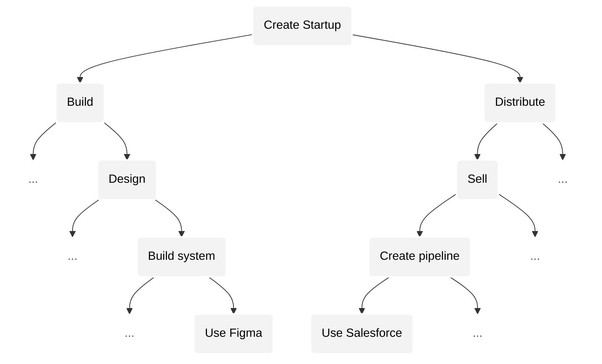
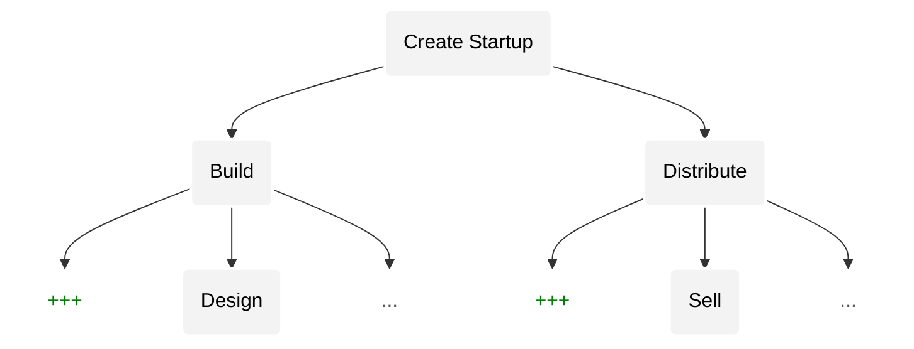
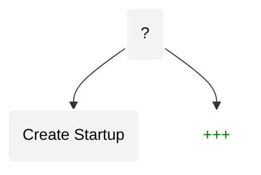

## Convergence

As AGI advances, all activities will increasingly _converge_ towards a _singular_ activity. Thus a _single_ system will eventually enable _all_ activity. To see how, we must first understand the nature of activity.

### Activity resembles a recursive tree

Human activity resembles a _finite_, _recursive_ tree [^2]. Each node of the tree represents an activity. Every activity can be broken down into sub-activities that each can be further divided into more sub-activities, thus forming a tree. This tree is finite because at some point the sub-activities become too simple to be considered an activity.

Each activity (i.e., node) has a notion of [complexity](https://en.wikipedia.org/wiki/Game_complexity): the number of possible states for that activity. For example: assembly work is less complex due to limited possibilities, whereas product design is far more complex due to exponentially more possibilities. Within the tree, sub-activities will have _superexponentially_ lesser complexity[^x] than their parent.

We observe that more complex activities yield more _extreme_ outcomes. E.g., outcomes for product design are far more extreme than outcomes for assembly work. We can also observe this phenomenon in popular board games: Go is far more complex than Chess, and thus has more extreme outcomes[^3].

Any _advancement_ unevenly, messily, pushes us _upwards_ towards more complex activities by adding more complex activities (and sub-activities) to the tree while removing less complex ones. For example: spreadsheets removed many lower complexity activities related to bookkeeping while spawning many new branches and fields (e.g. analysis, risk modeling, etc.). Since extreme outcomes is a feature of complexity, advancement creates activities with more extreme outcomes.

Yet, throughout history, advancement has been unequally distributed. Some branches of activity advanced far more rapidly than others. For example, computers, software and the internet advanced rapidly while much of the world continued to rely on less complex, ancient, agricultural practices. This meant that while we had extreme outcomes in a few, complex, activities, there still existed many low complex activities with non-extreme outcomes.

But, AGI operates on our tree in a fundamentally different way than any previous advancement. AGI will prune _all_ activities below a certain complexity threshold, completely eliminating less complex activities. All activities will become highly complex, and thus all activities will have extreme outcomes. This is what makes debt unviable in a post AGI world, as we discussed [earlier](#problem).

- A. Activities as a tree. It is unbalanced because change is not equally distributed.
- B. Advancements update the tree.
- C. AGI (fundamentally _different_ type of advancement) balances tree by eating all activities below a complexity threshold.

And importantly, as all activities become highly complex, they also become more similar: _converging_ towards a singular activity. An individual great at one activity will increasingly be great at all.

### Convergence within an activity

Let's understand convergence within the activity of: _creating a startup_.

| Depth            | Skill Type                   | Difference                                 | Skill Transferability | Intelligence |
| ---------------- | ---------------------------- | ------------------------------------------ | --------------------- | ------------ |
| `Towards parent` | Intuition                    | Even more similar "feel" for what works    | HIGH                  | SI           |
| `D2`             | Logic & reasoning            | Similar analysis & logical experimentation | MEDIUM                | AGI          |
| `D3`             | Domain specific knowledge    | Design frameworks vs. Sales frameworks     | LOW                   | AI           |
| `Towards leaves` | Execution specific knowledge | using Figma vs. Salesforce                 | VERY LOW              | AI / rules   |

Skill transferability between two activities is proportional to their complexities, because the _type_ of skill changes based on the complexity of the activity. Domain specific and execution specific knowledge do not transfer easily, whereas, higher order reasoning and intuition do.

As AGI prunes the tree according to complexity, we will notice that lower depths disappear:

Eventually converging:

---

We should be careful to not be attached to the labels we've used ("startup", "design", etc.). For example, a lead designer at a far more complex startup will almost certainly be doing higher complexity activities than a CEO of a lower complexity startup. Similarly, a mediocre designer will not operate at a high level of complexity even though their activity requires them to, because they are ignorant of its complexity. As we will see below, as we converge further, labels acceleratingly become useless.

Similarly, in the "Transferability" column above, what we've considered as "HIGH" may be seen as "VERY LOW" by our descendents who will be operating at such heights in the tree where transfering skills can happen even more seamlessly (/ faster). These are relative terms. We've presented it this way to show how convergence looks _locally_ within an activity that itself will be very low in the eventual tree that artificial intelligence will create.

### Implications

- Convergence occurs locally and globally.

- We will have gain many, many more activities than we will lose, but: \_\_.

- Thus, convergence dissolves boundaries between “domains”. Well, boundaries between domains have always been illusions, and convergence will destroy that illusion.
  

- Skill transfer upwards becomes exponentially more difficult over time.

- Delusion about the nature of an activity, its complexity, and its position in the overall tree also grows exponentially proportional to the complexity of the activity.

---

Transition:

Due to convergence, it would be a massive blunder to tackle each system separately: e.g. economic system, governance, political systems, technology systems, etc. If we wanted to build a platform that did all of them by _summing_ together distinct pieces, we would fail catastrophically because we would be making the same mistake that a low complexity worker makes when they look at activities higher up and treat them as the _sum_ of their sub-activities. We will not be able to find the right solution to _imbalance_ if we don't operate at a higher level of complexity that does not treat the sub activities as separate, distinct pieces to tackle independently.

AGI enables a higher complexity activity than all of what we've seen so far that will, as a single expression, advance all of humanity's activities at once, at their root. In order to achieve our mission, we must seek that single expression that will simultaneously enable advancements in stories, instruments _and_ technologies.
