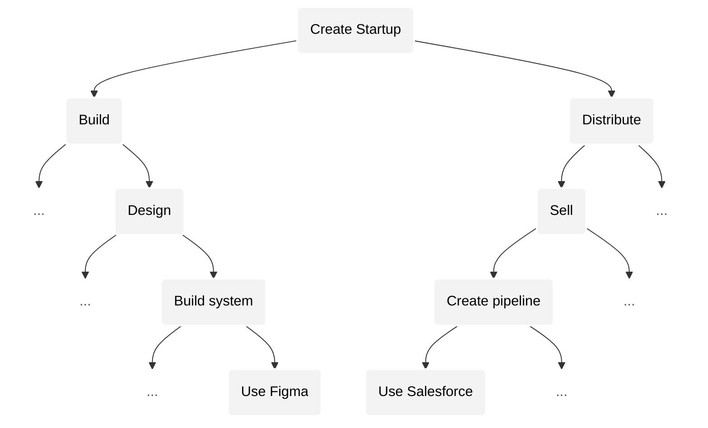
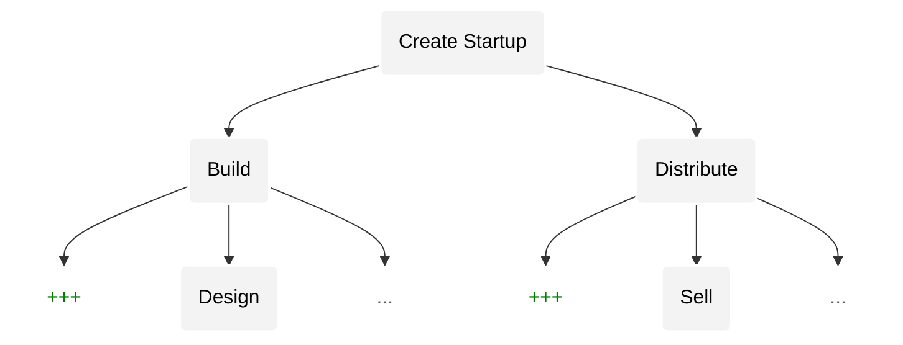
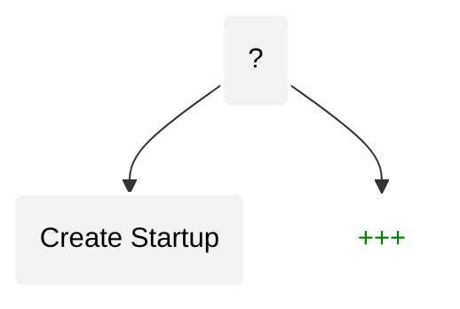

## Convergence

As AGI advances, all activities will increasingly _converge_ towards a _singular_ activity. Thus a _single_ system will eventually enable _all_ activity. To see how, we must first understand the nature of activity.

Human activity resembles a _finite_, _recursive_ tree [^2]. Each node of the tree represents an activity. Every activity can be broken down into sub-activities that each can be further divided into more sub-activities, thus forming a tree. This tree is finite because at some point the sub-activities become too simple to be considered an activity.

Each activity (i.e., node) has a notion of [complexity](https://en.wikipedia.org/wiki/Game_complexity): the number of possible states for that activity. For example: assembly work is less complex due to limited possibilities, whereas product design is far more complex due to exponentially more possibilities. Within the tree, sub-activities will have _superexponentially_ lesser complexity[^x] than their parent.

(TODO: superexponential diff must be explained here with an intuitive example. this intuition is critically important and can't be relegated to a footnote).

We observe that more complex activities yield more _extreme_ outcomes. E.g., outcomes for product design are far more extreme than outcomes for assembly work. We can also observe this phenomenon in popular board games: Go is far more complex than Chess, and thus has more extreme outcomes[^3].

Any _advancement_ unevenly, messily, pushes us _upwards_ towards more complex activities by adding more complex activities (and sub-activities) to the tree while removing less complex ones. For example: spreadsheets removed many lower complexity activities related to bookkeeping while spawning many new branches and fields (e.g. analysis, risk modeling, etc.). Since extreme outcomes is a feature of complexity, advancement creates activities with more extreme outcomes.

Yet, throughout history, advancement has been unequally distributed. Some branches of activity advanced far more rapidly than others. For example, computers, software and the internet advanced rapidly while much of the world continued to rely on less complex, ancient, agricultural practices. This meant that while we had extreme outcomes in a few, complex, activities, there still existed many low complex activities with non-extreme outcomes.

But, AGI operates on our tree in a fundamentally different way than any previous advancement. AGI will prune _all_ activities below a certain complexity threshold, completely eliminating less complex activities. All activities will become highly complex, and thus all activities will have extreme outcomes. This is what makes debt unviable in a post AGI world, as we discussed [earlier](#problem).

- A. Activities as a tree. It is unbalanced because change is not equally distributed.
- B. Advancements update the tree.
- C. AGI (fundamentally _different_ type of advancement) balances tree by eating all activities below a complexity threshold.

And importantly, as all activities become highly complex, they also become more similar: _converging_ towards a singular activity. An individual great at one activity will increasingly be great at all.

---

Let's understand convergence within the activity of: _creating a startup_.

| Depth            | Skill Type                   | Difference                                 | Skill Transferability | Intelligence |
| ---------------- | ---------------------------- | ------------------------------------------ | --------------------- | ------------ |
| `Towards parent` | Intuition                    | Even more similar "feel" for what works    | HIGH                  | SI           |
| `D2`             | Logic & reasoning            | Similar analysis & logical experimentation | MEDIUM                | AGI          |
| `D3`             | Domain specific knowledge    | Design frameworks vs. Sales frameworks     | LOW                   | AI           |
| `Towards leaves` | Execution specific knowledge | using Figma vs. Salesforce                 | VERY LOW              | AI / rules   |

Skill transferability between two activities is proportional to their complexities, because the _type_ of skill changes based on the complexity of the activity. Domain specific and execution specific knowledge do not transfer easily, whereas, higher order reasoning and intuition do.

As AGI prunes the tree according to complexity, we will notice that lower depths disappear, and new activities emerge at the higher depths.

Eventually converging because the higher the depth activities are added, the _closer_ they are to each other: i.e. the more likely it is that someone great at one is great at all.

> We should be careful to not be attached to the labels we've used ("startup", "design", "sell" etc.) because these labels have no meaning on their own. For example, a lead designer at a far more complex startup will likely be performing higher complexity activities than a CEO of a less complex startup. Similarly, a mediocre designer will not operate at a high level of complexity even though their activity requires them to, because they are ignorant of its complexity. As we will see below, as we converge further, labels acceleratingly become not only useless, but also limiting.

> Similarly, in the "Transferability" column above, what we've considered as "HIGH" may be seen as "VERY LOW" by our descendents who will be operating at such heights in the tree where transfering skills can happen even more seamlessly (/ faster). These are relative terms. We've presented it this way to show how convergence looks _locally_ within an activity that is familiar to many today. But, this activity itself will likely be very low in the eventual tree that artificial intelligence will create. Our descendents will view the majority of startups created today the way we view the many small businesses throughout history — we know the nature of them but we consider them largely inconsequential

---

Convergence occurs locally _and_ globally. In our example, we saw how the entire sub-tree stemming from that activity converges towards its root. Similarly, convergence occurs globally: in the entire tree that _that_ activity is a part of. For example, within the average B2B startup, as all activities within it converge towards its root, convergence will also occur much higher in the overall tree such that new companies will emerge at much higher places in the tree that will perform the function of this particular startup _along with_ the functions of thousands of other startups — rendering all of them useless, unless they can evolve to the higher complexity activity (that is higher in the tree) and win there.

---

Artificial intelligence will enable many more activities than it will remove. The range of activities we have witnessed throughout human history will eventually be a drop in the ocean of activities that will eventually exist. While it's impossible to predict the nature of these activities, we _can_ predict that they will increasingly be more _similar_: i.e. skill in one will increasingly translate to skill in all, and that outcomes will become unimaginably extreme (as complexity grows exponentially to depth).

---

As our activities become converge towards a singular activity, the notions of boundaries between "domains" will dissolve. Though we are in the earliest days of artificial intelligence, we have already begun to witness this convergence locally. There has been a rapid convergence in roles within startups. New roles have emerged (product engineer, design engineer, etc.). There is no room for those who only do a narrow function because those lower complexity activities have disappeared.

We are still very, very _low_ in the tree. As convergence accelerates towards higher levels in the tree, distinctions between startups, political organizations, science labs, film studios, etc. will also disappear. The phrase "starting a company" may not exist altogether. And, even if it does exist, it will mean something profoundly different.

 (todo: not sure where / how / if necessary to have the einstein tagore point).

---

As we accelerating converge upwards, It will become exponentially more difficult to level up and be great at any activity. This is because activities are _superexponentially_ more complex than their sub-activities. This exponential jump isn't as pronounced at lower complexities, but become glaringly apparent the higher you go. For example, many can make the jump from engineer to product engineer, but how many will be able to make the jump from product engineer to successfully operating at the complexity that most CEOs operate today? The reason we observe extreme outcomes proportional to complexity is due to this exponential jump in complexity between an activity and it's parent.

---

Importantly, our delusion about the nature of an activity (its complexity and position in the global tree) also grows exponentially proportional to its complexity.

This delusion occurs because all of us build an intuition about the nature an activity higher in the tree by _projecting_ our intuition of the lower complexity activities we are familiar with. This leads us to perceive the higher complexity activity as the _sum_ of its sub-activities (which we are more familiar with), whereas in reality, the higher complexity activity is exponentially more complex than the sum of its parts.

For example, an engineer at a startup will likely look at the activity of the CEO as the _sum_ of: engineering, product, sales, marketing, etc. Intuitively the engineer feels that the CEO is executing these sub-activities as separate functions with perhaps some overlap. In reality, the best CEOs operate in a much more complex way without distinguishing between their sub-activities. Steve Jobs's judgement on a product decision intuitively is intuitively connected with downstream impacts on positioning, brand, marketing, etc.

Similarly, there is an emerging trend among startups to have exceptional product launch videos. This trend has led some observers to claim that future founders will need to be great at product _and_ video storytelling. These observers are making the same blunder thinking that the founder activity has evolved into a _sum_ existing activities. The founders that are able to pull attention with exceptional visual storytelling while building great products do not distinguish these functions as separate. They are excelling at a much higher complexity game that observers can't intuitively understand.

This is why, succeeding at higher levels of complexity becomes incredibly difficult the higher we go. You cannot simply attack a higher complexity activity by adding your intuitions for each of its sub-activities. You can only succeed if you can achieve the higher complexity _intuition_ that does not compartmentalize that activity into lower complexity sub-intuitions.

It is very difficult to reason ourselves out of this delusion because it exists at the intuitive, subconscious levels of our minds. Thus, we all suffer from this delusion — especially those who don't realize they have it.

Similarly, our collective delusion about the _global_ tree of activities will grow exponentially. We will think we are approaching the global root, and thus, we will believe that all new activities will appear at the sibling level, enabling us to easily transfer our skill over. Yet, we will painfully realize that these new activities are _not_ sibling activities but distant cousins, and that what we thought was the root is actually far away from the global root.

---

AGI enables a new higher complexity activity that allows us to fulfill our mission of uniting humanity and unlocking its potential by advancing all of our activities through a _single_ expression.

It would be a tragic blunder to treat this expression as the sum of its parts: i.e. a sum of the economic system, governance system, stories, technologies, etc. If we treated each part separately, we would have missed the more fundamental design that achieves everything simutaneously, i.e., in a balanced way.

As we discussed [earlier](#interdependence--imbalance), any imbalance in advancement leads to suffering. The only way to advance everything in a balanced way is to advance everything _together_. As _one_.

We must seek this singular expression that will rapidly advance us towards uniting humanity and unlocking its potential.
