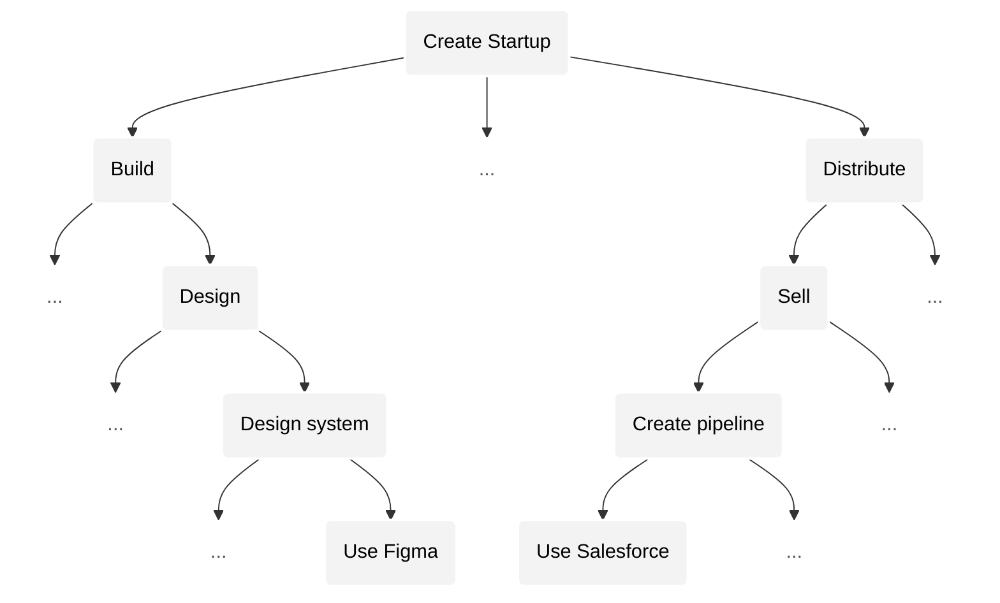

# Root

_[homan](https://x.com/homanspirit) & [shiv](https://scholar.google.com/citations?user=WNUGEccAAAAJ&hl=en)_

---

Artificial intelligence promises abundance and prosperity.

But we aren’t _organized_ in a way that lets us take advantage of it. On our _current_ systems, AI will concentrate opportunity and divide society.

In this essay, we propose a _new_ way to organize ourselves — one that enables us to use AI to achieve unity and prosperity instead of division and decay.

But first we need to understand how AI will change our world.

---

#### Side A. How AI will change our world
1. [Activity](#activity)
2. [Complexity of an activity](#complexity-of-an-activity)
3. [Example activity: creating a company](#example-activity-creating-a-company)
4. [Similarity between activities](#similarity-between-activities)
5. [AGI eats activities and enables new ones.](#agi-eats-activities-and-enables-new-ones)
6. [Local vs. global convergence](#local-vs-global-convergence)
7. [Predictions:](#predictions)
8. [1) Peak outcome grows superexponentially](#1-peak-outcome-grows-superexponentially)
9. [2) Competition grows at least exponentially](#2-competition-grows-at-least-exponentially)
10. [3) Outcomes superexponentially become more extreme across the board](#3-outcomes-superexponentially-become-more-extreme-across-the-board)
11. [4) Number of economically viable activities grows superexponentially.](#4-number-of-economically-viable-activities-grows-superexponentially)
12. [5) Rate of displacement of winners accelerates.](#5-rate-of-displacement-of-winners-accelerates)
13. [6) Absolute number of winners grows at least exponentially.](#6-absolute-number-of-winners-grows-at-least-exponentially)
14. [AGI will expand humanity's horizon](#agi-will-expand-humanitys-horizon)

#### Side B. Unlocking our collective potential
15. [Problem](#problem)
16. [Venture capital](#venture-capital)
17. [Personal token](#personal-token)
18. [Money → Company → Personal Token](#money---company---personal-token)
19. [Value will be concentrated in personal tokens](#value-will-be-concentrated-in-personal-tokens)
20. [Personal tokens will democratize opportunity](#personal-tokens-will-democratize-opportunity)
21. [The network](#the-network)
22. [Universal Basic Equity (UBE)](#universal-basic-equity-ube)
23. [Tokens will eat the world](#tokens-will-eat-the-world)
24. [Imbalance](#imbalance)
25. [RootNet](#rootnet)
26. [True value](#true-value)
27. [Grounded in reality](#grounded-in-reality)
28. [Solution](#solution)
29. [Decentralization](#decentralization)
30. [Fork-ability](#fork-ability)
31. [Unity](#unity)

---

# A. How AI will change our world

When we ask how AI will change our world, what we're really asking is how it changes the nature of our _activities_: i.e, what we will find valuable to work on and how we will work on them.

## Activity

Let's start with understanding the nature of an activity through an example: driving a car.

Bob, a beginner, wants to drive a car. Since driving a car is too complex to just do for Bob, he has to break this activity into *sub-activities*: turn it on, steer, accelerate, change gear, check the mirror, etc.

If a sub-activity is simple enough to do, Bob just does it. If it's too complex, Bob breaks[^break] that sub-activity down further into more sub-activities. For example, Bob breaks "change gear" down into remembering the gear pattern, pressing down the clutch, moving the gear handle etc.

[^break]: We break an activity into sub-activities when we can't tackle it as a whole. This can happen because we lack skill to perform it as a whole or perhaps due to lack of tools. For example, a great filmmaker who already knows what they want to create may still have to break it down into sub-activities to _implement_ it: e.g., animation, etc. because they lack the tools or resources to abstract that sub-activity away.

For Bob, the activity of driving a car is represented as a _recursive tree with falling complexity_: i.e., activities are more complex than their sub-activities. By complexity we mean the number of possibilities (or *moves*) for an activity. For example, in the activity of changing a gear, its complexity is the number of possible gear changes you can make.

A _leaf_ activity (at the bottom) has a complexity that _can_ be tackled without breaking down into further sub-activities. The root is the activity you _want_ to tackle. And importantly, this _difference_ between the complexity of the activity you _want_ to tackle and the complexity you _can_ tackle (without breaking down further) is what _causes_ this tree to be constructed.

## Parent vs. child activity

At first glance, it's tempting to consider the complexity of the parent activity as just the _sum_ of the complexities of its sub-activities. This feels natural because of course the parent activity contains the moves of the sub-activities, otherwise sub-activities wouldn't be _sub_ activities.

But, in reality, we see that the parent activity actually contains *many* moves that can't be found in any of the sub-activities. I.e., there are moves in the parent activity that *cannot* be understood as a collection of sub-moves that are each restricted to a sub-activity.

For example, when Steve Jobs envisioned the iPhone, he impacted product, engineering, marketing, sales, etc. sub-activities simultaneously. Each team projected this move into their own domains to understand and execute it. But, the *real* move lived *above* these sub-activities. The real move emerged from a holistic intuition about *all* the possibilities of the parent activity without *fracturing* the parent activity into sub-activities. 

Importantly, the real move *could not* have been reconstructed from the projections each team perceived. That is, if someone were to attempt to understand the real move by talking to the heads of each team to gather their perceptions about the move, they would fail to capture the essence of Steve's move.

This means that the complexity of the parent activity is *always greater* than the *sum* of complexities of its sub-activities. Specifically, the relationship between the parent's complexity and the sum of childs' complexities is at least *superlinear* (and possibly exponential).

Consequently, the complexity of an activity in the tree grows *superexponentially*[^complexity-growth] as we go up the tree.

[^complexity-growth]: To see why, let's consider the following: when we recurse this relation from any activity in the tree to *its* leaves, we see that the complexity of the activity is a superlinear function of the sum of complexity of its leaves. Because the number of leaves already grows exponentially with depth (due to tree structure), the complexity of the activity will be superexponentially greater than the complexity of its individual leaves.

> In case you unfamiliar with growth rates (i.e., superlinear, exponential, superexponential), we recommend reading [our primer](GrowthRatePrimer.md).

## Example activity: creating a company

Now let's take a more relevant example: creating a company that wants to, say, automate agriculture with robots.

## Similarity between activities

The lower you go in the tree, the more we have broken the root activity into more and more sub-activities. Each break introduces a separation or difference that would otherwise not exist if the activity could be performed as whole. This means the further down we go, the more the differences compound — i.e., the further away activities are from their common ancestor, the more *different* they become.

Which is why when we compare activities with further away common ancestors, they are less similar — i.e., ability transfers less easily across them. Naturally, the higher up in the tree we go, activities will be closer to their common ancestors, i.e., they become *more similar*.

In our example above, "Build product" and "Distribute" are more similar than their respective leaves of their sub-trees: "Design component in Figma" vs. "Set up a sales pipeline in Salesforce". The high level reasoning and intuition required to effectively break down "Build product" and "Distribute" into sub-activities and correctly prioritize them is more _similar_ (and easily ) than the domain specific knowledge you need to operate two different tools.

## AGI eats activities and enables new ones.

Artificial *general* intelligence (AGI) is a technology that _eats_ activities below a certain complexity threshold — *across the board*. In other words, AGI will eat low complexity activities in _any_ domain: design, product, music, art, engineering, law, etc. AGI distinguishes by _complexity_, not "domain" or any other form of distinctions that we've created between different kinds of work.

In our example, as AGI advances, it will eat activities lower in the tree: starting at the leaves (e.g., "Design component in Figma", "Write a specific algorithm", etc.) and work upwards.

As this happens, we change the way we break activities into sub-activities — i.e., we change our tree. When we change the way we break activities, we will also see new sub-activities that we previously couldn't do. In our company example, a new activity (and role) could be managing AI agents that will do to the lower complexity work that we previously had to do ourselves using domain specific tools.

**Thus, as AGI continues to push us upwards, it will _converge_ our activities (and thus our attention) towards our _root_ — a _highly complex_, _singular_ activity.**

## Local vs. global convergence

Our example activity (creating an agriculture robotics company) is a sub-activity within a larger activity tree that is rooted in creating _general_ robotics company which contains all the possibilities of our company along with many many more possibilities. And this larger activity tree itself is a part of a much larger _global_ activity tree: i.e, one that contains all of humanity's activities.

While convergence happens locally (towards the root of our company), it also happens globally. This means that progress in a more complex activity higher in the tree _will make our entire activity irrelevant_ in the same way that AGI _made our local leaves irrelevant_.

---

From this understanding of how AGI impacts our activities, we can predict what a post AGI world will look like.

## Predictions

As artificial intelligence advances, we will see that:

1. Peak outcome grows superexponentially.
2. Competition grows at least exponentially.
3. Outcomes become more extreme superexponentially, across the board.
4. Number of economically viable activities grows superexponentially.
5. Rate of displacement of winners grows at least exponentially.
6. Absolute number of winners grows at least exponentially.

Specificity in growth rates is critically important. Miscalculations in growth rates can lead to very different, sometimes even opposite predictions. In case you are unfamiliar with differences in growth rates (i.e., superlinear vs. exponential vs. superexponential) we recommend reading [our primer](GrowthRatePrimer.md).

## 1) Peak outcome grows superexponentially

We value an activity proportional to the possibilities it enables — i.e., proportional to its _complexity_.

Building Youtube is far more valuable than building a niche, genre-specific, video platform because Youtube captures far more possibilities. Similarly, building a general robotics company that can work for many domains is far more valuable than building a domain specific one because it enables far more possibilities.

Since complexity grows superexponentially as we go up the tree, so will the peak value that can be created (i.e., the peak _outcome_).

## 2) Competition grows at least exponentially

We have already seen that activities become more similar the higher up we go. Since ability transfers more easily across them, so does competition.

Furthermore, due to better training and resources, there will be many more people capable of competing at more complex activities, amplifying competition further.

## 3) Outcomes become more extreme superexponentially, across the board

Within _any_ activity, at any moment, a _smaller_ percentage of individuals will be responsible for a _greater_ share of economic value created — i.e., a _[power law distribution of outcomes](https://en.wikipedia.org/wiki/Power_law)_. Thus, the *median share* falls.

Generally, outcomes become more extreme as the following increase:

1. Complexity of an activity.
2. Competition (quantity and quality).
3. Leverage (how fast you can make a move).

We observe this relationship between extreme outcomes and complexity in popular games such as Chess and Go. Go has more extreme outcomes than Chess because it is more [complex](https://en.wikipedia.org/wiki/Game_complexity) — i.e., has more possible states or possibilities).

Furthermore, as competition has improved in these games (more players, better computer assisted training, coaching, etc.) over the years, outcomes have become _even more_ extreme (i.e., ELO spread has increased).

Finally, leverage also matters because the faster you can make a move, the more quickly the underlying extreme outcomes manifest. For example, when two competing startup founders can iterate twice as fast, the difference in their outcomes accelerates — the better one will more quickly outcompete the other.

AGI accelerates all three factors:

1. Complexity increases superexponentially.
2. Competition increases at least exponentially.
3. Leverage (AGI capability) has been increasing exponentially.

Thus, outcomes will become more extreme superexponentially.

Extreme outcomes aren't new. Complex activities like building startups and creating content have always had extreme outcomes: the best founders and creators generate massive outcomes while the median founders and creators make nothing. **But, for the first time in human history, outcomes will be extreme in _all_ activities, not only in a few activities**. This is because AGI eats less complex activities _across the board_, instead of just in a few domains.

## 4) Number of economically viable activities grows superexponentially.

**All of humanity's activities until now aren't even a drop of water in the ocean of activities that will emerge.**

All of the activities we see in our world are sub-activities for some highly complex root activity that we may not even be able to see right now.

The number of activities that we conceive will be proportional to ratio of: the complexity of the highest complexity activity we can see (i.e., "root"), and the complexity that we can tackle directly without breaking into sub-activities. Since the complexity of activities grows superexponentially the higher up we go, this ratio will always increase. This ratio will likely increase at least exponentially.

## 5) Rate of displacement of winners grows at least exponentially

Winners remaining winners becomes exponentially more difficult. _Churn_ accelerates.

For winners at the current level of complexity, who are aiming to tackle a more complex activities, the following apply:

1. Advantage relative to someone just starting off shrinks rapidly. As we go up the tree, the complexity of new high complexity activities will be so massive that the knowledge you gained in the lower complexity activity increasingly becomes an irrelevant advantage relative to someone starting off with no knowledge.
2. Success becomes a drag because learnings increasingly won't translate to insights in higher complexity activities (and will increasingly create wrong, limiting intuitions). You will increasingly be outcompeted by those who _start_ from above.
3. Pool of competition widens exponentially. Increasingly you will be made irrelevant from places you least expect.

---

At higher complexities, transferring success from an activity to its parent activity is less about scaling what you already know and more about having a fundamental breakthrough.

For example, scaling McDonald's from one city to the world (a previously high complexity activity from a couple of decades ago) is far more straightforward than scaling a robotics company from one domain (agriculture) to a more general robotics company that can handle many domains (an example of a current high complexity activity). You can reason about how to scale McDonald's to many locations. But you cannot easily reason about how to make a domain specific robot _generally_ useful — this requires re-imagining and big breakthroughs.

Those who will crack the more complex activities will increasingly have to start directly *at* them. Success at a lower complexity activity creates unnecessary drag and distraction because your learnings at that level become less likely to translate into insights in the higher complexity activities above. For example, OpenAI could not have emerged as an evolution of a domain specific AI winner.

---

Furthermore, the higher up in the tree we are at, the more similar our activities become — i.e., the more easily you can transfer ability from one activity to another. This greatly widens the pool of competition.

Winners will increasingly face competition from places they least expect. We are seeing early signs of this: top content creators and startup founders are starting to find themselves rubbing shoulders fighting for the same attention. Similarly, companies building coding agents are finding themselves competing with companies working on project management tools (because building and managing are converging).

Eventually, some random biology discovery in a quantum computing lab could wipe out a massive sub-tree of robotics companies by enabling embodied intelligence grounded in biology that can generalize far better than mechanical robots. It will be increasingly difficult to predict and counter such competition.

Also, there will be greater quality of competition due to better training at scale (enabled by AI). Furthermore, as the peak outcome grows superexponentially, more capable individuals will start by directly attacking activities very high in the tree, shaking up many sub-trees of current winners.

It will be tough to remain a winner when you have no idea where you will be outcompeted from. Your pool of competent competitors grows superexponentially and the prizes for winning grow superexponentially leading to many more competent teams working on activities that will make yours irrelevant.

---

**Therefore, most value will be created by companies that haven't been started, by individuals who haven't been born.**

We are entering a new age of creating value. Successfully tackling highly complex activities requires a very different approach than we're used to. Increasingly, the way the best teams operate will look very weird[^weirdwinner] (and "wrong") to current winners.

[^weirdwinner]: We are entering a new age of creating value. Individuals and teams that will win will operate very differently than they do today. Teams will take years just to discover and frame the right activity to work on before they launch anything because you cannot simply _iterate_ upwards from a lower complexity activity. Roles will be distinguished by complexity not "domain". Teams will completely abandon their current products and customers and jump upwards as soon as they see a glimpse of a higher complexity activity. They will simultaneously execute mass layoffs _and_ go on hiring frenzies at every jump in AGI. They will be paranoid about advancements in completely unrelated activities that may have a common ancestor with theirs higher up in the tree. Most of our current winners will be blindsided.

## 6) Absolute number of winners grows at least exponentially.

Even though the distribution of outcomes will be far more extreme, since the peak outcomes grow superexponentially, even _tiny_ wins (relative to the peak wins) will still be _massive_. And since the rate of displacement grows at least exponentially, in a given period of time, there will be *many more* who would have touched extreme successes as well.

## AGI will expand humanity's horizon

A post AGI world will be dynamic and extreme. The reign of winners will be increasingly short-lived. We will see rapid advancement across the board. AGI will push humanity to dream bigger and work on more and more complex problems. Problems we consider too complex to solve now will seem like simple tasks to our descendants. Thus, advancing and leveraging AGI will enable us to achieve a degree prosperity and abundance that we can't fathom.

Artificial intelligence will never render humans unnecessary because we will always *see* more than we can *do*. When we cure cancer we will want to cure death itself. When we reach Mars, we will want to get to Pluto. Our imaginations are our only limitations. We believe in humanity's ability to imagine far more than anything artificial intelligence will be able to do.

But, we are not organized in a way that enables us to *collectively* take advantage of artificial intelligence. In fact, AGI makes our current systems oppressive — concentrating opportunity in the hands of those who are wealthy, devastating those without means, and tearing society apart.

To understand why, let's study how our current economic system becomes oppressive in a post AGI world.

# B. Unlocking our collective potential

## Problem

In a post AGI world, due to [extreme outcomes](#3-outcomes-superexponentially-become-more-extreme-across-the-board) in _all_ activities, debt will no longer be a viable means to finance anything.

This is not due to fewer opportunities (AGI will enable far more opportunities than it takes), but rather due to the extreme, winner-takes-all nature of outcomes within _any_ opportunity. In extreme outcomes, the median outcome falls to nothing and thus financing with debt is no longer viable.

Tragically, billions are still taking out loans to finance their lives — from their educations, to their homes, businesses, etc. — without realizing that they will almost certainly never be able to repay these loans as outcomes rapidly becomes more extreme.

_Even_ if one is debt-free, they will almost certainly be outcompeted by one who can experiment boldly and tinker freely with _abundant_ resources.

And critically, in an extreme world, if people don't have a stake in the collective upside, they will resent the winners — dividing society.

Therefore, we must:
1. Finance human activity in a way that ensures that anyone with potential has access to the resources they need to fully realize their potential — regardless of the circumstances of their birth.
2. Give each individual a stake in the collective upside to elevate our baseline, i.e, when any one succeeds everyone benefits.

Otherwise opportunity becomes concentrated in those who aren't be burdened by debt (i.e., those with extreme wealth), dividing society and preventing a future of collective opportunity and prosperity.

## Venture capital

In an extreme world, venture capital (VC) is the _only_ viable way to finance our lives.

At its core, venture capital unites people by intertwining their success and failure — through _equity_ in outcomes.

VC is already a popular way to finance startups: investors give startup companies money in exchange for an _equity_ stake in the startup itself. If the startup succeeds, the investors make great returns. If the startup fails, the investors lose their investment. Importantly, startup founders are *not* indebted to investors. And because of the shared stake, investors are incentivized to give founders the resources they need to succeed.

Venture capital works exceptionally well in domains with extreme outcomes because an investor only needs a few bets to succeed in order to _more-than-compensate_ for the many failed bets they will inevitably have (because the median outcome is failure). Therefore, VC is the only way to finance activities that have extreme outcomes because no other mode of financing can withstand the extreme failure rate.

Since AGI makes _all_ activities extreme, VC will be the only viable way to finance *anything*. But, VC as it exists today is too restrictive because only those ready to start a company can leverage VC. In order to unlock our collective potential, we must enable individuals to access venture capital to finance a *broader* range of activities, *earlier* in their lives.

We need a new financial instrument that democratizes venture capital.

## Personal token

To democratize access to venture capital, we are creating the _personal token_: a financial instrument that represents an individual's potential, with transact-able shares. Individuals can raise venture capital by selling equity in their personal token.

_(Jane's personal token with her shareholders and her equities in companies and other personal tokens.)_

Your personal token's value is grounded in your equities in companies and other personal tokens. A portion of the capital you gain when selling equity in a company or personal token (i.e., capital gains) is sent to your personal token shareholders — proportional to the equity they hold (i.e. dividends).

Unlike company shareholders, personal token shareholders have _no_ “ownership", control, or say over the personal token owner or anything they do. **The personal token owner retains absolute, complete agency and control over their lives**.

## Money -> Company -> Personal token

The personal token is the next phase in the evolution of financial instruments — as an abstraction that sits above the company, which in turn sits above money.

Simple notions of debt and exchange became painful as the complexity of transactions grew. Over time, this created a pressure which gave rise[^messy] to transferrable IOUs — i.e. _money_.

[^messy]: In a messy, nonlinear way.

Similarly, debt instruments became a painful means to finance high-risk high-reward expeditions that emerged due to rapid advancement. This created a pressure that gave rise to transferrable equity in upside — i.e. _venture-backed company_.

For instance, in seafaring, bankers simultaneously invested in many risky expeditions in exchange for a stake in the profits, enabling them to profit even when only a few expeditions survived.

Importantly, the notion of a venture-backed company allowed us to assign value to _hope_. The gap between the value of a company and reality (its revenue) is the company’s greatest feature. Being able to _transact_ equity shares of a company enables venture capital financing.

Today, we are at another inflection point. AGI makes _all_ outcomes extreme, not just those in a few domains, invalidating debt as a viable means to finance _anything_. This creates pressure for an instrument that sits _above_ companies: representing an individual’s equities across companies — i.e. _personal token_.

Being able to _transact_ shares of equity in personal tokens enables individuals to access venture capital much more broadly. In the same way that a company enables us to assign value to hope in a particular expression, the personal token enables us to assign value to hope in an _individual_, across all of their expressions.

## Value will be concentrated in personal tokens

As we advance, value concentrates _upwards_.

Over time, value became concentrated in companies, not transactions. The most valuable companies have been _increasingly_ valued more than the sum of their transactions (revenue).

Similarly, in a post AGI world with extreme outcomes, value will increasingly become concentrated in personal tokens. A personal token will be valued far more than the sum of the values of its equities in companies _(recall: a personal token’s value is grounded in its equities in companies and other personal tokens)_.

With the leverage that artificial intelligence provides, individuals will be able to manifest many more ideas. Therefore, people will increasingly want to invest directly in the _source_ of the many valuable ideas (i.e., in personal tokens) instead of specific ideas (i.e., in companies).

## Personal tokens will democratize opportunity

Personal tokens create a market for human potential that will increasingly allocate resources according to an individual’s potential, _regardless_ of the circumstances of their birth and privilege.

We acknowledge that _initially_, personal tokens will be better harnessed by individuals with privilege. Early individuals who raise capital by selling equity in their personal tokens would have likely had advantages such as better education, access to resources, capital, networks, etc. But eventually, as the network matures through more participants and investments (in number and magnitude), market forces will more aggressively allocate resources to undervalued or undiscovered talent. Thus, market forces will push resources to individuals _earlier_ in their lives across a _broader_ range of activities — preventing wastage of valuable potential and minimizing unfair advantages.

As discussed [earlier](#predictions), even with extreme outcomes:
1. We will have greater absolute number of winners.
2. More rapid displacement of these winners.
3. Greater and higher quality competition.
4. Peak success grows.

Because of more extreme success outcomes _and_ greater number of competent contenders for those outcomes, we will see more widespread investments of greater magnitude. Therefore, even the investment into the median contender will increase.

Therefore, personal tokens, through the market forces they create, will rapidly negate privilege by incentivizing capital to flow to incorrectly undervalued individuals — based on their potential, not wealth.

## NetworkToken

Personal tokens can't exist in a vacuum. We need many functions in order to have a thriving ecosystem of individuals investing in each other (e.g., enabling discovery, fighting fraud, etc.). In order to finance such functions this system will collect a small _equity fee_: a micro stake in every personal token that has successfully raised funds.

To be able to collect this equity fee, we have another _type_ of token called the _network token_. An instance of a network token — “NetworkToken” — represents the collective potential of the _entire_ network through its micro stakes in all personal tokens. The wallet associated with the NetworkToken is the network's Treasury that helps finance all of its functions.

## Universal Basic Equity (UBE)

In an extreme world with a falling median outcome, a sufficient *baseline* of resources for each individual is a prerequisite to democratize opportunity.

This is best achieved through _Universal Basic Equity (UBE)_: every citizen receives an _equity stake_ in the collective upside — i.e., a stake in the NetworkToken.[^children] This creates a symbiotic relationship between the individual and the collective that represents that *we are in this together: when one wins we all win; when one fails we all fail.

[^children]: UBE also incentivizes having children. When a baby is born, new shares in the NetworkToken is minted for that baby, thus diluting the value everyone else’s shares. Thus, families will be incentivized to have more children to increase their collective equity in the NetworkToken.

**UBE eliminates the lag between individual and collective success**. Waiting to _tax_ success to distribute wealth doesn't work because we have to wait for equity to be sold (i.e., so that capital _gains_ can be taxed). On the other hand, when each individual *directly* holds equity in the collective (i.e., NetworkToken), the value of their equity goes up as soon as hope in the future increases. Any major scientific discovery, technological breakthrough, or artistic expression that instills *hope* in our future increases the value of the NetworkToken *immediately*. 

And importantly, the value of the NetworkToken is grounded in reality: in personal tokens, which are grounded in companies, which are grounded in revenue, which is grounded in transactions in which real value is created — else the transaction would not have occurred. (We'll revisit this [grounding](#grounded-in-reality) in greater depth later).

Critically, Universal basic _income_ (UBI) will _not_ work on its own because it will cause difficult-to-manage inflation (because capital is pumped into the market). On the other hand, **Universal basic _equity_ (UBE) will not cause inflation** due to the _strong_ incentive to *hold* your equity in the NetworkToken given the promise of great upside. As long as we have faith in humanity's potential, more people will hold than sell, preventing inflation.

> Note: if needed, in addition to UBE, UBI can also be offered by siphoning some of the dividends the NetworkToken accrues to its shareholders, or by having the NetworkToken periodically sell a percentage of its stakes in every personal token, triggering dividends for all holders of the NetworkToken. The details of this functionality can be voted on by users.

UBE ensures that our descendants will enjoy a level of abundance that we can't fathom. Artificial intelligence and economies of scale will bring the price of all important goods down, while UBE will increase the wealth in each individual's hands *without* inflation. Furthermore, as your shares in the NetworkToken accumulate, you gain a safety net to take bold risks. Even if you sell all of your equity in the NetworkToken to take a risk and fail, future NetworkToken share allocations through UBE (which will eventually be a continuously flowing allocation) will more than support you and enable you to take more risks in the future.

UBE ensures that our *baseline* grows, giving *each* individual a strong safety net to realize their potential.

While democratizing opportunity through personal tokens and raising our baseline through UBE will help us solve our [problem](#problem) of debt not working in a post AGI world, we have a much broader, more fundamental, problem on our hands.

## Imbalance

In our world, when one system advances rapidly ahead of the others, it causes an *imbalance*. 

For example, rapid advancement in AI made our economic system oppressive by making outcomes extreme across the board and invalidating debt — creating an *imbalance* between our technological progress and economic organization.

Similarly, there are many other imbalances that rapid advancement in AI has caused (and will accelerate):
- Our education system has become oppressive because what people are learning will make them _unemployable_ in a post AGI world.
- Our governance system has become oppressive because its rate of decision-making can’t keep up with rate of change. Our policies, regulations and courts are acceleratingly lagging behind where they need to be.
- Our political climate has become oppressive because it lacks the powerful story of unity and collective growth that are required to take advantage of AI.
- _(and many many more)_.

The degree of imbalance correlates with suffering. As we saw with our economic system, the further AI races ahead, the more painful debt becomes — crushing those who depend on it. Similarly, all imbalances become amplifies, amplifying our collective suffering.

We must solve a more fundamental problem to be able to advance *without* imbalance.

## Root problem

Our root problem is our inability to *allocate* resources towards what we *truly value*, *quickly*.

#### A. Allocation

Each of us is unique. Our diversity of perspectives is our greatest strength. When *each* individual can allocate resources according to what *they* believe is valuable — proportional to how good their judgement is — we maximize the quality of our *collective* resource allocation.

When a centralized authority allocate resources *on behalf* of a group of individuals, it cannot represent the range of perspectives of all of the individuals in the group. Centralized resource allocation *oppresses* a vast range of *necessary* perspectives, without which we cannot effectively direct resources to where they need to go.

And it's important that individuals with better judgement gain more power, and those with poor judgement (repeatedly mis-allocating resources) are penalized by losing power (that they will need to earn back with better judgement). Without this correcting force we will waste resources.

#### B. Value

Implicit in allocating resources is a notion of value. Even if we have an excellent system that enables each individual to allocate resources towards what they value, if our notion of value itself is limited, then resources will be terribly mis-allocated.

For example, our current *economic* notion of value is limited because it can't represent long-term outcomes: we will gladly burn our world down for short-term profits because the negative long-term outcomes aren't reflected in our notion of value. Similarly, even though most of us believe that great parenting is one of the most valuable activities that enables a healthy, prosperous society, because we can't *tangibly* represent its value, we fail to direct adequate resources to it.

#### C. Speed

Speed matters. If values shift faster than resources move, by the time resources reach their target, circumstances have already changed, leading to waste.

---

Imbalances (e.g., debt becoming unviable in a post AGI world, quality of education falling behind, etc.) are a consequence of this root problem. The faster the [world changes](#predictions), the more severe this mismatch becomes, amplifying imbalances and amplifying our collective suffering.

All popular ideologies for how to organize ourselves have blind spots. _Capitalism_ excels at decentralizing power over how resources are allocated, but because our current notion of value is limited, we will burn our world down chasing short-term profits. _Socialist and communist_ systems try to account for the value we can't tangibly represent through centralized allocation that oppresses the individual perspectives we need to keep our allocation dynamic, accurate and up-to-date.

Markets are the best mechanism we've found to allocate resources *given* a certain notion of value. Instead of throwing away markets, we should try and *improve* our notion of value so that we optimize for what we actually value, instead of optimizing for a restrictive, limited *projection* of what we actually value.

We need to find a way to tangibly represent *true*, *holistic* value.

## RootNet

Personal tokens and the NetworkToken that we discussed earlier are part of a larger system — *RootNet*.

RootNet is a network designed to enable a more *true*, *holistic* notion of value to emerge — so that we can efficiently allocate resources to what we *actually* value.

On RootNet, activity is not divided. There is no distinction between social and financial. RootNet is based on a single primitive — *the token* — that represents *potential*, that can be assigned to an individual (*personal token*), collective (*network token*), or expression (*company token*, etc.). Each user on RootNet is assigned a *personal token*.

The token represents its holder's potential to create value. Users can hold *equity* in tokens. Users *value* a token by transacting on its shares. And importantly, a token's value is *grounded in reality*: in its holder's equities in other tokens, companies, or their own revenue. By enabling users to transact seamlessly on tokens, RootNet enables users to allocate resources to what (individuals, collectives, or expressions) they value, *immediately*.

The network itself is assigned a *network token*: the NetworkToken (as [discussed earlier](#networktoken)). The individual and the collective are *intertwined*: users have stakes in the NetworkToken; the NetworkToken has stakes in all users. **Therefore, when *any* user creates value for the collective, *all* users gain.**

## True value

RootNet enables us to represent what we *truly* value.

#### RootNet *expands* existing notion of value. 

The personal token of an individual who has the potential to create economic value by starting, or joining, or investing in companies (or investing in other tokens) will be valued greatly. RootNet enables us to value such potential *earlier* and more *broadly* than ever before.

#### RootNet represents *intangible* value.

RootNet lets us value forms of contribution that have always mattered but were never reflected in economic systems.

Take parenting. Most would agree that parenting is one of the most (if not *the* most) vital contributors to collective prosperity. Children raised with love, care, and resources are more likely to become kind, capable, and hopeful adults — benefiting everyone through both who they *are* and what they *do*.

On RootNet, this value can be represented directly. Parents will hold equity in their children's personal tokens and can raise capital by selling shares in their own tokens to support their children. As their children succeed, the value of the parents' tokens will rise. Exceptional parents will even be encouraged to share their wisdom, train others, and *invest* in new parents.

By tangibly representing the value of parenting, RootNet creates a strong incentive for _better_ parenting. Great parents gain access to resources they previously lacked. Absent or harmful parenting becomes economically costly, as it puts at risk future wealth tied to their children’s potential.

> And independent of personal tokens, **Universal Basic Equity (UBE)** will raise the baseline—ensuring all parents have the minimum resources needed to care for their children.

RootNet allows us to allocate resources toward what we deeply value, but previously couldn't represent.

#### RootNet represents *collective* value.

The NetworkToken captures our _collective potential_ by holding stakes in all personal tokens on RootNet. The stronger our belief that the future will be more prosperous than today, the more we’ll value the NetworkToken.

Our current economic system fails to account for long-term collective consequences, like climate change, because it narrowly defines value. As a result, we’re often rewarded for short-term gains even when they cause long-term harm.

On the other hand, on RootNet, actions that harm our shared future — even if profitable in the short term — will be strongly disincentivized. For example, burning more fossil fuels might yield quick profits, but it undermines our hope in a better future, dragging down the NetworkToken’s value. Since we each hold equity in the NetworkToken, we’re directly harmed. The collective loss will far outweigh the short-term profit, making such behavior economically *irrational*.

Conversely, actions that _strengthen_ our shared belief in the future will be rewarded. An artist who uplifts our collective hope can increase the value of the NetworkToken itself. As it becomes clear their work creates this kind of value, the artist’s personal token valuation will surge (i.e., we will give them more resources to keep creating such value) — as long as such hope continues to translate into actual value created.

## Grounded in reality

The value represented on RootNet is grounded in _reality_.

The NetworkToken holds stakes in personal tokens, which in turn hold stakes in companies (and other tokens), which are backed by revenue — i.e., actual transactions that reflect real-world value creation. If no value is created, no transaction occurs, no revenue is generated, and the valuations of companies (and the tokens that hold shares of these companies) will fall. RootNet is anchored in the real value creation.

But what about those who create _hope_, like artists, especially when no one directly “buys” their work? Why would their personal tokens hold value?

Because hope _is_ real. It shapes behavior, inspires action, and unlocks possibility. Much of what holds humanity back is not lack of ability but lack of belief. The moment we *believe* something is possible, we begin *building* it. Throughout history, every great achievement was enabled by a shift in belief that it _could_ be done.

Hope is often a self-fulfilling prophecy. An artist who instills genuine hope that we _can_ solve our problems *materially* improves our trajectory.

Importantly, RootNet keeps hope grounded. If hope doesn’t translate into actual value creation, the NetworkToken won’t respond, and the market will correct. As long as we continue to translate hope into actual value, actions that instill hope will be tangibly valued because they increase our collective (and therefore individual) wealth. And so, users will allocate resources to such efforts by investing in the tokens of the individuals, collectives, and expressions that generate hope.

## Solution

Let's see how to *implement* RootNet.

Recall: RootNet is based on a single primitive — *the token* — that represents *potential*, that can be assigned to an individual (*personal token*), collective (*network token*), or expression (*company token*, etc.). Each user on RootNet is assigned a *personal token*.

RootNet is built on a decentralized blockchain Ledger that contains all of the tokens in the network, including the [NetworkToken](#networktoken) that represents the potential of the *entire* network. This technical "core" is developed and controlled by a non-profit organization — *RootFoundation*.

Entities (such as companies) will be able to operate on top of RootNet to enable a wide range of products and services built on tokens, while adhering to the *policies* of RootNet that determine how entities must engage with the Ledger.

Initially, RootFoundation will determine these policies. Over time, control over these policies, and more broadly *all* of RootNet's functions and evolution, will be progressively decentralized so that *users* will own, control and shape RootNet. If during this progressive decentralization RootFoundation fails to live up to what users want, anyone can *fork* the ledger, issue a new NetworkToken and continue onwards.

Let's expand on each of these...

### Token

RootNet is based on the primitive — _the token_ — that represents an individual, collective, or expression.

A token contains the following information:

1. **ID**: a unique identifier.
2. **Ownership**: total number of shares, and mapping between any token.ID to number of shares that token holds.
3. **Wallet**: holds USDC (for now[^rootcoin]).
4. **Data**: key value mapping that can contain any kind of data: strings, images, videos, and higher representational data formats that we haven't invented yet.
5. **History**: all _interactions_ this token has had with any other token. For example: investing, transacting, liking a post, following, reporting fraud, etc.

There are three _kinds_ of tokens that extend from this primitive: 
1. *personal* tokens are for individuals.
2. *network* tokens are for collectives (nations tokens (e.g., "USAToken"), NetworkToken, etc.).
3. *expression* tokens are for individual ideas or expressions (e..g, companies).

[^rootcoin]: Eventually, RootNet will have its own currency. Starting with USDC will eliminate unnecessary volatility.

### Ledger

The Ledger represents information about _all_ tokens in the network — on a decentralized blockchain. Every edit to the core ledger is recorded and public. Anyone can verify and audit what happens in this system.

### NetworkToken & Treasury

The NetworkToken is an instance of a network token that represents the collective potential of the *entire* network through its micro stakes in all tokens in the network (which it captures through an equity fee when token shares are transacted). Since the NetworkToken is just another token, it exists _within_ the Ledger.

The NetworkToken's wallet, the Treasury, reflects the dividends the NetworkToken accrues through its stakes in all tokens in the network. The NetworkToken is the economic heart of the entire network: fueling all of the activities required to keep the network healthy.

### Foundation

The Ledger will be developed and controlled by a non-profit organization (RootFoundation).

RootFoundation’s sole goal is to unite humanity and unlock our collective potential.

In addition to building the core technology, RootFoundation will be responsible for educating the world about these new ideas, and advocating for policies in the direction of uniting humanity and unlocking our collective potential.

RootFoundation cannot be “bought”. As the network matures, users will progressively vote on the all of the network's functionality and evolution. Importantly, these voting rights are *not* related to the user's stake in the NetworkToken. This means that wealthy individuals cannot simply "buy" influence.

RootFoundation members will work together _in person_ at our HQ in San Francisco, California, USA.

### Legal

All transactions in RootNet will be compliant with relevant laws and regulations. This means that investing in tokens within RootNet will initially be restricted to users who live in the United States of America.

## Decentralization

Initially, RootFoundation will hold a lot of control. Over time, as the network matures, RootFoundation will progressively decentralize control. For example, early on, RootFoundation will handle reputation and fraud in a centralized way: managing complaints from users, investigating and banning/pursuing legal actions, etc. Over time, as the network matures, RootFoundation will decentralize reputation by incentivizing users themselves to accurately identify misrepresentation/fraud[^decentralized_reputation].

[^decentralized_reputation]: Perhaps something like a transparent, decentralized [community notes](https://vitalik.eth.limo/general/2023/08/16/communitynotes.html) with appropriate financial incentives.

Such progressive decentralization will enable a rich, competitive ecosystem of ideas, companies, entities, etc. to emerge upon this tokenized foundation. And, users will increasingly have control and influence over all policy and decision making regarding the network (and how entities engage with the network) by *voting*.

Voting will be continuous: users can shift their vote as soon as they change their minds. Users can _transfer_ their vote for someone else to cast for an _individual_ decision, a _type_ of decision, or all decisions. Such representational voting will enable a much faster rate of decision-making.

## Fork-ability

RootNet is fork-able at its core. If RootFoundation stops serving its users in the way *they* want, the Ledger itself can be forked, a new NetworkToken issued, and a *new* foundation can continue the work towards uniting humanity and unlocking our collective potential in a way that's actually aligned with what people want.

All of the RootFoundation’s activity will be publicly available in _this_ repository under an [MIT license](LICENSE), enabling anyone to fork anything without needing permission.

Over time, as the network progressively decentralizes, we believe that *even* the entities operating on top of RootFoundation will become fork-able because users will vote for policies that force transparency and fork-ability on any entity that engages with the network.

RootFoundation will progressively become more transparent. Eventually, every cent it spends, every idea it produces, every conversation it has, every line of code it writes will be published in realtime for the world to see, judge, and steal. Yet, even today, RootFoundation will be _far_ more transparent than any other organization.

## Unity

If artificial intelligence is to unlock abundance for humanity — not just a privileged few — we must reorganize ourselves.

Our current systems weren’t built for this future. They divide us by concentrating opportunity, rewarding short-term gain at the expense of long-term collective loss, and making the success of one feel like the loss of another. Words alone cannot overcome this. We need better _incentives_ that make unity *rational*.

RootNet offers such a system. It intertwines our fates: each of us is a stakeholder in the collective, and the collective a stakeholder in each of us. When one wins, we all win. When one falls, we all feel it.

Through personal tokens, we fund potential. Through the NetworkToken, we share in collective upside. Through Universal Basic Equity, we raise the baseline without inflation. RootNet makes supporting each other the most _self-interested_, _rational_, _profitable_ move we can make.

And only through this such *structural* unity can we fully take advantage of artificial intelligence — _toward prosperity, not decay_.

---

[Vote for RootNet](https://onroot.net) to *accelerate* humanity’s shift to a system that unites us, unlocks our collective potential, and enables us to thrive in the age of artificial intelligence. (*make sure you vote with a wallet you will retain control of*).

We’ve only scratched the surface of what RootNet will make possible. RootNet will fundamentally [rewrite our education system](appendix/Education.md) through better incentives. And importantly, RootNet will [*enable* superintelligence](appendix/Superintelligence.md) which cannot emerge outside of a network like RootNet.

No part of this idea is "owned" by anyone. We encourage the world to build upon these ideas, iterate, challenge, and fork them. May the best network win. The more experimentation, and competition, the better for humanity.