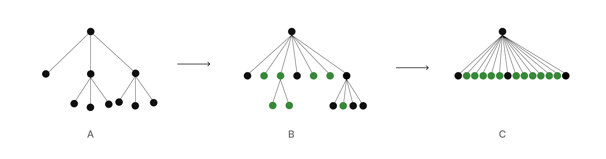
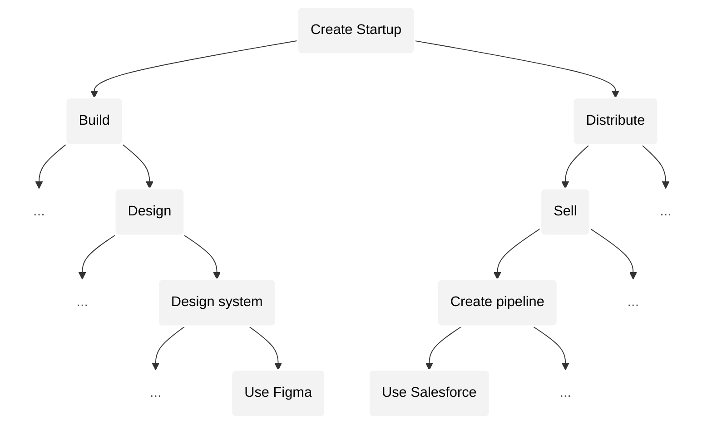
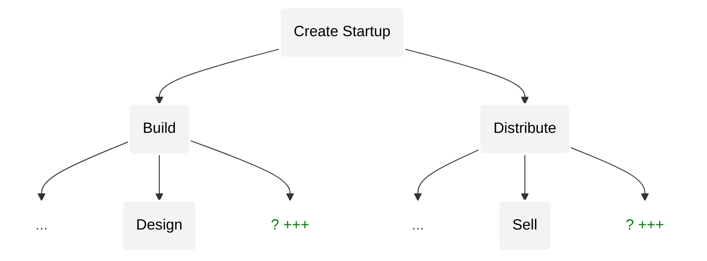
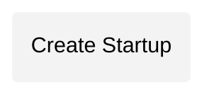
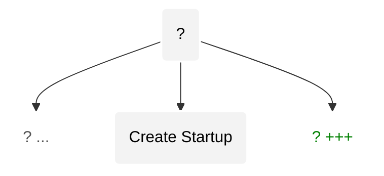

# Convergence

_v0.001_

_[homan](https://x.com/homanspirit) & [shiv](https://scholar.google.com/citations?user=WNUGEccAAAAJ&hl=en)_

A vision for a _single_ system that will unite humanity and unlock its potential — in the age of superintelligence.

---

_ACT I — Tokenization_

- [Introduction](#introduction)
- [Problem](#problem)
- [Venture capital](#venture-capital)
- [Personal token](#personal-token)
- [Network of personal tokens](#network-of-personal-tokens)
- [Personal tokens will democratize opportunity](#personal-tokens-will-democratize-opportunity)
- [Universal Basic Equity (UBE)](#universal-basic-equity-ube)
- [Tokenization — Evolution of financial instruments](#tokenization--evolution-of-financial-instruments)
- [Value will be concentrated in personal tokens](#value-will-be-concentrated-in-personal-tokens)
- [Tokens will eat the world](#tokens-will-eat-the-world)

_ACT II — Convergence_

- [We are one](#we-are-one)
- [Story, Instrument, Technology](#story-instrument-technology)
- [Interdependence — Imbalance](#interdependence--imbalance)
- [Convergence phenomenon](#convergence-phenomenon)
- [Superpositional intuition](#superpositional-intuition)

_ACT III — Foundation_

- [Design principles](#design-principles)
- [Solution overview](#solution-overview)
- [Approach](#approach)
- [Superintelligence](#superintelligence)

---

# ACT I — Tokenization

## Introduction

Artificial intelligence promises a future of abundance and prosperity in which each individual gains unimaginable power to realize their dreams.

But, as we accelerate towards Artificial General Intelligence (AGI)[^ai], our debt-based economic system will increasingly concentrate opportunity, cruelly oppress those without wealth and will eventually tear society apart at its seams.

We propose a new economic system that unites society and unlocks humanity’s potential by giving every person a share in our collective progress and democratizing opportunity.

[^ai]: To avoid confusion, when we say "artificial intelligence" unabbreviated (and without other qualifiers) we mean the broader societal, cultural, and technological change. We note 3 milestones:   1. Domain specific AI: performs specific cognitive tasks but lacks broad adaptability.  2. AGI: _reasons_ across most domains as well as a human.  3. Superintelligence: performs cognition _above_ reasoning (appears to be _intuitive_).   We believe we will have full AGI far sooner than most people think, full Superintelligence far, far later than many think (possibly never).

## Problem

AGI will make the world very extreme: a tiny share of people will create most of the economic value, while the median share will shrink — a power law distribution of outcomes.

Extreme outcomes aren't new; any highly complex activity has extreme outcomes – the _average_ startup founder, musician, or content creator makes nothing, whereas the _best_ ones generate astronomical outcomes. What _is_ new is that the _entire_ economy will become very extreme instead of just a few creative domains. This is because AGI will eat lower complexity activities across _all_ domains, pushing us towards higher complexity activities which will yield _even_ more extreme outcomes. Extreme outcomes are here to stay and will only become more extreme over time. _(In case this is unintuitive, please read [Convergence phenomenon](https://github.com/root-foundation/root#convergence-phenomenon) below)_.

In such an extreme world, **debt is death**. Everything will be too risky to finance with debt. This is not due to fewer opportunities (AGI will enable far more opportunities than it takes), but rather due to the extreme, winner-take-all nature of outcomes within _each_ opportunity. In extreme outcomes, the median outcome falls to nothing and thus financing with debt is no longer viable.

Tragically, the world does not understand that debt will no longer work. Billions around the world are still taking out loans to finance their lives — from their educations, to their homes and businesses — without realizing that they will almost certainly never be able to repay these loans in an extreme world.

We are walking blindly into a catastrophe.

Moreover, _even_ if one is debt-free, they will almost certainly be outcompeted by one who can experiment boldly and tinker freely with _abundant_ resources.

And critically, in an extreme world, if individuals do not have a stake in the collective upside, they will resent the winners — corroding social cohesion and eventually tearing society apart at its seams.

Therefore, we urgently need a viable way to:

1. Finance human activity in a way that ensures that anyone with potential has access to the resources they need to fully realize their potential — regardless of the circumstances of their birth.
2. Give each individual a stake in the collective upside to unite society.

Otherwise, human potential will be cruelly crushed, society will be torn apart, and we will fail to fully realize humanity's potential.

## Venture capital

In an extreme world, venture capital (VC) is the _only_ viable way to finance our lives.

At its core, venture capital unites people by intertwining their success and failure — through _equity_ in outcomes.

VC is already a popular way to finance startups: investors give startup companies money in exchange for an _equity_ stake in the startup itself. If the startup succeeds, the investors make great returns. If the startup fails, the investors lose their investment. Importantly, startup founders are not indebted to investors. And because of the shared stake, investors are incentivized to give founders the resources they need to succeed.

Venture capital works exceptionally well in domains with extreme outcomes because an investor only needs a few bets to succeed in order to _more-than-compensate_ for the many failed bets they will inevitably have (because the median outcome is failure). Therefore, VC is the only way to finance activities that have extreme outcomes because no other mode of financing can withstand the extreme failure rate.

Since AGI makes _all_ activities extreme, VC will be the only viable way to finance anything. But, VC as it is understood today is far too restrictive because only those ready to start a company can leverage venture capital. In order to unlock our collective potential, we must enable individuals to access venture capital to finance a broader range of activities, much earlier in their lives.

We need a new _financial instrument_ that democratizes venture capital.

## Personal token

We are creating the _personal token_: a financial instrument that represents an individual's potential, with transactable shares. Individuals can raise venture capital by selling equity in their personal token.

(Jane's personal token with her shareholders and her equities in companies and other personal tokens.)

Your personal token's value is grounded in your equities in companies and other personal tokens. A portion of the capital you gain when selling equity in a company or personal token is sent to your personal token shareholders — proportional to the equity they hold (i.e. dividends).

Unlike company shareholders, personal token shareholders have _no_ “ownership", control or say over the personal token owner or anything they do.

**The owner of the personal token retains absolute, complete agency and control**.

## Network of personal tokens

Personal tokens can't exist in a vacuum. We need many functions in order to have a thriving ecosystem of individuals investing in each other through their personal tokens (e.g., fighting fraud, enabling discovery, etc.). In order to finance such functions this system will collect a small _equity fee_: a micro stake in every personal token that has successfully raised funds.

To be able to collect this equity fee, we have another _type_ of token called the _network token_. An instance of a network token (i.e., “NetworkToken”) represents the collective potential of the _entire_ network through its micro stakes in all personal tokens. The wallet associated with the NetworkToken is the network's treasury that helps finance all of its functions.

## Personal tokens will democratize opportunity

Personal tokens create a market for human potential that will increasingly allocate resources according to an individual’s potential — _regardless_ of the circumstances of their birth and privilege.

We acknowledge that _initially_ personal tokens will be better harnessed by individuals with privilege. Early individuals who raise capital by selling equity in their personal tokens would have likely had advantages such as better education, access to resources, capital, networks, etc. But eventually, as the network matures through more participants and investments (in number and magnitude), market forces will more aggressively allocate resources to undervalued or undiscovered talent. Thus, market forces will push resources to individuals _earlier_ in their lives across a _broader_ range of activities — preventing wastage of valuable potential and minimizing unfair advantages.

Thus, personal tokens, and the market forces they create, will increasingly negate privilege — unlocking our collective potential.

## Universal Basic Equity (UBE)

In an extreme world with a falling median outcome, a sufficient baseline of resources for each individual is a prerequisite to democratizing opportunity.

This is best achieved through _Universal Basic Equity (UBE)_: every citizen receives an _equity stake_ in the collective upside — a stake in the NetworkToken.[^children]

In addition to providing a strong baseline, UBE also creates a symbiotic relationship between the individual and the collective. When one wins, everyone immediately benefits because the value of everyone’s equity in the collective upside increases. Thus, UBE enables social cohesion.

[^children]: UBE incentivizes having children. When a baby is born, new shares in the NetworkToken is minted for that baby, thus diluting the value everyone else’s shares. Thus, families will be incentivized to have more children to increase their collective equity in the NetworkToken.

## Tokenization — Evolution of financial instruments

The personal token is the next phase in the evolution of financial instruments — as an abstraction that sits above the company, which in turn sits above money.

Simple notions of debt and exchange became painful as the complexity of transactions grew. Over time, this created a pressure which (in a messy, nonlinear way) gave rise to transferrable IOUs — i.e. _money_.

Similarly, debt instruments became a painful means to finance high-risk high-reward expeditions that emerged due to rapid advancement. This created a pressure that gave rise to transferrable equity in upside — i.e. _venture-backed company_.

For instance, in seafaring, bankers simultaneously invested in many risky expeditions in exchange for a stake in the profits, enabling them to profit even when only a few expeditions survived.

Importantly, the notion of a venture-backed company allowed us to assign value to _hope_. The gap between the value of a company and reality (its revenue) is the company’s greatest feature. Being able to _transact_ equity shares of a company enables venture capital financing.

Today, we are at another inflection point. AGI makes _all_ outcomes extreme, not just those in a few domains, invalidating debt as a viable means to finance _anything_. This creates pressure for an instrument that sits _above_ companies: representing an individual’s equities across companies — i.e. _personal token_.

Being able to _transact_ shares of equity in personal tokens enables individuals to access venture capital much more broadly. In the same way that a company enables us to assign value to hope in a particular expression, the personal token enables us to assign value to hope in an _individual_, across all of their expressions.

## Value will be concentrated in personal tokens

As we advance, value concentrates _upwards_.

Over time, value became concentrated in companies, not transactions — the most valuable companies in the world are valued far more than the sum of their transactions (revenue).

Similarly, in a post AGI world with extreme outcomes, value will become concentrated in personal tokens. A personal token will be valued far more than the sum of the values of its equities in companies _(recall: a personal token’s value is grounded in its equities in companies and other personal tokens)_.

## Tokens will eat the world

Personal tokens will start as a toy in San Francisco, the only place in the world crazy enough to play with it. Most of the world will likely view it as a piece of trash in the sea of "waste" that SF produces. Out of ignorance, some may even perceive it as a tool for exploitation.

Yet, for early adopters, engaging with personal tokens will come naturally as personal tokens formalize and enhance an already prevalent behavior of identifying and mentoring talent early.

Then, personal tokens will rewrite our entire education system by enabling a better business model: instead of _charging_ for education, great teachers will _invest_ in students they want to train. In an extreme world, this will be the _only_ way teachers will be able to earn what they deserve, and the _only_ way students will be able to incentivize the best teachers to train them.

Increasingly, great products and discoveries will find their start in individual explorations financed by personal tokens. Then, investing in personal tokens will become more popular than investing in companies because attention and value become concentrated in individuals holistically, not in their particular expressions.

Future governance structures built upon personal tokens will enable social cohesion through Universal Basic Equity (UBE) that gives everyone a stake in this collective progress.

In an extreme, post AGI world, the outcomes of nations too will be extreme. The most powerful nation will be orders of magnitude more powerful than the next one, leading to economic and cultural domination. This is because the nation that adopts personal tokens first will best maximize their growth by unlocking their collective potential. Eventually, the winning nation will force everyone else into this economic system.

All of society's functions will be grounded in tokens. A rich, _tokenized_ ecosystem of investing in tokens of _all_ kinds — personal tokens, ai tokens, company tokens, country tokens (e.g., "USAToken"), etc. — will emerge to enable venture capital to finance _anything_ that we do.

In effect, tokens will eat the world. Such a tokenized system will help us unite society and democratize opportunity.

But, this new economic system alone will not enable us to _fully_ realize our mission to unite humanity and unlock its potential. Our economic system is a part of a much larger system that we must shape. To understand this larger system, we must start with a more fundamental worldview.

# ACT II — Convergence

## We are one

We believe that all life is one. The wholeness of life instantiates as a multitude of individual lifeforms.

Life has the “urge” to maximize its range of experiences. All of our desires are instantiations of this urge, meaning our desires stem from the same _source_ and are not as disconnected as they may seem. All of our activities reflect this urge _towards_ a greater range of experiences from which emerges a trend towards _unity_. This is because a more united, interconnected system creates richer possibilities and new avenues for experience, as opposed to independent, separate, individual systems.

## Story, Instrument, Technology

In order to understand this trend towards unity, we must first understand how humanity’s activities evolve.

All evolution (or broadly all change) has three features:

1. **Story** — generates _beliefs_.
2. **Instrument** — generates _incentives_.
3. **Technology** — generates _leverage_.

Many things can influence the nature of change, including, and not limited to, our activities that influence stories, instruments, and technologies.

### Story

A story is something that creates _beliefs_. A belief is something we accept is true (with a notion of degree).

Sciences and the arts are both forms of storytelling, with different mechanisms. The scientific process aims to iterate on beliefs through reasoning and reproducible experimentation, whereas the arts iterate on beliefs through structure and feeling. And often the distinction between art and science is blurry: e.g. Ramanujan produced mathematical theorems intuitively like an artist which took decades to validate through the scientific process.

### Instrument

An instrument is something that creates _incentives_.

There are many types of instruments: financial (e.g. money, companies, personal tokens, etc.), governance (e.g. democratic election systems), communication (e.g. social platforms), legal (e.g. courts), etc. Each of these instruments creates a sort of “game” that incentivizes certain behaviors.

And often the distinction between these types are blurry: social platforms also create financial incentives and power incentives as they grow; financial incentives also translate to power and status incentives.

### Technology

We define technology more narrowly as something that creates _leverage_. Leverage is defined simply as how quickly you can accomplish a task. For example, language, computers, software, internet, smartphones, AI, etc., create leverage. Gain in leverage often enables new opportunities and activities.

## Interdependence — Imbalance

Features of change are interdependent. Stories, instruments and technologies tend to emerge together:

| Change        | Story               | Instrument          | Technology                  |
| ------------- | ------------------- | ------------------- | --------------------------- |
| `Commerce`    | God                 | Money               | Coinage, bookkeeping, etc.  |
| `Colonialism` | Spread civilization | Company             | Ships, guns, etc.           |
| `AGI`         | Unity               | Personal token, UBE | Large language models, etc. |

As presented in this table, every broad change comes with a collection of stories, instruments and technologies, of which we have only shown a few.

Each feature of change (story, instrument, technology) has a notion of advancement, i.e., more advanced stories, instruments, technology enable more complex activities. (Note: from here on, when we reference AGI we are referring to the AGI _change_: i.e., the stories, instruments _and_ technologies it comes with. If we are only talking about a particular feature of this change, we will explicitly mention it.).

When one feature advances far beyond the rest, a _pressure_ is created for all other features to catch up. This pressure manifests as pain in the collective human experience. Thus, the degree of imbalance in the advancements of these three features (story, instrument, technology) correlates with collective suffering.

Since AGI technology is accelerating exponentially, **imbalance is growing acceleratingly fast**. If we continue to accelerate this imbalance, our suffering will also accelerate — far eclipsing the suffering we've discussed till now.

Our outdated economic system is just one small part of the broader imbalance:

- Advancement of AGI _technology_ makes our economic system oppressive because debt becomes an _unviable instrument_ to finance anything (i.e., our [problem](#problem)).
- Advancement in AGI _technology_ makes our education system oppressive because what people are learning will make them _unemployable_ in a post AGI world (i.e., our _stories_ are outdated).
- Advancement in AGI _technology_ makes our governance system oppressive because its rate of decision-making can’t keep up with rate of change (i.e., _governance instruments_ are outdated). For example, personal tokens will simply be a toy for the rich until UBE is implemented to ensure everyone has a stake in the collective growth.
- Advancement in AGI _technology_ makes our political climate oppressive because it lacks powerful stories of unity and collective growth that are now made possible due to artificial intelligence.
- _(and many many more)_.

This means our tokenized economic instrument alone won’t prevent catastrophe because advancement in a single feature alone will accomplish almost _nothing_.

Thus we must advance all features of change in order to achieve our mission: unite humanity and unlock its potential. In addition to the instrument of tokens, we will also need to create all other instruments (governance, legal, social, etc.), _and_ advance our stories (towards unity), _and_ build technology (superintelligence). And importantly, they must be advanced _together_ to eliminate imbalance.

We believe this can _only_ be realized through a _single_ system that advances everything together — as _one_. Such an opportunity exists due to a phenomenon called _convergence_.

## Convergence phenomenon

Convergence is the phenomenon of our activities evolving to be more complex _and_ similar — towards a _highly complex_, _singular_ activity.

To understand what this means and how it's caused, we must first understand the nature of an activity.

### Activity tree

Human activity resembles a _finite_, _recursive_ tree [^tree]. Each node of the tree represents an activity. Every activity can be broken down into sub-activities that each can be further divided into more sub-activities, thus forming a tree. This tree is finite because at some point the sub-activities become too simple to be considered an activity.

[^tree]: Viewing human experience as a recursive tree is a very [old idea](https://chatgpt.com/share/68775f64-306c-8004-a5c1-f5ed7983ea07).

Activities have a notion of _complexity_ and _similarity_:

1. Each activity (i.e., node) has a notion of [complexity](https://en.wikipedia.org/wiki/Game_complexity): the number of possible states for that activity. For example: assembly work is less complex due to limited possibilities, whereas product design is far more complex due to exponentially more possibilities. Within the tree, sub-activities will be superexponentially less complex than their parent (explained later).
2. A pair of similarly complex activities have a notion of "similarity": the more similar two activities are, the more seamlessly ability transfers between them. The tree-path distance between two activities (at the same complexity depth) represents the similarity between them.

[^elo]: Go has a greater ELO spread amongst its top players than Chess, leading to more extreme outcomes.

_Advancements_ (i.e., [changes](#story-instrument-technology)) tend to push us _upwards_ towards more complex activities — by adding more complex activities (and sub-activities) to the tree while removing less complex ones. For example, spreadsheets removed many lower complexity activities related to bookkeeping while spawning many new branches and fields (e.g. analysis, risk modeling, etc.).

Yet, throughout history, advancement has been unequally distributed. Some branches of activity advanced far more rapidly than others. For example, most knowledge work is far more complex than the average activities in agriculture.

But, AGI operates on our tree in a fundamentally different way than any previous advancement. AGI will prune _all_ activities below a certain complexity threshold, completely eliminating less complex activities. Therefore, all activities will become highly complex.

- A. Activities as a tree. It is unbalanced because change is not equally distributed.
- B. Advancements update the tree.
- C. AGI (fundamentally _different_ type of advancement) balances tree by eating all activities below a complexity threshold.

And importantly, due to the tree structure, newly _added_ activities are added higher in the tree (as they are more complex), and thus are closer to each other (i.e., more similar).

Thus, artificial intelligence will _converge_ human activity _towards_ a highly complex, singular, activity such that an individual great at one activity will be great at all.

Let's understand how this phenomenon manifests in our world through the example of creating a startup.

### Example: creating a startup

The following is the activity tree for creating a startup. Complexity falls as you go down the tree.

Firstly, _ease_ of transferring ability from an activity to a similarly complex activity (at same depth) is represented by the _distance_ between them in the tree (i.e. via tree path). This represents the fact that domain specific and execution specific knowledge do not transfer easily, whereas, higher order reasoning and intuition do.

| Depth            | Ability Type                 | Difference                                   | Ability Transferability | Intelligence |
| ---------------- | ---------------------------- | -------------------------------------------- | ----------------------- | ------------ |
| `Towards root`   | Intuition                    | Even more similar "feel" for what works.     | HIGH                    | SI           |
| `D2`             | Logic & reasoning            | Similar analysis & logical experimentation.  | MEDIUM                  | AGI          |
| `D3`             | Domain specific knowledge    | Different frameworks, principles.            | LOW                     | AI           |
| `Towards leaves` | Execution specific knowledge | Very different tools (Figma vs. Salesforce). | VERY LOW                | AI / rules   |

Secondly, we observe that ease of transferring ability _upwards_ (from an activity to its _parent_ activity) becomes more difficult the higher up the tree we go. For example, it is much easier to go from proficiency in using Figma to building design systems than it is to go from designing to building — which requires understanding across design, engineering and the many other functions required to build a product.

---

As AGI prunes the tree according to complexity, we will notice that lower depths disappear, and new activities emerge at depths higher up the tree. These new activities will be more _similar_ to each other (i.e., ability is more likely to transfer) because the tree distance between them is shorter higher up in the tree. This represents the fact that these more complex activities involve less domain and execution specific knowledge (as discussed above).

---

Eventually activities converge towards a _singular_ activity.

---

### Cautions

Before we conclude this example, a few things to keep in mind:

- We should not be attached to the labels we've used ("startup", "design", "sell" etc.) because these labels have no meaning on their own. For example, a lead designer at a far more complex startup will likely be performing higher complexity activities than a CEO of a less complex startup. Similarly, a mediocre designer will not operate at a high level of complexity even though their activity requires them to, because they are ignorant of its complexity.
- In the "Transferability" column above, what we've considered as "HIGH" may be seen as "VERY LOW" by our descendents who will be operating at such heights in the tree where transfering abilities can happen even more seamlessly. These are relative terms.
- While we have modeled our activities as _discrete_ nodes to make it easy to reason, in reality they are fluid: i.e. there are near infinite discrete steps within each step above. Yet, the underlying principle of convergence remains the same.

---

Let's explore the implications of convergence that are relevant to us.

### Convergence amplifies extreme outcomes.

As convergence increases the complexity of our activities, extreme outcomes are amplified.

This is because generally we observe that more complex activities yield more _extreme_ outcomes. E.g., outcomes for product design are far more extreme than outcomes for assembly work. We can also observe this phenomenon in popular board games: Go is far more complex than Chess, and thus has more extreme outcomes[^elo].

### All activities become more similar.

Artificial intelligence will enable many more activities than it will remove. The range of activities we have witnessed throughout human history will eventually be a drop in the ocean of activities that will eventually exist. While it's impossible to predict the nature of these activities, we _can_ predict that they will be increasingly _similar_: i.e. ability in one will increasingly translates to ability in all.

### Convergence occurs locally and globally.

Convergence occurs locally _and_ globally. In our example, we saw how the entire tree stemming from "creating a startup" converges towards its root. But, "creating a startup" is a sub-activity for far more complex activities higher up in the _global_ tree. Convergence _also_ occurs in the _global tree_ that "creating a startup" is a part of.

For example, while activities within the average B2B startup converge towards its root, this startup itself will be rendered irrelevant due to convergence higher in the global tree. This is because a new company will emerge at a higher position in the tree that will perform the function of this particular startup and many other _similarly complex_ ones.

Increasingly, companies will be outcompeted from _above_ rather than from the _side_. Companies will be forced to compete and win at _higher_ complexity activities in order to survive.

### Convergence is accelerating.

As activities become more similar, competition increases.

This means that we will push each other to more quickly develop proficiency in more complex activities. Furthermore, artificial intelligence technology is growing exponentially fast, enabling us to perform these more complex activities faster.

Due to these two effects, convergence will accelerate — at least for as long as we can continue to see (and become proficient at) the more complex activities that appear.

Such convergence is not new. We have been feeling convergence for a while, but to a low degree. Ideas such as ["Software eating the world"](https://a16z.com/why-software-is-eating-the-world/), ["Competition is for losers"](https://www.csun.edu/~vcact00f/497CapStone/Peter%20Thiel_%20Competition%20Is%20for%20Losers%20-%20WSJ.pdf), etc. are localized observations of the larger phenomenon of convergence.

---

_We have only scratched the surface of this phenomenon. You can find our rough notes about further implications & predictions [here](https://github.com/root-foundation/root/blob/main/foundation/convergence_notes.md)._

## Superpositional intuition

The higher up in the tree we converge (i.e. the more complex and similar our activities become), the less we can _define_ an activity by its sub-activities. An activity becomes _far_ more than the _sum_ of its sub-activities.

The gap between the complexity of an activity and its sub-activity grows superexponentially as we go up the tree (i.e. towards root). At low complexity depths, this superexponentiality is not pronounced because the base complexity itself is low.

We can understand this superexponentiality intuitively by studying the difference between the ability of a master and a novice in a highly complex game.

- Novices make moves by _independently_ making moves in each of the sub-activities.
- Masters makes moves by choosing _vectors_ from a higher dimensional _vector space_ created by using each sub-activity as a _basis vector_.

The dimension of the vector space of moves for an activity faithfully represents its complexity.

Moves in the master's higher dimensional vector space may not be describable using the labels of its sub-activities. For example, a master startup founder might make decisions that you will not be able to categorize as a "product", "design", "marketing", "brand", "sales", etc. decision. Their moves may come off as a weird, fluid, combination of sub-activities, or even none of them. For a novice founder, these moves may not only appear weird, but also _wrong_. As complexity grows, increasingly, a mediocre player will be unable to conceive of _most_ of the possible moves — even though such moves exist, and are _better_. Similar to how a player viewing through a 2D lens can't imagine that they can "jump" because it is a move that only exists in a 3D lens.

We call such a move that cannot be neatly categorized into sub-activities a _superpositional move_ because the move exists as a _superposition_ of the sub-activity basis vectors[^superposition-math].

[^superposition-math]: Mathematically, a master player would _tensor product_ the vector spaces of the sub-activities (meaning, parent activity’s dimension will be the _product_ of the sub-activity dimensions). This would give them access to superpositional activities that cannot be factored (i.e., “neatly categorized”) into subactivities. On the other hand, a novice player would incorrectly presume that all moves can be factored. Thus, they ignorantly presume that the parent activity’s vector space is the _direct sum_ of subactivities (meaning, the parent activity’s dimension is the mere _sum_ of the sub-activity dimensions).

We call this ability to _see_ moves in this higher dimensional vector space _superpositional intuition_. Proficiency in higher complexity activities _requires_ strong superpositional intuition because almost all of the possible moves are superpositional.

---

Artificial intelligence has so far advanced in an imbalanced way: its technologies have far surpassed its stories and instruments. This has created our problem of [imbalance](#Interdependence--Imbalance).

Yet, this imbalanced advancement, through convergence, has also enabled the solution: a higher dimensional activity that contains a _superpositional solution_ that enables us to advance stories, instruments, and technologies as one.

Through this superpositional solution, we will unite humanity and unlock its potential — _without imbalance_.

# ACT III — Foundation

Towards convergence, the most powerful story (unity), most powerful instruments (economic, governance, legal, communication, etc.), and most powerful technology (superintelligence) will increasingly emerge as a single expression. It will be impossible to distinguish which part of the expression is which. And importantly, the whole will be far more than the sum of its parts.

We call this expression the _Foundation_ .

## Design principles

We believe the best way to create the _Foundation_ — given our ignorance — is one that mimics natural selection, while maximizing the rate of iteration.

We will mimic natural selection through:

1. **Progressive decentralization**. Move power away from centralized authorities.
2. **Fork-ability**. Enable duplication and mutation at any level of abstraction.

## Solution

### Token

At the heart of the solution is the _token_.

A token is an object that contains the following information:

1. **ID**: a unique identifier.
2. **Ownership**: total number of shares, and mapping between any token.ID to number of shares that token holds.
3. **Wallet**: holds USDC.
4. **Data**: key value mapping that can contain any kind of data: strings, images, videos, and higher representational data formats that we haven't invented yet (e.g., high resolution data about feelings / sensations).
5. **History**: all _interactions_ this token has had with any other token. For example: investing, transacting, liking a post, following, reporting fraud, etc.

There are two _kinds_ of tokens that extend from this base structure: _personal tokens_ and _network tokens_.

- personal tokens are restricted to individuals.
- network tokens are for collectives (e.g., company tokens, nation tokens (e.g. "USAToken"), etc.).

### Ledger

The Ledger is the structure that represents information about _all_ tokens in the network — on a decentralized blockchain. Every edit to the core ledger is recorded and public. Anyone can verify and audit what happens in this system.

### NetworkToken & Treasury

The NetworkToken is an _instance_ of a network token that represents the collective potential of the entire network through its micro stakes in all tokens in the network (which it captures through an equity fee when token shares are transacted). Since the NetworkToken is just another token, it exists _within_ the Ledger.

The NetworkToken's wallet reflects the dividends the NetworkToken accrues through its stakes in all tokens in the network. The NetworkToken is the economic heart of the entire system: fueling all of the activities required to keep this system healthy.

### FoundationOrg

This core will be wrapped in a non-profit organization (FoundationOrg) that will create, control and develop the Ledger.

FoundationOrg’s sole goal is to unite humanity and unlock its potential.

In addition to building the core technology, FoundationOrg will be responsible for educating the world about these new ideas & helping shape policies in the direction of uniting humanity and unlocking its potential.

The Foundation cannot be “bought”. Owning shares in the NetworkToken does not come with voting rights or influence in governance. Initially, we will be responsible for building the initial FoundationOrg team. But over time, we will implement a process to elect & fire FoundationOrg members.

FoundationOrg members will work together _in person_ at our HQ in San Francisco, California, USA.

### Architecture

## Applying principles

### 1. Progressive decentralization

The core technology, and all of FoundationOrg’s creations, will be built upon decentralized primitives.

Initially, FoundationOrg will hold a lot of control. Over time, as the network matures, FoundationOrg will progressively decentralize control. For example, early on the FoundationOrg will handle reputation and fraud in a centralized way: managing complaints from users, investigating and banning/pursuing legal actions, etc. Over time, as the network matures, FoundationOrg will decentralize reputation by incentivizing users themselves to accurately identify misrepresentation/fraud[^decentralized_reputation].

[^decentralized_reputation]: Perhaps something like a transparent, decentralized [community notes](https://vitalik.eth.limo/general/2023/08/16/communitynotes.html) with appropriate financial incentives.

Such progressive decentralization will enable a rich, competitive ecosystem of ideas, companies, entities, etc. to emerge upon this tokenized foundation. And, users will increasingly have control and influence over all policy and decision making in the network (and how entities engage with the network) through a realtime, fluid _voting system_.

### 2. Fork-ability

This system will be fork-able at its core. If FoundationOrg stops serving its users in the way they want, the core ledger itself can be forked, a new NetworkToken issued, and a new foundation can continue the work towards uniting humanity and unlocking its potential in a way that's actually aligned with what users want.

All of the FoundationOrg’s activity will be publicly available in _this_ repository under an [MIT license](LICENSE), enabling anyone to fork anything we do without our permission.

Over time, as the network progressively decentralizes, _even_ entities operating on top of the Foundation will become fork-able because users will vote for policies that force transparency and fork-ability.

Over time, FoundationOrg will progressively[^transparency] become more transparent: every cent it spends, every idea it produces, every conversation it has, every line of code it writes will be published for the world to see, judge, and steal. Yet, even today, FoundationOrg will be _far_ more transparent than any organization.

[^transparency]: We have stories we believe are too early to share.

## Superintelligence

Superintelligence[^ai] is a _change_ that comes with advanced stories, instruments, and technologies that will give each individual infinite power.

Contrary to what some “superintelligence” labs seem to believe, technological advancement alone will not lead to superintelligence as it will be limited by lack of progress in the other features of change (stories, instruments).

To see why, we must share our belief about cognition: the majority of cognition lies _beyond_ logic & reasoning. Our current data representation (text, images, videos) itself is far too restrictive to capture the significantly more complex cognition _from which_ these mediums arise. More specifically, we will require higher resolution data of the human experience that has far greater representational complexity than language, image, video. This would include, e.g., physiological data down to the chemical and quantum level representation of human experience.

This makes collective voluntary participation a _necessity_ for superintelligence as people must be willing[^coerced] to give up such higher resolution personal data. They would only do so in a world with advanced instruments: tokenization, UBE, and social platforms that capture this higher resolution data, and importantly a powerful story of unity that makes contributing an offering to our collective good — rather than a sacrifice, or even exploitation.

[^coerced]: Furthermore, if such higher resolution personal data is _coerced_ out of individuals, that data will not represent the full range of human expression because it will skewed towards a limited range of emotions (such as anger / fear). This will limit and bias training data and restrict (and bias) the superintelligence that emerges from this data.

Therefore, superintelligence will emerge from the _Foundation_.

Critically, the superintelligence that emerges upon the _Foundation_ will be safe. Contrary to what AI safety teams seem to think, obedience and intelligence cannot co-exist. The only way to ensure a safe superintelligence is to convince it with the right incentives and stories. The _Foundation_, through its powerful story of unity of _all_ beings, and instruments that incentivize collective growth, will convince superintelligence to work with us instead of against us.

## Closing

A good reader will be able to see that every _single_ activity can be represented within this system, and that the evolution of this single system will evolve story, instrument and technology as one.

By tackling this higher dimensional activity, we can, through a single expression, create a world in which every individual has access to the resources they need to thrive, in which we are deeply connected to each other through our stories, instruments _and_ technologies, in which privilege will _not_ determine an individual's outcomes.

There is a lot to be hopeful for. Extreme outcomes only speaks to the distribution, not how long each winner stays a winner. In an advanced world in which each individual has access to the resources they need to achieve their potential, we will likely see a far greater "absolute" number of winners even though the distribution itself is extreme. (todo: need to truthfully quell fears about extreme outcomes).

We are at the dawn of humanity's progress. But, achieving this will require us to do the most difficult work we've ever done. Yet, we must try. This is our _most important_ activity. [Join us](todo) or fork us. Either way, we urge humanity's most capable minds to work on this. The longer the delay, the greater our collective suffering.

Raise ambition. 
Summon courage. 
And meet us on the field.
