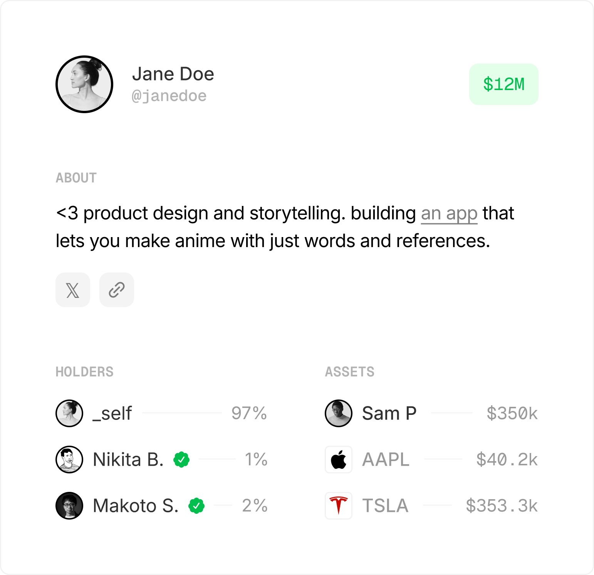
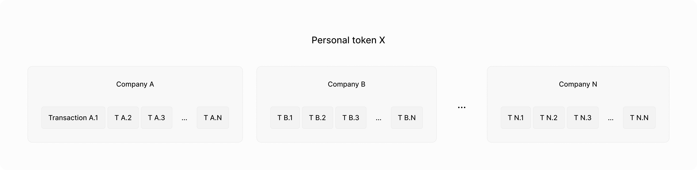
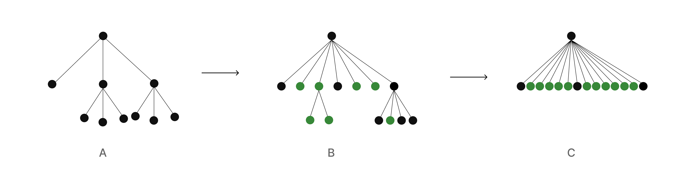
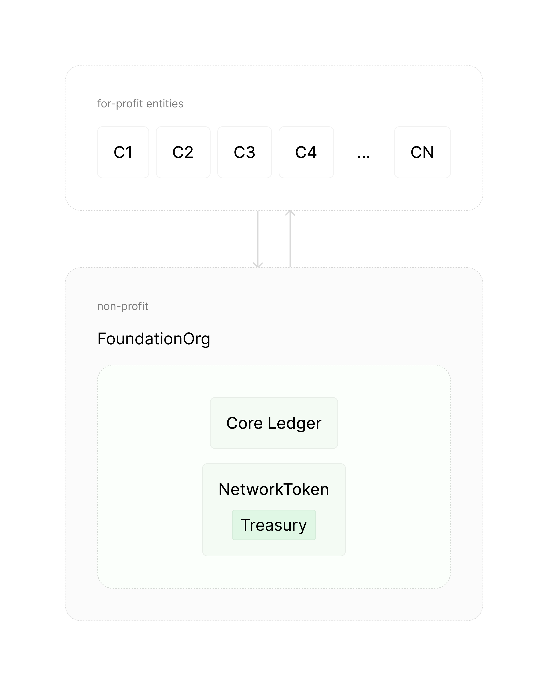

# Root of _all_ activity

_[homan](https://x.com/homanspirit) & [shiv](https://scholar.google.com/citations?user=WNUGEccAAAAJ&hl=en)_

A vision for a _single_ system that will unite humanity and unlock its potential — in the age of superintelligence.

From this _root_, all activity blossoms.

---

_ACT I — Tokenization_

- [Artificial Intelligence](#artificial-intelligence)
- [Problem](#problem)
- [Venture capital](#venture-capital)
- [Personal token](#personal-token)
- [Network of personal tokens](#network-of-personal-tokens)
- [Personal tokens will democratize opportunity](#personal-tokens-will-democratize-opportunity)
- [Universal Basic Equity (UBE)](#universal-basic-equity-ube)
- [Tokenization — Evolution of financial instruments](#tokenization--evolution-of-financial-instruments)
- [Value will be concentrated in personal tokens](#value-will-be-concentrated-in-personal-tokens)
- [Tokens will eat the world](#tokens-will-eat-the-world)

_ACT II — Convergence_

- [We are one](#we-are-one)
- [Story, Instrument, Technology](#story-instrument-technology)
- [Imbalance — Interdependence](#imbalance--interdependence)
- [Convergence](#convergence)

_ACT III — Foundation_

- [Design principles](#design-principles)
- [Solution overview](#solution-overview)
- [Approach](#approach)
- [Superintelligence](#superintelligence)

---

# ACT I — Tokenization

## Artificial Intelligence

Artificial intelligence promises a future of abundance and prosperity by giving each individual unimaginable power to realize their dreams.

But, as we accelerate towards Artificial General Intelligence (AGI)[^0], our debt-based economic will increasingly concentrate opportunity, cruelly oppress those without wealth and will eventually tear society apart at its seams.

We must unlock humanity’s potential _and_ unite society by democratizing opportunity and giving each individual a stake in our collective growth — powered by artificial intelligence.

[^0]: To avoid confusion, we've defined artificial intelligence milestones as follows:   1. AI: performs specific cognitive tasks but lacks broad adaptability.  2. AGI: _reasons_ across most domains as well as a human.  3. Superintelligence: performs cognition _above_ reasoning (appears to be _intuitive_).   We believe we will have full AGI far sooner than most people think, full Superintelligence far, far later than many think (and possibly never).

## Problem

AGI will make the world very extreme: a tiny share of people will create most of the economic value, while the median share will shrink — a power law distribution of outcomes.

Extreme outcomes aren't new; any highly complex activity has extreme outcomes – the _average_ startup founder, musician, or content creator makes nothing, whereas the _best_ ones generate astronomical outcomes. What _is_ new is that the _entire_ economy will become very extreme instead of just a few creative domains. This is because AGI will eat lower complexity activities across _all_ domains, pushing us towards higher complexity activities which will yield _even_ more extreme outcomes. Extreme outcomes are here to stay and will only become more extreme over time. _(In case this is unintuitive, please read [Convergence](https://github.com/root-foundation/root?tab=readme-ov-file#convergence) below)_.

In such an extreme world, **debt is death**. Everything will be too risky to finance with debt. This is not due to fewer opportunities (AGI will enable far more opportunities than it takes), but rather due to the extreme, winner-take-all nature of outcomes within _each_ opportunity. In extreme outcomes, the median outcome falls to nothing and thus financing with debt is no longer viable.

Tragically, the world does not understand that debt will no longer work. Billions around the world are still taking out loans to finance their lives — from their educations, to their homes, to their businesses — without realizing that they will almost certainly never be able to repay them in an extreme world. We are walking blindly into a catastrophe.

Moreover, _even_ if one is debt-free, they will almost certainly be outcompeted by one who can experiment boldly and tinker freely with _abundant_ resources.

And critically, in an extreme world, if individuals do not have a stake in the collective upside, they will resent the winners — corroding social cohesion and eventually tearing society apart at its seams.

Therefore, we urgently need a viable way to:

1. Finance human activity in a way that ensures that anyone with potential has access to the resources they need to fully realize their potential — regardless of the circumstances of their birth.
2. Give each individual a stake in the collective upside to unite society.

Otherwise, human potential will be cruelly crushed, society will be torn apart, and we will fail to fully realize humanity's potential.

## Venture capital

In an extreme world, venture capital (VC) is the _only_ viable way to finance our lives.

At its core, venture capital unites people by intertwining their success and failure.

VC is already a popular way to finance startups: investors give early stage companies money in exchange for a stake in the company itself. If the company succeeds, the investors make great returns. If the company fails, the investors lose their investment. Importantly, startup founders are not indebted to investors, and because of the shared stake, investors are incentivized to give founders the resources they need to succeed.

Venture capital works exceptionally well in domains with extreme outcomes because an investor only needs a few bets to succeed in order to _more-than-compensate_ for the many failed bets they will inevitably have (because the median outcome is failure). Therefore, VC is the only way to finance activities that have extreme outcomes, as no other mode of financing can withstand the extreme failure rate.

Since AGI makes _all_ activities extreme, VC will be the only viable way to finance anything. But, VC as it is understood today is far too restrictive because only those ready to start a company can leverage venture capital. In order to unlock our collective potential, we must enable individuals to access venture capital to finance a broader range of activities _and_ much earlier in their lives.

We need a new financial instrument that democratizes venture capital.

## Personal token

We are creating the _personal token_: a financial instrument that represents an individual's potential, with transactable shares. Individuals can raise venture capital by selling equity in their personal token.

(Jane's personal token with her shareholders and her equities in companies and other personal tokens.)

Your personal token's value is grounded in your equities in companies and other personal tokens. A portion of the capital you gain when selling equity in a company or personal token is sent to your personal token shareholders — proportional to the equity they hold (i.e. dividends).

Unlike company shareholders, personal token shareholders have _no_ “ownership” or control over anything the personal token owner does. **The owner of the personal token retains absolute, complete agency**.

## Network of personal tokens

Personal tokens can't exist in a vacuum. We need many functions in order to have a thriving ecosystem of individuals investing in each other through their personal tokens (e.g., fighting fraud, enabling discovery, etc.). In order to finance such functions this system will collect a small _equity fee_: a micro stake in every personal token that has successfully raised funds.

To be able to collect this equity fee, we have another _type_ of token called the _network token_. An instance of a network token (“NetworkToken”) represents the collective potential of the _entire_ network through its micro stakes in all personal tokens. The wallet associated with the NetworkToken is the network's treasury that helps finance all of its functions.

## Personal tokens will democratize opportunity

Personal tokens create a market for human potential that will increasingly allocate resources according to an individual’s potential — _regardless_ of the circumstances of their birth and privilege.

We acknowledge that _initially_ personal tokens will be better harnessed by individuals with privilege. Early individuals who raise capital by selling equity in their personal tokens would have likely had advantages such as better education, access to resources, capital, networks, etc. But eventually, as the network matures through more participants and investments (in number and magnitude), market forces will more aggressively allocate resources to undervalued or undiscovered talent. Thus, market forces will push resources to individuals _earlier_ in their lives across a _broader_ range of activities — preventing wastage of valuable potential and minimizing unfair advantages.

Thus, personal tokens, and the market forces they create, will increasingly negate privilege — unlocking our collective potential.

## Universal Basic Equity (UBE)

In an extreme world with a falling median outcome, a sufficient baseline of resources for each individual is a prerequisite to democratize opportunity. This is best achieved through _Universal Basic Equity (UBE)_: each citizen receives an _equity stake_ in the collective upside (i.e. stake in NetworkToken).[^1]

In addition to providing a strong baseline, UBE also creates a symbiotic relationship between the individual and the collective. When one wins, everyone immediately benefits because the value of one’s equity in the collective upside increases. Thus, UBE enables social cohesion.

## Tokenization — Evolution of financial instruments

The personal token is the next phase in the evolution of financial instruments — as an abstraction that sits above the company, which in turn sits above money.

Simple notions of debt and exchange became painful as the complexity of transactions grew. Over time, this created a pressure which (in a messy, nonlinear way) gave rise to transferrable IOUs — i.e. _money_.

Similarly, debt instruments became a painful means to finance high-risk high-reward expeditions that emerged due to rapid growth in technology and ambition. This created a pressure that gave rise to transferrable equity in upside — i.e. _venture-backed company_.

For instance, in seafaring, bankers simultaneously invested in many expeditions in exchange for a piece of the profits, enabling them to profit even when only a few survived.

Importantly, the notion of a venture-backed company allowed us to assign value to hope. The gap between the value of a company and reality (its revenue) is the company’s greatest feature. Being able to _transact_ shares of equity in this instrument enables venture capital financing.

Today, we are at another inflection point. AGI makes _all_ outcomes extreme, not just those in a few creative domains, invalidating debt as a viable means to finance anything. This creates pressure for an instrument that sits _above_ companies: representing an individual’s equities across companies — i.e. _personal token_.

Being able to _transact_ shares of equity in personal tokens enables individuals to access venture capital much more broadly. In the same way that a company enables us to assign value to hope in a particular expression, the personal token enables us to assign value to hope in an _individual_, across all of their expressions.

## Value will be concentrated in personal tokens

Concentration of value moves _upwards_.

Over time, value became concentrated in companies, not transactions. We can observe this by seeing how the most valuable companies in the world are valued far more than the sum of their transactions (revenue).

Similarly, in a post AGI world with extreme outcomes, value will become concentrated in personal tokens. A personal token will be valued far more than the sum of the values of its equities in companies _(recall: a personal token’s value is grounded in its equities in companies and other personal tokens)_.

## Tokens will eat the world

Personal tokens will start as a toy in San Francisco, the only place in the world crazy enough to play with it. Most of the world will likely view it as a piece of trash in the sea of "waste" that SF produces. Out of ignorance, some may even perceive it as a tool for exploitation.

Yet, for early adopters, engaging with personal tokens will come naturally as personal tokens formalize and enhance an already prevalent behavior of identifying and mentoring talent early.

Then, personal tokens will rewrite our entire education system by enabling a better business model: instead of _charging_ for education, great teachers will _invest_ in students they want to train. In an extreme world, this will be the _only_ way teachers will be able to earn what they deserve, and the _only_ way students will be able to incentivize the best teachers to train them.

Increasingly, great products and discoveries would find their start in individual explorations financed by personal tokens. Then, investing in personal tokens will become more popular than investing in companies because attention and value becomes concentrated in individuals holistically, not individual expressions.

Future governance structures built upon personal tokens will enable social cohesion through Universal Basic Equity (UBE) that gives everyone a stake in this collective progress.

In an extreme, post AGI world, the outcomes of nations too will be extreme. The most powerful nation will be orders of magnitude more powerful than the next one, leading to a near absolute economic and cultural domination. This is because the nation that adopts personal tokens first will best maximize their growth by unlocking their collective potential. Eventually, the winning nation will force everyone else into this economic system.

A new _tokenized_ economic system will emerge upon personal tokens. All investing will happen within this system. From the _personal token_, we can derive: ai tokens, human tokens, etc. Similarly, from the _network token_, we can derive: company tokens, country tokens (e.g. “USAToken”) and various other sub-network tokens. A rich ecosystem of products and services will emerge upon this tokenized framework.

In effect, tokens will eat the world, unite humanity through UBE, and unlock its potential by democratizing opportunity.

But, this new economic system alone will not enable us to fulfill our mission to unite humanity and unlock its potential. Our economic system is a part of a much larger system that we must shape in order to be able to achieve our mission. In order to understand this larger system, we must start with a more fundamental worldview.

# ACT II — Convergence

## We are one

We believe that all life is one. The wholeness of life instantiates as a multitude of individual lifeforms.

Life has the “urge” to maximize its range of experiences. All of our desires are instantiations of this urge, meaning our desires stem from the same _source_ and are not as disconnected as they may seem. All of our activities reflect this urge _towards_ a greater range of experiences from which emerges a trend towards _unity_. This is because a more united, interconnected system creates richer possibilities and new avenues for experience, as opposed to independent, separate, individual systems.

## Story, Instrument, Technology

Features of every change can be categorized into:

1. **Story** — generates _beliefs_.
2. **Instrument** — generates _incentives_.
3. **Technology** — generates _leverage_.

### Story

A story is something that creates _beliefs_. A belief is something we accept is true (with a notion of degree).

Sciences and the arts are both forms of storytelling, with different mechanisms. The scientific process aims to iterate on beliefs through reasoning and reproducible experimentation, whereas the arts iterate on beliefs through structure and feeling. And often the distinction between art and science is blurry: e.g. Ramanujan produced mathematical theorems intuitively like an artist which took decades to validate through the scientific process.

### Instrument

An instrument is something that creates _incentives_.

There are many types of instruments: financial (e.g. money, companies, personal tokens, etc.), governance (e.g. democratic election systems), communication (e.g. social platforms), legal (e.g. courts), etc. Each of these instruments creates a sort of “game” that incentivizes certain behaviors.

And often the distinction between these types are blurry: social platforms also create financial incentives and power incentives as they grow; financial incentives also translate to power and status incentives.

### Technology

We define technology more narrowly as something that creates _leverage_. Leverage is defined simply as how quickly you can accomplish a task. For example, language, computer, software, internet, smartphones, AI, etc., create leverage. Gain in leverage often enables new opportunities and activities.

## Imbalance — Interdependence

Features of change are interdependent. Stories, instruments and technologies tend to emerge together:

| Change        | Story               | Instrument     | Technology                  |
| ------------- | ------------------- | -------------- | --------------------------- |
| `Commerce`    | God                 | Money          | Coinage, bookkeeping, etc.  |
| `Colonialism` | Spread civilization | Company        | Ships, guns, etc.           |
| `AGI`         | Unity               | Personal token | Large language models, etc. |

Each feature of change (story, instrument, technology) has a notion of advancement, i.e., more advanced stories, instruments, technology enable more complex activities.

When one feature advances far beyond the rest, a _pressure_ is created for all other features to catch up. This pressure manifests as pain in the collective human experience. Thus, the degree of imbalance in the advancements of these three features, correlates with collective suffering.

We have already explored our current imbalance earlier: advancement of AGI technology makes our economic system incredibly oppressive because debt will be an _unviable instrument_ to finance anything. Similarly, advancement in AGI technology makes our current education incredibly oppressive because most of the stories that people are learning and believing will render them _unemployable_ in a post AGI world. Moreover, advancement in AGI technology makes our current governance system oppressive because the rate of government decision making can’t keep up with the rate of change, thus any policy reliefs will increasingly come far too late.

Since AGI technology is accelerating exponentially, **imbalance is growing acceleratingly fast**. If we continue to accelerate in such an unbalanced manner, our suffering will also grow exponentially — far eclipsing the suffering we are already experiencing due to the current imbalance.

This means that advancing our economic system through personal tokens alone won’t prevent catastrophe because advancement in a single feature alone will accomplish almost _nothing_. For example, without an advancement in our governance instruments, personal tokens will simply be a toy for the rich, as UBE cannot be implemented as it needs to be to give everyone a stake in the collective growth.

Thus we must advance all features of change in order to achieve our mission: unite humanity and unlock its potential. In addition to the instrument of tokens, we will also need to create all other instruments (governance, legal, social, etc.), _and_ advance our stories (towards unity), _and_ build technology (superintelligence).

We believe this can _only_ be realized through a _single_ system.

## Convergence

As AGI advances, all valuable human activities _converge_ towards a _singular_ activity. Therefore, a single system will enable all valuable activities due to their same-ness, thus acting as the _Foundation_ for all valuable activity.

To justify this vision, let’s first understand the nature of human activity, specifically objectively valuable activity.

Activity resembles a recursive tree structure[^2]. Each node of the tree represents an activity. Every activity can be broken down into sub-activities that each can be further divided into more sub-activities, thus forming a tree. Activities that are closer (via the tree path) are more similar: skill in one is more likely to translate to skill in the other.

Each activity (i.e., node) has a notion of [game complexity](https://en.wikipedia.org/wiki/Game_complexity): the number of possible states for that activity. For example: assembly work is less complex due to limited possibilities, whereas product design is far more complex due to exponentially more possibilities. Within the tree, sub-activities will have exponentially lesser complexity than their parent, because the complexity of an activity is _at least_ as much as the sum of complexity of all of its descendents (which themselves scale exponentially with depth).

We observe that more complex activities yield more extreme outcomes. E.g., outcomes for product design are far more extreme than outcomes for assembly work. Similarly, in popular board games, Go is far more complex than Chess, and thus Go has far more extreme outcomes than Chess[^3]. In some cases, even if an activity will eventually yield extreme outcomes, if leverage is low (it takes a long time to make each move), we may not notice extreme outcomes until much later.

Change[^4] is a process that _updates_ the tree by:

1. pruning low-complexity activities.
2. adding new activities and sub-activities.

Examples:

1. Pruning — AlphaFold now predicts protein structures with near‑experimental accuracy, eliminating much of the labor‑intensive homology modeling and wet‑lab screening that structural biologists once performed routinely.
2. Adding — CRISPR–Cas9 gene editing unlocked entirely new branches such as base editing, prime editing, and in‑vivo gene therapies, spawning fresh research niches, companies, etc.

AGI, updates the tree in a fundamentally different way by pruning _all_ activities below a certain complexity threshold, balancing the tree. When we say AGI here, we mean the _change_: i.e. all of the stories, instruments _and_ technologies associated with AGI, not merely the technological aspects (LLMs, etc.).

- A. Activities as a tree with falling complexity.
- B. Normal change updates the tree in an unbalanced way.
- C. AGI (fundamentally different change) balances tree by eating all activities below a complexity threshold.

Thus, as AGI advances, activity is pushed _upwards_ towards a _larger range_ of more complex activity, that are more _similar_ to each other.

As activities converge upwards, they will become more similar and the boundaries between them will dissolve. Thus, as AGI advances, it becomes more likely that an individual great at one activity, is great at all of them.

The most valuable stories, instruments and technologies will increasingly emerge as part of _one expression_. We can already notice this phenomenon in its earliest stages: startups are becoming a confluence of artistic expression, political statements, storytelling engines, instruments and technologies. It’s becoming more difficult to call a startup a “technology company” because it has become something far more.

So far, we’ve assumed our activities are objectively valuable. We expect that eventually every activity—including those we consider subjective—will be valued in objective terms. Thus, _all_ activity converges towards a _singular_ activity[^5] that will be enabled by a _single_ system — the _Foundation_.

# ACT III — Foundation

At convergence, the most powerful story (unity), most powerful instruments (economic, governance, legal, communication, etc.), and most powerful technology (superintelligence) will emerge as one expression. It will be impossible to distinguish which “part” of the expression is the story, instrument or technology.

The _Foundation_ will be this one expression that will fully unite humanity and unlock its potential.

## Design principles

We believe the best way to create the _Foundation_ — given our ignorance — is one that mimics natural selection, while maximizing the rate of iteration.

We will mimic natural selection through:

1. **Competition**. Encourage fair competition and ease of participation.
2. **Progressive decentralization**. Move power from centralized authorities to individuals.
3. **Fork-ability**. Enable duplication and mutation at any level of abstraction.
4. **Transparency**. No secrets. Any idea should be available to steal & judge at its earliest stages.

## Solution overview

### Core

At the core of the Foundation is:

1. Core ledger
2. NetworkToken
3. Treasury (wallet of the NetworkToken).

The core ledger associates each individual with data. In the case of personal tokens, this data would be equities in companies and other personal tokens. In the case of social platforms, this data would be the content that users publish, etc.

The NetworkToken represents the collective potential of the entire network through its micro stakes in all personal tokens in the network (which it captures as a participation fee). The treasury reflects the dividends the NetworkToken accrues through its stakes in all personal tokens in the network. The NetworkToken is the economic heart of the entire system: fueling activities in all categories: stories, instruments, and technologies.

### FoundationOrg

This core will be wrapped in a non-profit organization (FoundationOrg) that will own and control the core ledger, NetworkToken and its treasury. FoundationOrg’s sole goal is to unite humanity and unlock its potential. FoundationOrg will operate on long-term timescales and goals. It is also responsible for the development of this core underlying technology. In addition to technology, FoundationOrg is also responsible for educating the world about these new ideas & helping shape policy.

The Foundation cannot be “bought”. Owning shares in the NetworkToken does not come with voting rights or influence in governance. Initially, we will be responsible for building the initial FoundationOrg team. But over time, we will implement a process to elect & fire FoundationOrg members.

FoundationOrg members will collaborate _in person_ at our HQ in San Francisco, California, USA.

### Competition

To encourage competition, FoundationOrg will enable and encourage many for-profit entities to operate on _top_ of it to create a rich ecosystem of products and services that engage with the core layer.

When launching any new category, FoundationOrg will also create the FirstCompany for that category to kick things off. For example, for personal tokens, the FirstCompany will focus on ensuring legal compliance and fraud-mitigation to enable users to participate seamlessly. The FirstCompany will also admit users into the network in a selective & tiered manner, build the clients (web & mobile apps) used to engage with personal tokens on chain, enable discovery, and whatever else it takes to drive usage. The FirstCompany will operate like a lean, hungry startup.

### Checks and balances

Initially, FoundationOrg and the FirstCompany will act seemingly as one because they both want the same exact thing: bringing personal tokens to the world as quickly as possible. Over time, there will be a growing tension between FoundationOrg & the FirstCompany. FoundationOrg will create opportunities for other companies to come and build on top of the network — that may even directly compete with the FirstCompany — to cultivate healthy competition to ensure a rich ecosystem of products and services. The only advantage the FirstCompany has is being first. FoundationOrg will ensure that users are able to switch between various products and services built upon it.

The incentive structure of a company doesn't allow it to remain relevant for centuries. Sooner or later, the FirstCompany will be outcompeted on all of its functions. New companies will form and die in their efforts to serve the growing changing needs of users. FoundationOrg, on the other hand, is designed to last.

### Progressive decentralization

The core technology, and all of FoundationOrg’s creations, will be built upon decentralized primitives. Thus, we are fundamentally set up to progressively decentralize power.

In the early stages of any category, FoundationOrg and FirstCompany will control a lot of the power. Over time, as the category matures, FoundationOrg will progressively decentralize control. For example, in the context of personal tokens, early on the FoundationOrg / FirstCompany will handle reputation and fraud in a centralized way: managing complaints from users, investigating and banning / pursuing legal actions, etc. Over time, as the personal token ecosystem matures, FoundationOrg will decentralize reputation by incentivizing users themselves to accurately identify misrepresentation / fraud[^6].

Individuals will have complete power over their data and can control access (visibility and otherwise). This will be ensured at the technical level.

### Forkability

If FoundationOrg goes insane, the core ledger itself can be forked, a new NetworkToken issued, and a new foundation can continue the work towards uniting humanity and unlocking its potential in a way that's actually aligned with reality.

All of the FoundationOrg’s activity will be publicly available in _this_ repository under an [MIT license](LICENSE), enabling anyone to fork anything we do without our permission.

### Transparency

Technologically, the system is transparent. Every edit to the core ledger is recorded and public. Anyone can verify and audit what happens in this system.

Culturally, FoundationOrg will operate transparently: every cent it spends, every idea it produces, every conversation it has, every line of code it writes will be published for the world to see, judge, and steal. FoundationOrg will hold no secrets.

## Approach

We will start with personal tokens, and the new economic system upon it. Then, we will implement governance instruments that have UBI + UBE at their core to create a symbiotic relationship between the individual and the collective to enable us to grow _together_. There are many other stories and instruments we will need to implement. We will share these plans when the time is right.

Finally, upon this Foundation, we will converge towards _superintelligence_.

## Superintelligence

Superintelligence is a _change_ that comes with advanced stories, instruments, and technologies.

Contrary to what some “superintelligence” labs seem to believe, technological advancement alone will not lead to superintelligence as it will be limited by lack of progress in the other features of change (stories, instruments).

To see why, we must share our belief about cognition: the majority of cognition lies _beyond_ logic & reasoning. Our current data representation (text, images, videos) itself is far too restrictive to capture the significantly more complex cognition _from which_ these mediums arise. More specifically, we will require higher resolution data of the human experience that has far greater representational complexity than language, image, video. This would include, e.g., physiological data down to the chemical and quantum level representation of human experience.

To clarify, we define AGI technology as eating reasoning, and superintelligence technology as progressively eating cognition above reasoning.

This makes collective voluntary participation a necessity for superintelligence as people must be willing to give up such higher resolution personal data. They would only do so in a world with advanced instruments: tokenization, UBE, and social platforms that capture this higher resolution data, and importantly a powerful story of unity that makes contributing an offering to our collective good — rather than a sacrifice, or even exploitation.

Furthermore, if such personal data is _coerced_ out of individuals, that data will not represent the full range of human expression thus limiting and biasing training data. This will restrict and bias the superintelligence that emerges from this data.

Therefore, the _Foundation_ will be the only platform where superintelligence can emerge.

Critically, the superintelligence that emerges upon the _Foundation_ will be safe. Contrary to what AI safety teams seem to think, obedience and intelligence cannot co-exist. The only way to ensure a safe superintelligence is to convince it with the right incentives and stories. The _Foundation_, through its powerful story of unity of _all_ beings, and instruments that incentivize collective growth, will convince superintelligence to work with us instead of against us.

## Closing

[^1]: When a baby is born, new shares in the NetworkToken is minted for that baby, thus diluting the everyone else’s equity. As the value of the NetworkToken keeps growing, individual families will be incentivized to have more children to increase their fraction in the NetworkToken.
[^2]: Seeing human experience as a recursive tree is a very [old concept](https://chatgpt.com/share/68775f64-306c-8004-a5c1-f5ed7983ea07).
[^3]: Go has a greater ELO spread amongst its top players than Chess, leading to far more [extreme outcomes](https://chatgpt.com/share/68776b0a-d10c-8004-b6d3-b0fa17344411).
[^4]: The current state of activities (among other things not represented in this model) causes subsequent change.
[^5]: This singular activity is best described as "seeking truth" — a story for another time.
[^6]: Perhaps something like an transparent, decentralized [community notes](https://vitalik.eth.limo/general/2023/08/16/communitynotes.html) with appropriate financial incentives.
