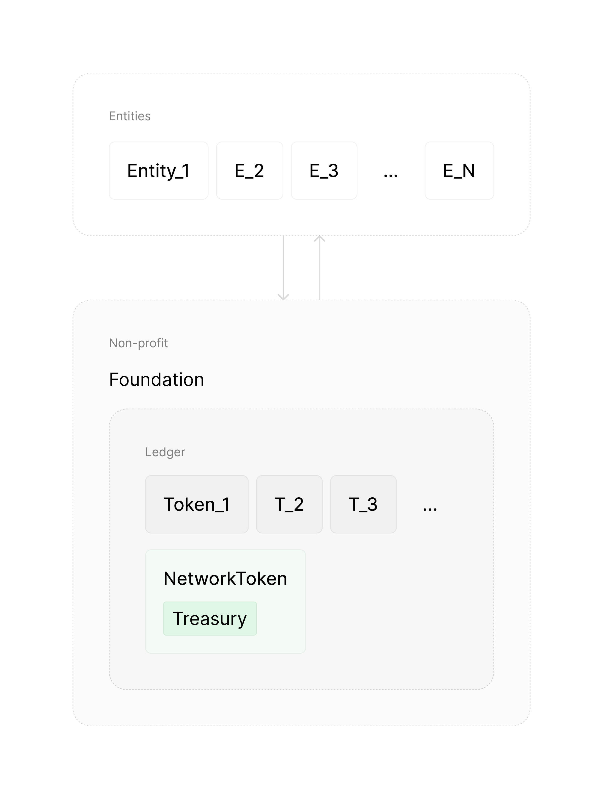

# Root

_[homan](https://x.com/homanspirit) & [shiv](https://scholar.google.com/citations?user=WNUGEccAAAAJ&hl=en)_

---

RootNet is a network that connects people socially _and_ financially. Users own their data, invest in each other's ideas and potential, and increasingly control how the network functions and evolves.

RootNet's mission is to unite humanity and unlock our collective potential in the age of intelligence — by giving each person a stake in our collective success and by democratizing opportunity.

In this essay we explore why we will _need_ RootNet to organize humanity to take advantage of artificial intelligence, our vision of the future, and how we will build it.

---

Artificial intelligence promises a future of abundance and prosperity in which each individual has unimaginable power to realize their dreams.

But, we're far from _organizing_ ourselves in a way that enables us to take advantage of artificial intelligence to achieve prosperity. In fact, on top of our current economic and governance systems, artificial intelligence is poised to concentrate opportunity and divide society.

To see why, we must first understand how artificial intelligence will change our world.

---

#### A. How AI will change our world
1. [Activity](#activity)
2. [Complexity of an activity](#complexity-of-an-activity)
3. [Example: creating a company](#example-creating-a-company)
4. [Similarity between activities](#similarity-between-activities)
5. [AGI eats activities and enables new ones.](#agi-eats-activities-and-enables-new-ones)
6. [Local vs. global convergence](#local-vs-global-convergence)
7. [Predictions](#predictions)
8. [Peak outcome grows superexponentially](#1-peak-outcome-grows-superexponentially)
9. [Competition grows at least exponentially](#2-competition-grows-at-least-exponentially)
10. [Outcomes superexponentially become more extreme across the board](#3-outcomes-superexponentially-become-more-extreme-across-the-board)
11. [Number of economically viable activities grows superexponentially.](#4-number-of-economically-viable-activities-grows-superexponentially)
12. [Rate of displacement of winners accelerates.](#5-rate-of-displacement-of-winners-accelerates)
13. [Absolute number of winners grows at least exponentially.](#6-absolute-number-of-winners-grows-at-least-exponentially)
14. [AGI will expand humanity's horizon](#agi-will-expand-humanitys-horizon)

#### B. Unlocking our potential
15. [Problem](#problem)
16. [Venture capital](#venture-capital)
17. [Personal token](#personal-token)
18. [Money → Company → Personal Token](#money---company---personal-token)
19. [Value will be concentrated in personal tokens](#value-will-be-concentrated-in-personal-tokens)
20. [Personal tokens will democratize opportunity](#personal-tokens-will-democratize-opportunity)
21. [The network](#the-network)
22. [Universal Basic Equity (UBE)](#universal-basic-equity-ube)
23. [Tokens will eat the world](#tokens-will-eat-the-world)
24. [Imbalance](#imbalance)
25. [RootNet](#rootnet)
26. [Design principles](#design-principles)
27. [Solution](#solution)
28. [Applying principles](#applying-principles)
29. [Legal grounding](#legal-grounding)
30. [Superintelligence](#superintelligence)

---

# A. How AI will change our world

When we ask how AI will change our world, what we're really asking is how it changes the nature of our _activities_: what will we will find valuable to work on, and how we work on them.

## Activity

Let's start with understanding the nature of an activity itself through an example: "drive car".

Bob is a beginner driver who breaks down the activity of driving a car into _sub-activities_: turn it on, steer, accelerate, change gear, check the mirror, etc.

If a sub-activity is simple enough to do it, Bob just does it. If it's too complex, Bob breaks that sub-activity down further into more sub-activities. For example, Bob breaks "change gear" down into remembering the gear pattern, pressing down the clutch, moving the gear handle etc.

For Bob, the activity of driving a car is represented as a _recursive tree with falling complexity_: i.e., parent activities are more complex than sub-activities. We can think of [complexity](https://en.wikipedia.org/wiki/Game_complexity) as the number of possibilities (or _moves_) within an activity.

A _leaf_ activity (at the bottom) has a complexity that _can_ be tackled without breaking down into more sub-activities. The root is the activity you _want_ to tackle. And importantly, this _difference_ between the complexity of the activity you _want_ to tackle and the complexity of what you _can_ tackle (without breaking down further) is what _causes_ the tree to be constructed.

## Complexity of an activity

At first glance, it's tempting to consider the complexity of the parent activity just the _sum_ of complexities of its sub-activities. This feels natural because of course the parent activity contains the moves of the sub-activities, otherwise sub-activities wouldn't be _sub_ activities.

But, in reality, we see that the parent activity actually contains many moves that _can't_ be categorized neatly into these sub-activities.

For example, when Alice, an expert driver, drives a car, she fluidly makes many moves that don't treat those moves as separate sub-activities. For example, she may glance at the mirror while changing gears while turning the steering wheel while skipping to the next song in her music player. Alice has no need to break the activity of driving a car into sub-activities because she can handle its complexity.

We can also see this in the context of startups: a great founder makes moves that can't neatly be categorized into product, design, engineering, brand, marketing, etc. Their moves exist in a fluid _space_ that contains exponentially more possibilities than the possibilities in any sub-activity.

This means that each activity is _exponentially_ more complex than its sub-activities, so complexity increases _superexponentially_ as we climb the tree. In other words, the space of possible moves doesn’t just grow as we go up the tree, it _accelerates_.

## Example: creating a company

Now let's take a more relevant example: creating a company that wants to, say, automate agriculture with robots.

This root activity is broken into _sub-activities_:

1. Build product
2. Distribute
3. Raise money
4. Hire
5. ... etc.

And these sub-activities are broken down even further. Build product may have the following sub-activities:

1. Craft spec
2. Design robot
3. Engineer prototype
4. ... etc.

This process of breaking down goes on until _leaves_ such as:

1. Write a specific algorithm.
2. Design component in Figma.
3. ... etc.

We break an activity into sub-activities when we can't tackle it as a whole. This can happen because we lack skill to perform it as a whole as we saw with how a beginner driver can't just "drive". We may also be forced to break an activity into sub-activities due to lack of tools. For example, a great filmmaker who already knows what they want to create may still have to break it down into sub-activities to _implement_ it: e.g., animation, etc. because they lack the tools or resources to abstract that sub-activity away.

## Similarity between activities

The lower you go in the tree, the more we have broken the root activity further and further. Each _break_ creates a separation or difference. This means the further down we go, the more the differences compound — i.e., the further away activities are from their common ancestor, the more different they become.

Which is why when we compare two activities further down in our tree, we will find that they are less similar — i.e., ability transfers less easily across them. The higher up we go, ability transfers more easily between activities because they are closer to their common ancestor (i.e., shorter tree path).

In our example above, "Build product" and "Distribute" are more similar than their respective leaves of their sub-trees: "Design component in Figma" vs. "Set up a sales pipeline in Salesforce". The high level reasoning and intuition required to effectively break down "Build product" and "Distribute" into sub-activities and correctly prioritize them is more _similar_ than the domain specific knowledge you need to operate two different tools.

## AGI eats activities and enables new ones.

We can think of AGI as a advancement that _eats_ activities below a certain complexity threshold — *across the board*. In other words, AGI will eat low complexity activities in _any_ domain: design, product, music, art, engineering, law, etc. It distinguishes by _complexity_, not "domain" or any other form of distinctions that we've created between different kinds of work.

In our example, as AGI advances, it will eat activities lower in the tree: starting at the leaves (e.g., "Design component in Figma", "Write a specific algorithm", etc.) and work upwards.

As this happens, we change the way we break activities into sub-activities — i.e., changing our tree. Therefore, we can also see new sub-activities that have been enabled (that we previously couldn't do). For example, In our company, a new activity (and role) could be managing AI agents that will do to the lower complexity work that we previously had to do ourselves using domain specific tools.

**Thus, As AGI continues to push us upwards, it will _converge_ our activities (and thus our attention) towards our _root_ — a _highly complex_, _singular_ activity.**

## Local vs. global convergence

Our activity (creating an agriculture robotics company) is a sub-activity within a larger activity tree that is rooted in creating _general_ robotics company which contains all the possibilities of our agriculture robotics company along with many many more possibilities. And this larger activity tree itself is a part of a much larger _global_ activity tree: i.e, one that contains all of humanity's activities.

While convergence happens locally: towards the root of our company, it also happens globally. AGI enables greater (and faster) progress higher above the tree. This means that progress in a more complex activity higher in the tree _will make our entire activity irrelevant_ in the same way that AGI _made our local leaves irrelevant_.

From this understanding of how AGI impacts our activities, we can predict what a post AGI world will look like.

## Predictions

As artificial intelligence advances towards and beyond AGI:

1. Peak outcome grows superexponentially.
2. Competition grows at least exponentially.
3. Outcomes superexponentially become more extreme across the board.
4. Number of economically viable activities grows superexponentially.
5. Rate of displacement of winners accelerates at least exponentially.
6. Absolute number of winners grows at least exponentially.

## 1. Peak outcome grows superexponentially.

We value an activity proportional to the possibilities it enables — i.e., proportional to its _complexity_.

Building Youtube is far more valuable than building a niche, genre-specific, video platform because Youtube captures far more possibilities. Similarly, building a general robotics company that can work for many domains is far more valuable than building a domain specific one because it enables far more possibilities.

Since complexity grows superexponentially as we go up the tree, so will the peak value that can be created (i.e., the peak _outcome_).

## 2. Competition grows at least exponentially.

We have already seen that activities become more similar the higher up we go. Since ability transfers more easily across them, so does competition.

Furthermore, due to better training and resources, there will be many more people capable of competing at more complex activities, amplifying competition further.

## 3. Outcomes superexponentially become more extreme across the board.

Within _any_ activity, at any moment, a _smaller_ percentage of individuals will be responsible for a _greater_ share of economic value created — i.e., a _[power law distribution of outcomes](https://en.wikipedia.org/wiki/Power_law)_. Thus, the median _share_ falls.

Outcomes become more extreme as the following increase:

1. Complexity of an activity.
2. Competition (quantity and quality).
3. Leverage (how fast you can make a move).

We observe this relationship between extreme outcomes and complexity in popular games such as Chess and Go. Go has more extreme outcomes than Chess because it is more [complex](https://en.wikipedia.org/wiki/Game_complexity) — i.e., has more possible states or possibilities).

As competition has improved (more players, better computer assisted training, coaching, etc.) over the years, outcomes have become _even more_ extreme (i.e., ELO spread has increased).

Leverage also matters because the faster you can make a move, the more quickly the underlying extreme outcomes manifest. For example, when two competing startup founders can iterate twice as fast, the difference in their outcomes accelerates — the better one will more quickly outcompete the other.

AGI accelerates all three factors:

1. Complexity increases superexponentially.
2. Competition increases at least exponentially.
3. Leverage (AGI capability) has been increasing exponentially.
   Thus, outcomes will acceleratingly become more extreme.

Extreme outcomes aren't new. Complex activities like building startups and creating content have always had extreme outcomes: the best founders and creators generate massive outcomes while the median founders and creators make nothing. **But, for the first time in human history, outcomes will be extreme in _all_ activities, not only in a few activities**. This is because AGI eats less complex activities _across the board_, instead of just in a few domains.

## 4. Number of economically viable activities grows superexponentially.

**All of humanity's activities until now aren't even a drop of water in the ocean of activities that will emerge.**

All of the activities we see in our world are sub-activities for some highly complex root activity that we may not even be able to see right now.

The number of activities that we conceive will be proportional to ratio of: the complexity of the highest complexity activity we can see (i.e., "root"), and the complexity that we can tackle directly without breaking into sub-activities. Since the complexity of activities grows superexponentially the higher up we go, this ratio will always increase. This ratio will likely increase at least exponentially.

## 5. Rate of displacement of winners accelerates.

Winners remaining winners becomes exponentially more difficult. _Churn_ accelerates.

For winners at the current level of complexity, who are aiming to tackle a parent activity (which will be exponentially more complex):

1. Advantage relative to someone just starting off shrinks rapidly. The complexity of the new activity is so massive that the knowledge you gained in the lower complexity activity increasingly becomes an irrelevant advantage relative to someone starting off with no knowledge.
2. Success becomes a drag because learnings increasingly won't translate to higher complexity activities (and will actually create wrong intuitions). You will increasingly be outcompeted by those who _start_ from above.
3. Pool of competition widens exponentially. Increasingly you will be made irrelevant from places you least expect.

At higher complexities, transferring success from an activity to its parent activity is less about scaling what you already know and more about having a fundamental breakthrough.

For example, scaling McDonald's from one city to the world (a previously high complexity activity from a couple of decades ago) is far more straightforward than scaling a robotics company from one domain (agriculture) to a more general robotics company that can handle many domains (an example of _current_ high complexity activity). You can reason about how to scale McDonald's to many locations. But you cannot _linearly_ reason about how to make a domain specific robot _generally_ useful — this requires re-imagining and big breakthroughs.

Those who will crack the more complex activity that will make current winners obsolete will increasingly have to _start_ directly at the higher complexity activity. Success at a lower complexity activity creates unnecessary drag and distraction because the learnings you gain from that traction become less likely to translate into insights in the higher complexity activities above. For example, OpenAI could not have emerged as an evolution of a domain specific AI winner.

Furthermore, the higher up in the tree we are at, the more similar our activities become — i.e., the more easily you can transfer ability from one activity to another. This greatly widens the pool of competition.

Winners will increasingly face competition from places they least expect. We are seeing early signs, the top content creators and startup founders are starting to find themselves rubbing shoulders fighting for the same attention. Similarly, companies building coding agents are finding themselves competing with companies working on project management platforms (because building and managing are converging).

Eventually, some random biology discovery in a quantum computing lab could wipe out a massive sub-tree of robotics companies by enabling embodied intelligence grounded in biology that can generalize far better than mechanical robots. It will be increasingly difficult to predict and counter such competition.

There will be greater overall quality of competition as quality of training and resources become more democratized. As the peak outcome grows superexponentially, more capable individuals will start by directly attacking activities very high in the tree, shaking up many sub-trees of current winners.

It will be tough to remain a winner when you have no idea where you will be outcompeted from, your pool of competent competitors grows superexponentially, and the prizes for winning grow superexponentially leading to many more competent teams working activities that will make yours irrelevant.

**Therefore, most value will be created by companies that haven't been started, by individuals who haven't been born.**

We are entering a new age of creating value. Successfully tackling highly complex activities requires a very different approach than we're used to. Increasingly, the way the best teams operate will look very weird[^weirdwinner] (and "wrong") to current winners.

[^weirdwinner]: We are entering a new age of creating value. Individuals and teams that will win will operate very differently than they do today. Teams will take years just to discover and frame the right activity to work on before they launch anything because you cannot simply _iterate_ upwards from a lower complexity activity. Roles will be distinguished by complexity not "domain". Teams will completely abandon their current products and customers and jump upwards as soon as they see a glimpse of a higher complexity activity. They will simultaneously execute mass layoffs _and_ go on hiring frenzies at every jump in AGI. They will be paranoid about advancements in completely unrelated activities that may have a common ancestor with theirs higher up in the tree. Most of our current winners will be blindsided.

## 6. Absolute number of winners grows at least exponentially.

Even though the distribution of outcomes will be far more extreme, since the peak outcomes grow exponentially, even _tiny_ wins (relative to the peak wins) will still be _massive_. And since the rate of displacement accelerates, in a given period of time, there will be many more who would have touched the extreme success as well.

## AGI will expand humanity's horizon

A post AGI world will be dynamic. The reign of winners will be increasingly short-lived. We will see rapid advancement across the board. AGI will push humanity to dream bigger and work on more and more complex problems. Problems we consider too complex to solve now will seem like simple tasks to our descendants. Thus, advancing and leveraging AGI will enable us to achieve a degree prosperity and abundance that we can't fathom.

(todo: Bet on humanity: _we can always see more than what we can do_).

But, we are _not_ organized in a way that enables us to take advantage of artificial intelligence. In fact, AGI makes our current systems oppressive — concentrating opportunity in the hands of those who are wealthy, and devastating those without means. To understand why, let's study how our current economic system becomes oppressive in a post AGI world.

# B. Unlocking our potential

## Problem

In a post AGI world, due to extreme outcomes in _all_ activities, debt will no longer be a viable means to finance anything.

This is not due to fewer opportunities (AGI will enable far more opportunities than it takes), but rather due to the extreme, winner-take-all nature of outcomes within _any_ opportunity. In extreme outcomes, the median outcome falls to nothing and thus financing with debt is no longer viable.

Tragically, billions are still taking out loans to finance their lives — from their educations, to their homes, businesses, etc. — without realizing that they will almost certainly never be able to repay these loans as outcomes rapidly becomes more extreme.

_Even_ if one is debt-free, they will almost certainly be outcompeted by one who can experiment boldly and tinker freely with _abundant_ resources.

And critically, in an extreme world, if people don't have a stake in the collective upside, they will resent the winners — dividing society.

Therefore, we must:

1. Finance human activity in a way that ensures that anyone with potential has access to the resources they need to fully realize their potential — regardless of the circumstances of their birth.
2. Give each individual a stake in the collective upside to elevate our baseline along with our success.

Otherwise opportunity becomes concentrated in those who aren't be burdened by debt (i.e., those with extreme wealth), dividing society and preventing a future of collective opportunity and prosperity.

## Venture capital

In an extreme world, venture capital (VC) is the _only_ viable way to finance our lives.

At its core, venture capital unites people by intertwining their success and failure — through _equity_ in outcomes.

VC is already a popular way to finance startups: investors give startup companies money in exchange for an _equity_ stake in the startup itself. If the startup succeeds, the investors make great returns. If the startup fails, the investors lose their investment. Importantly, startup founders are not indebted to investors. And because of the shared stake, investors are incentivized to give founders the resources they need to succeed.

Venture capital works exceptionally well in domains with extreme outcomes because an investor only needs a few bets to succeed in order to _more-than-compensate_ for the many failed bets they will inevitably have (because the median outcome is failure). Therefore, VC is the only way to finance activities that have extreme outcomes because no other mode of financing can withstand the extreme failure rate.

Since AGI makes _all_ activities extreme, VC will be the only viable way to finance anything. But, VC as, as it exists today, is too restrictive because only those ready to start a company can leverage venture capital. In order to unlock our collective potential, we must enable individuals to access venture capital to finance a broader range of activities, much earlier in their lives.

We need a new _financial instrument_ that democratizes venture capital.

## Personal token

To democratize access to venture capital, we are creating the _personal token_: a financial instrument that represents an individual's potential, with transact-able shares. Individuals can raise venture capital by selling equity in their personal token.

_(Jane's personal token with her shareholders and her equities in companies and other personal tokens.)_

Your personal token's value is grounded in your equities in companies and other personal tokens. A portion of the capital you gain when selling equity in a company or personal token is sent to your personal token shareholders — proportional to the equity they hold (i.e. dividends).

Unlike company shareholders, personal token shareholders have _no_ “ownership", control or say over the personal token owner or anything they do. **The personal token owner retains absolute, complete agency and control over their lives**.

## Money -> Company -> Personal token

The personal token is the next phase in the evolution of financial instruments — as an abstraction that sits above the company, which in turn sits above money.

Simple notions of debt and exchange became painful as the complexity of transactions grew. Over time, this created a pressure which (in a messy, nonlinear way) gave rise to transferrable IOUs — i.e. _money_.

Similarly, debt instruments became a painful means to finance high-risk high-reward expeditions that emerged due to rapid advancement. This created a pressure that gave rise to transferrable equity in upside — i.e. _venture-backed company_.

For instance, in seafaring, bankers simultaneously invested in many risky expeditions in exchange for a stake in the profits, enabling them to profit even when only a few expeditions survived.

Importantly, the notion of a venture-backed company allowed us to assign value to _hope_. The gap between the value of a company and reality (its revenue) is the company’s greatest feature. Being able to _transact_ equity shares of a company enables venture capital financing.

Today, we are at another inflection point. AGI makes _all_ outcomes extreme, not just those in a few domains, invalidating debt as a viable means to finance _anything_. This creates pressure for an instrument that sits _above_ companies: representing an individual’s equities across companies — i.e. _personal token_.

Being able to _transact_ shares of equity in personal tokens enables individuals to access venture capital much more broadly. In the same way that a company enables us to assign value to hope in a particular expression, the personal token enables us to assign value to hope in an _individual_, across all of their expressions.

## Value will be concentrated in personal tokens

As we advance, value concentrates _upwards_.

Over time, value became concentrated in companies, not transactions. The most valuable companies have been _increasingly_ valued more than the sum of their transactions (revenue).

Similarly, in a post AGI world with extreme outcomes, value will increasingly become concentrated in personal tokens. A personal token will be valued far more than the sum of the values of its equities in companies _(recall: a personal token’s value is grounded in its equities in companies and other personal tokens)_.

With the leverage that artificial intelligence provides, individuals will be able to manifest many more ideas. Therefore, people will increasingly want to invest directly in the _source_ of the many valuable ideas (i.e., in personal tokens) instead of specific ideas (i.e., in companies).

## Personal tokens will democratize opportunity

Personal tokens create a market for human potential that will increasingly allocate resources according to an individual’s potential — _regardless_ of the circumstances of their birth and privilege.

We acknowledge that _initially_ personal tokens will be better harnessed by individuals with privilege. Early individuals who raise capital by selling equity in their personal tokens would have likely had advantages such as better education, access to resources, capital, networks, etc. But eventually, as the network matures through more participants and investments (in number and magnitude), market forces will more aggressively allocate resources to undervalued or undiscovered talent. Thus, market forces will push resources to individuals _earlier_ in their lives across a _broader_ range of activities — preventing wastage of valuable potential and minimizing unfair advantages.

As discussed earlier, _even_ with extreme outcomes we will have a greater absolute number of winners because of rapid displacement of winners (due to accelerating change). Furthermore, as artificial intelligence advances humanity, the number of quality contenders will increase (due to better training, resources, leverage, etc.).

Because of more extreme success outcomes _and_ greater number of competent contenders for those outcomes, we will see more widespread investments of greater magnitude. Therefore, even the investment into the median contender will increase.

Therefore, personal tokens, and the market forces they create, will increasingly negate privilege by incentivizing capital to flow to incorrectly undervalued individuals — based on their potential, not wealth.

## The network

Personal tokens can't exist in a vacuum. We need many functions in order to have a thriving ecosystem of individuals investing in each other through their personal tokens (e.g., fighting fraud, enabling discovery, etc.). In order to finance such functions this system will collect a small _equity fee_: a micro stake in every personal token that has successfully raised funds.

To be able to collect this equity fee, we have another _type_ of token called the _network token_. An instance of a network token (i.e., “NetworkToken”) represents the collective potential of the _entire_ network through its micro stakes in all personal tokens. The wallet associated with the NetworkToken is the network's treasury that helps finance all of its functions.

Before we can paint the picture of _how_ personal and network tokens can unite society and democratize opportunity, we need to first see how artificial intelligence is changing our world.

## Universal Basic Equity (UBE)

In an extreme world with a falling median outcome, a sufficient baseline of resources for each individual is a prerequisite to democratizing opportunity.

This is best achieved through _Universal Basic Equity (UBE)_: every citizen receives an _equity stake_ in the collective upside — i.e., a stake in the NetworkToken.[^children]

[^children]: UBE also incentivizes having children. When a baby is born, new shares in the NetworkToken is minted for that baby, thus diluting the value everyone else’s shares. Thus, families will be incentivized to have more children to increase their collective equity in the NetworkToken.

In addition to providing a strong baseline, UBE also creates a symbiotic relationship between the individual and the collective. When value is created anywhere, in any form, everyone _immediately_ benefits because the value of everyone’s equity in the collective upside will increase (i.e., value of the NetworkToken rises). UBE incentivizes us to root for each other to win.

Critically, Universal basic _income_ (UBI) will _not_ work on its own because it will cause difficult-to-manage inflation (because capital pumped into the market). **Universal basic _equity_ (UBE) will not cause inflation** due to the _strong_ incentive to hold your equity in the NetworkToken given the promise of great upside (i.e., belief that humanity will create _even_ more value in the future).

As long as we have faith in humanity's potential, more people will hold than sell, preventing inflation.

> Note: if needed, in addition to UBE, UBI can also be offered by siphoning some of the dividends the NetworkToken accrues to its shareholders, or by having the NetworkToken periodically sell a percentage of its stakes in every person, triggering dividends for all holders of the NetworkToken. The details of this functionality can be voted on by users.

**UBE eliminates the lag between individual and collective success**. Waiting to _tax_ success to distribute wealth doesn't work because we have to wait for equity to be sold (i.e., so that capital _gains_ can be taxed). When each individual directly holds equity in the collective, the value of their equity goes up as soon as hope in the future increases. Any major scientific discovery, breakthrough, artistic expression that instills hope, etc. will lead to your equity in the collective rising. And importantly, this equity in the collective is grounded in reality: in the actual revenue generated at the end of the day.

UBE ensures that every one of descendants will enjoy a level of abundance that we can't fathom. Artificial intelligence and economies of scale will bring the price of all important goods down, while UBE will increase the wealth in each individual's hands without inflation. Furthermore, as your shares in the NetworkToken accumulate, you gain a safety net to take bold risks. Even if you sell all of your equity in the NetworkToken to take a bold risk, UBE share allocations (which will eventually be a continuously flowing allocation) will more than enable you to live a healthy life.

## Tokens will eat the world

Personal tokens will start as a toy in San Francisco, the only place in the world crazy enough to play with it. Most of the world will likely view it as a piece of trash in the sea of "waste" that SF produces. Out of ignorance, some may even perceive it as a tool for exploitation.

Yet, for early adopters, engaging with personal tokens will come naturally as personal tokens formalize and enhance an already prevalent behavior of identifying and mentoring talent early.

Then, personal tokens will rewrite our entire education system by enabling a better business model: instead of _charging_ for education, great teachers will _invest_ in students they want to train. In an extreme world, this will be the _only_ way teachers will be able to earn what they deserve, and the _only_ way students will be able to incentivize the best teachers to train them.

An education system based on _investing_ instead of charging money will improve the quality of knowledge available for everyone — _even_ for students who aren't yet ready to be invested in. Teachers who charge money to teach are incentivized to hoard their most important knowledge to only paying students. Teacher-investors, on the other hand, are _incentivized_ to spread _all_ of their knowledge as widely as they can in order to attract more investable talent.

Increasingly, great products and discoveries will find their start in individual explorations financed by personal tokens. Then, investing in personal tokens will become more popular than investing in companies because attention and value become concentrated in individuals holistically, not in their particular expressions.

In an extreme, post AGI world, the outcomes of nations too will be extreme. The most powerful nation will be orders of magnitude more powerful than the next one, leading to economic and cultural domination. This is because the nation that adopts personal tokens first will best maximize their growth by unlocking their collective potential. Eventually, the winning nation will force everyone else into this economic system.

All of society's functions will be grounded in tokens. A rich, _tokenized_ ecosystem of investing in tokens of _all_ kinds — personal tokens, ai tokens, company tokens, country tokens (e.g., "USAToken"), etc. — will emerge to enable venture capital to finance _anything_ that we do.

Tokens will eat the world. And such a tokenized system, through UBE and the marketplace for potential, will help us unite society and democratize opportunity.

Let's explore how to build such a system.

## Imbalance

## RootNet

RootNet is a network that connects people socially _and_ financially.

On RootNet, users own their data, invest in each other's ideas and potential, and increasingly influence how the network functions and evolves.

(todo: 3 paras, one for each function).

RootNet's mission is to unite humanity and unlock our collective potential.

## Design principles

We believe the best way to create RootNet — given our ignorance about what is best — is one that mimics natural selection, while maximizing the rate of iteration.

We will mimic natural selection through:

1. **Progressive decentralization**. Move power away from centralized authorities.
2. **Fork-ability**. Enable duplication and mutation at any level of abstraction.

## Solution

### Token

RootNet is based on the primitive — _the token_ — that represents an individual or collective.

A token contains the following information:

1. **ID**: a unique identifier.
2. **Ownership**: total number of shares, and mapping between any token.ID to number of shares that token holds.
3. **Wallet**: holds USDC.
4. **Data**: key value mapping that can contain any kind of data: strings, images, videos, and higher representational data formats that we haven't invented yet.
5. **History**: all _interactions_ this token has had with any other token. For example: investing, transacting, liking a post, following, reporting fraud, etc.

There are two _kinds_ of tokens that extend from this base structure: _personal tokens_ and _network tokens_.

- personal tokens are for individuals.
- network tokens are for collectives (companies, nations (e.g., "USAToken"), NetworkToken, etc.).

### Ledger

The Ledger is the structure that represents information about _all_ tokens in the network — on a decentralized blockchain. Every edit to the core ledger is recorded and public. Anyone can verify and audit what happens in this system.

### NetworkToken & Treasury

The NetworkToken is an _instance_ of a network token that represents the collective potential of the entire network through its micro stakes in all tokens in the network (which it captures through an equity fee when token shares are transacted). Since the NetworkToken is just another token, it exists _within_ the Ledger.

The NetworkToken's wallet reflects the dividends the NetworkToken accrues through its stakes in all tokens in the network. The NetworkToken is the economic heart of the entire system: fueling all of the activities required to keep the network healthy.

### RootFoundation

The Ledger will be developed and controlled by a non-profit organization (RootFoundation).

RootFoundation’s sole goal is to unite humanity and unlock our collective potential.

In addition to building the core technology, RootFoundation will be responsible for educating the world about these new ideas & helping shape policies in the direction of uniting humanity and unlocking our collective potential.

RootFoundation cannot be “bought”. Owning shares in the NetworkToken does not come with voting rights or influence in governance. Initially, we will be responsible for building the initial RootFoundation team. But over time, we will implement a process to elect & fire RootFoundation members, and progressively decentralize control over the network's functionality and evolution.

RootFoundation members will work together _in person_ at our HQ in San Francisco, California, USA.

### Architecture

## Applying principles

### 1. Progressive decentralization

The Ledger, and all of RootFoundation’s creations, will be built upon decentralized primitives.

Initially, RootFoundation will hold a lot of control. Over time, as the network matures, RootFoundation will progressively decentralize control. For example, early on, RootFoundation will handle reputation and fraud in a centralized way: managing complaints from users, investigating and banning/pursuing legal actions, etc. Over time, as the network matures, RootFoundation will decentralize reputation by incentivizing users themselves to accurately identify misrepresentation/fraud[^decentralized_reputation].

[^decentralized_reputation]: Perhaps something like a transparent, decentralized [community notes](https://vitalik.eth.limo/general/2023/08/16/communitynotes.html) with appropriate financial incentives.

Such progressive decentralization will enable a rich, competitive ecosystem of ideas, companies, entities, etc. to emerge upon this tokenized foundation. And, users will increasingly have control and influence over all policy and decision making regarding the network (and how entities engage with the network) through a realtime, continuous _voting system_.

### 2. Fork-ability

This system will be fork-able at its core. If RootFoundation stops serving its users in the way they want, the Ledger itself can be forked, a new NetworkToken issued, and a new foundation can continue the work towards uniting humanity and unlocking our collective potential in a way that's actually aligned with what people want.

All of the RootFoundation’s activity will be publicly available in _this_ repository under an [MIT license](LICENSE), enabling anyone to fork anything we do without our permission.

Over time, as the network progressively decentralizes, we believe that even the entities operating on top of RootFoundation will become fork-able because users will vote for policies that force transparency and fork-ability on any entity that engages with the network.

RootFoundation will progressively become more transparent: every cent it spends, every idea it produces, every conversation it has, every line of code it writes will be published in realtime for the world to see, judge, and steal. Yet, even today, RootFoundation will be _far_ more transparent than any other organization.

## Legal grounding

RootFoundation will ensure that all transactions in RootNet are compliant with all relevant laws and regulations. This means that investing in tokens within RootNet will initially be restricted to users who live in the United States of America.

## Superintelligence

Superintelligence can only emerge from RootNet.

Contrary to what some superintelligence labs seem to believe, technological advancement alone will not lead to superintelligence.

We expect that the majority of cognition lies _beyond_ logic & reasoning. Our current data representation (text, images, videos, etc.) itself is too restrictive to capture the significantly more complex cognition _from which_ these mediums arise. More specifically, we will require higher resolution data of the human experience that has far greater representational complexity than language, image, video, etc. We believe this would include, e.g., physiological data down to the chemical and quantum level representation of human experience.[^timeline]

[^timeline]: This is why we believe superintelligence (an entity that surpasses the _intuitions_ of the best humans for the most complex tasks) will not arrive anytime soon, if ever. We don't have anywhere near the quality of sensors and compute required to even represent a single experience in sufficient resolution, let alone train on a set of many experiences. Which is why we strongly believe that for the foreseeable future artificial intelligence will _amplify_ human expression, not eliminate the need for humans to create value.

This makes collective voluntary participation a _necessity_ for superintelligence as people must be willing to give up such higher resolution personal data. They would only voluntarily[^coerced] participate if they had a strong incentive to do so: a significant stake in the collective upside (through UBE), _and_ had sufficient influence over how companies could use their data.

RootNet will give users both a financial incentive to offer their data to train superintelligence _and_ control (because users will increasingly have control over how entities can engage with RootNet through realtime, continuous voting). Therefore, superintelligence will emerge from RootNet (or a winning fork), _not_ from an entity outside of such a network.

[^coerced]: If such higher resolution personal data is _coerced_ out of individuals, that data will not represent the full range of human expression because it will skewed towards a limited range of emotions (such as anger / fear). This will limit and bias training data, which will limit the superintelligence that emerges from this data. Thus, it's critically important that people actively choose to participate in creating superintelligence.

Critically, the superintelligence that emerges from RootNet will be safe. Contrary to what AI safety teams seem to think, obedience and intelligence cannot co-exist. The only way to ensure a safe superintelligence is to convince it with the right incentives and stories. RootNet, through its powerful story of unity of _all_ beings, and instruments that incentivize _collective_ growth, will convince superintelligence to work _with_ us instead of _against_ us.
