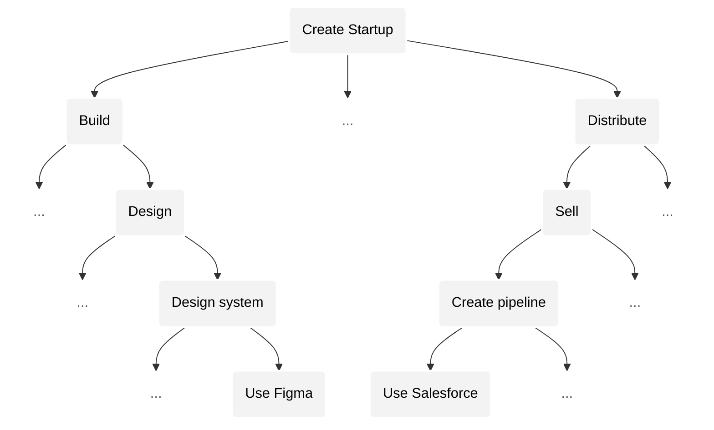
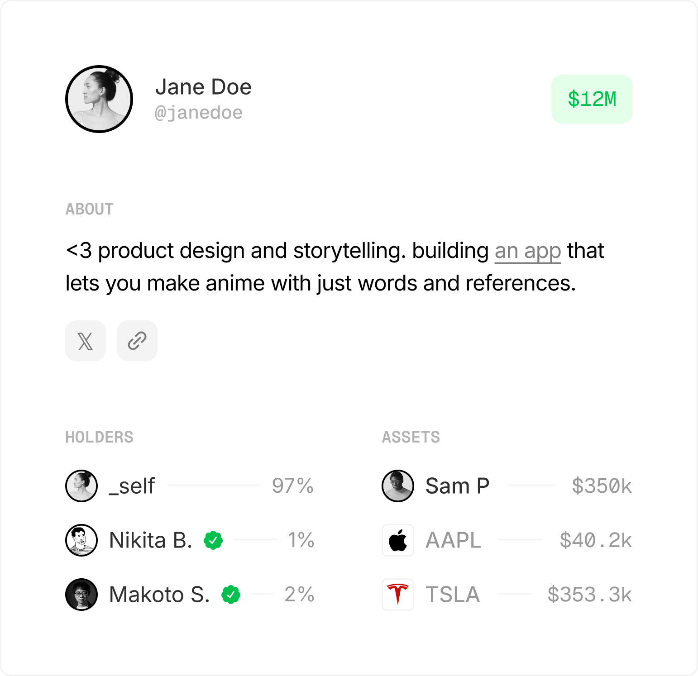
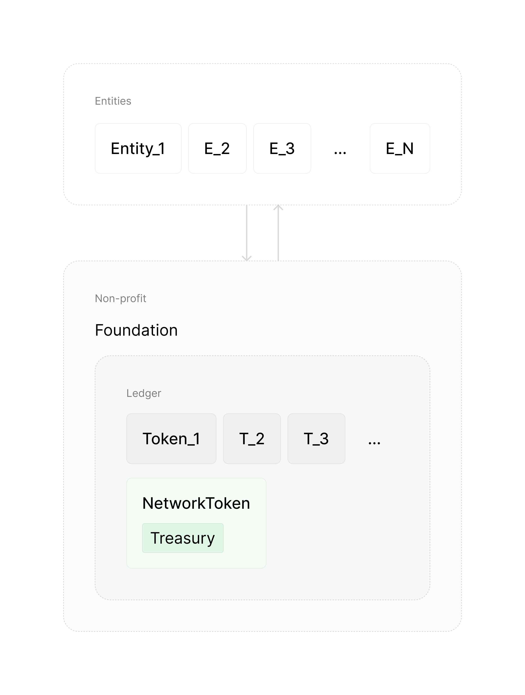

# RootNet: Prosperity through Unity

_[homan](https://x.com/homanspirit) & [shiv](https://scholar.google.com/citations?user=WNUGEccAAAAJ&hl=en)_

> Read [shorter essay](README.md) first if you haven't.

RootNet is a network that enables collective prosperity in the age of AI, through unity.

In this essay we dive into *why* we need RootNet, *what* it is, and *how* to create it. 

To understand why we need RootNet, we need to first understand how AI will change our world.

#### Side A. How AI will change our world
1. [Activity](#activity)
2. [Complexity of an activity](#complexity-of-an-activity)
3. [Example activity: creating a company](#example-activity-creating-a-company)
4. [Similarity between activities](#similarity-between-activities)
5. [AGI eats activities and enables new ones.](#agi-eats-activities-and-enables-new-ones)
6. [Local vs. global convergence](#local-vs-global-convergence)
7. [Predictions:](#predictions)
8. [1) Peak outcome grows superexponentially](#1-peak-outcome-grows-superexponentially)
9. [2) Competition grows at least exponentially](#2-competition-grows-at-least-exponentially)
10. [3) Outcomes become more extreme superexponentially, across the board](#3-outcomes-become-more-extreme-superexponentially-across-the-board)
11. [4) Number of economically viable activities grows superexponentially.](#4-number-of-economically-viable-activities-grows-superexponentially)
12. [5) Rate of displacement of winners accelerates.](#5-rate-of-displacement-of-winners-accelerates)
13. [6) Absolute number of winners grows at least exponentially.](#6-absolute-number-of-winners-grows-at-least-exponentially)
14. [AGI will expand humanity's horizon](#agi-will-expand-humanitys-horizon)

#### Side B. New foundation for civilization
15. [Problem](#problem)
16. [Venture capital](#venture-capital)
17. [Personal token](#personal-token)
18. [Money → Company → Personal Token](#money---company---personal-token)
19. [Value will be concentrated in personal tokens](#value-will-be-concentrated-in-personal-tokens)
20. [Personal tokens will democratize opportunity](#personal-tokens-will-democratize-opportunity)
21. [NetworkToken](#networktoken)
22. [Universal Basic Equity (UBE)](#universal-basic-equity-ube)
23. [Imbalance](#imbalance)
24. [Root problem](#root-problem)
25. [RootNet](#rootnet)
26. [True value](#true-value)
27. [Grounded in reality](#grounded-in-reality)
28. [Solution](#solution)
29. [Decentralization](#decentralization)
30. [Fork-ability](#fork-ability)
31. [Unity](#unity)
32. [Vote for humanity](#vote-for-humanity)

---

# A. How AI will change our world

The age of AI will be dynamic. The biggest successes will be far larger than anything we’ve seen before, while the rewards will be concentrated in fewer hands at any moment (i.e., extreme outcomes), _across all fields_. More people will be able to compete for them, but the gap between the best and the rest will grow sharply. The number of valuable opportunities will explode, winners will be replaced more quickly, and more people than ever will experience success — even if only briefly before being overtaken.

AI will also keep expanding our horizons by pushing us towards ever more complex problems. Each time we solve something, we’ll see even bigger challenges ahead. What feels difficult today will seem trivial to our descendants. And importantly, AI will never make us unnecessary. We will always be able to *see* more than we can *do*, continuously pushing our horizon further.

To understand why AI will change our world this way, we need to first see how it transforms a _single_ activity.

## Activity

Let’s start with a simple example: driving a car.

Bob wants to drive. But for Bob, the activity of driving is too complex to do all at once. So he breaks it down into **sub-activities**: turning on the car, steering, pressing the gas, shifting gears, checking the mirrors, and so on.

If a sub-activity is simple enough, Bob just does it. If it’s too complex, he breaks[^break] it down further. For example, to shift gears, he has to:
- remember the gear pattern
- press the clutch
- move the gear stick.
- etc.

[^break]: We break an activity into sub-activities when we can't tackle it as a whole. This can happen because we lack skill to perform it as a whole or perhaps due to lack of tools. For example, a great filmmaker who already knows what they want to create may still have to break it down into sub-activities to _implement_ it: e.g., animation, etc. because they lack the tools or resources to abstract that sub-activity away.

This process of breaking down a complex activity into simpler sub-activities continues until Bob reaches sub-activities he can actually perform without breaking down further.

We can visualize Bob’s process as a *tree* of activities. The root is the activity Bob wants to perform: *driving a car*. The leaves are the *simplest* sub-activities that Bob can tackle without breaking down further.

In this tree, complexity *falls* as we go down because activities are more complex than their sub-activities. By complexity we mean the number of possibilities (or *moves*) for an activity. For example, the complexity of *changing gears* is the number of possible gear changes you can make.

And importantly, the _difference_ between the complexity of the activity you _want_ to tackle and the complexity you _can_ tackle (without breaking down further) is what _causes_ this tree to be constructed.

## Parent vs. child activity

It’s tempting to think that the complexity of a parent activity is just the *sum* of the complexities of its sub-activities. That sounds reasonable because if the sub-activities make up the parent, shouldn’t their combined complexity equal the whole?

But in reality, the parent activity contains *many* moves that don’t belong to _any_ of the sub-activities. I.e., there are moves in the parent activity that *cannot* be understood as a collection of sub-moves that are each restricted to a sub-activity. These are *holistic* moves that can only be fully understood in the context of the parent activity.

Take Steve Jobs envisioning the iPhone. This single move affected many sub-activities at once: engineering, design, marketing, sales, etc. Each team *projected* this move into their own domains to understand and execute it. But, the *real* move lived *above* these sub-activities. The real move emerged from a *holistic*, *unified* intuition about *all* the possibilities of the parent activity without *fracturing* the parent activity into sub-activities. 

And importantly, you couldn't reconstruct that move just by interviewing each team (sub-activity) and stitching their answers together. The essence of the move would be lost.

This means that the parent activity is *always more complex* than the sum of its parts (i.e., sum of complexities of its sub-activities). Specifically, the relationship between the parent's complexity and the sum of childs' complexities is at least *superlinear* (and possibly exponential).

Therefore, as we move *up* the tree, from sub-activities to their parents, the complexity of an activity grows *superexponentially*[^complexity-growth].

[^complexity-growth]: Why does complexity grow superexponentially? Because the number of **leaves** (simplest sub-activities) already grows **exponentially** with depth in a tree. And the complexity of a parent activity is a **superlinear function** of the combined complexity of its leaves. So when you recurse upward, you get **superexponential growth**.

> In case you're unfamiliar with growth rates like "superlinear", "exponential", "superexponential", read our [growth rate primer](GrowthRatePrimer.md).

## Example activity: creating a company

Let’s take a more relevant example: **creating a company** (to, say, automate agriculture using robots).

## Similarity between activities

The lower we go in the activity tree, the more the root activity has been broken into smaller and more specific sub-activities.

Each break introduces a *difference* that wouldn’t exist if the activity could be done as a whole. So the further down the tree we go (i.e., the more we *break*), the more these differences compound. This means that sub-activities become *more different* from each other the *farther* they are from their common ancestor.

This is why the further apart two activities are — that is, the further away their common ancestor is — the less similar they become. In other words, *ability* transfers *less* easily between activities the further they are from their common ancestor.

Conversely, the *closer* two activities are to a shared ancestor, the *more* similar they are, and the easier it is to transfer ability between them.

For example, in our earlier tree, “Build product” and “Distribute” are higher-level activities that rely on general reasoning and prioritization, so *ability transfers more easily* between them. In contrast, their sub-activities — like “Design in Figma” or “Set up a sales pipeline in Salesforce” — require domain-specific skills that *don’t transfer as easily*, making them less similar.

## AGI eats activities and enables new ones.

Artificial _general_ intelligence (AGI) is a technology that _eats_ activities below a certain complexity threshold — _across all domains_.

AGI doesn’t care whether an activity is in design, engineering, music, law, or art. It only cares about _complexity_. Any activity that’s simple enough — no matter the field or domain — will be eaten.

In our earlier example, AGI will start at the _leaves_ of the activity tree: sub-activities like _designing a component in Figma_ or _writing a specific algorithm_, and then move _upward_.

As AGI eats these lower-level activities, we’ll be forced to change how we break down activities into sub-activities. In other words, we’ll _rebuild our activity tree_. And as we do, *new* sub-activities will emerge that we couldn’t even attempt before. For example, instead of doing the low-level work (using domains specific tools) ourselves, we would focus on the new activity of *managing* AI agents that do that work for us.

**As AGI continues to push us upward, it will converge our activities (and our attention) toward the root: a *singular*, *highly complex* activity.**

## Local vs. global convergence

Our earlier example — creating an agricultural robotics company — is itself a _sub-activity_ within a *larger* activity tree. That tree might be rooted in building a _general robotics company_, which includes all the possibilities of our specific company and many more.

And that larger robotics tree is just one sub-tree of an *even* bigger _global_ activity tree that includes _all_ of humanity’s activities.

So while AGI pushes us upward in our _local_ activity tree, the same convergence happens *globally*. This means that progress in a more complex activity higher in the tree _will make our entire activity irrelevant_ in the same way that AGI made our *local* lower-level activities irrelevant.

---

From this understanding of how AGI impacts our activities, we can predict what a post AGI world will look like.

## Predictions

As artificial intelligence advances, we will see that:

1. Peak outcome grows superexponentially.
2. Competition grows at least exponentially.
3. Outcomes become more extreme superexponentially, across *all* activities.
4. Number of economically viable activities grows superexponentially.
5. Rate of displacement of winners grows at least exponentially.
6. Absolute number of winners grows at least exponentially.

The _specificity_ of these growth rates matters. For example, misjudging the difference between _exponential_ and _superexponential_ growth can lead to very different, sometimes even opposite, predictions. In case you're unfamiliar with growth rates we recommend reading [our primer](GrowthRatePrimer.md).

## 1) Peak outcome grows superexponentially

We tend to value an activity based on the number of possibilities it enables — in other words, its _complexity_.

For example, building _YouTube_ is far more valuable than building a niche video platform. YouTube supports a vastly wider range of content, creators, and use cases (i.e., more possibilities). Similarly, a general robotics company is more valuable than one focused only on agriculture, because it can be applied across many domains, enabling greater possibilities.

And since we’ve already seen that activity complexity grows _superexponentially_ as we move up the tree, the _maximum possible value_ — the peak outcome — will also grow _superexponentially_.

## 2) Competition grows at least exponentially

As we move higher up the activity tree, activities become _more similar_, which means that _ability transfers more easily_ between them.

As activities become more similar, the same skills apply more broadly, meaning more people can compete for the same opportunities — leading to a much larger pool of competition.

On top of that, better training tools and resources will allow _more people_ to reach the level needed to compete in complex activities, expanding the pool *even* further.

So both the growing *similarity* between activities and the growing number of capable individuals drive competition to grow _at least exponentially_.

## 3) Outcomes become more extreme superexponentially, across the board

Within _any_ activity, at any moment, a _smaller_ percentage of individuals will be responsible for a _greater_ share of economic value created — i.e., a _[power law distribution of outcomes](https://en.wikipedia.org/wiki/Power_law)_ — while the *median share* falls.

Generally, outcomes become more extreme as the following increase:

1. Complexity of an activity.
2. Competition (quantity and quality).
3. Leverage (how fast you can make a move).

We observe this relationship between extreme outcomes and complexity in popular games such as Chess and Go. Go has more extreme outcomes than Chess because it's more [complex](https://en.wikipedia.org/wiki/Game_complexity) — i.e., has more possible states or possibilities).

Furthermore, as competition has improved in these games over the years (more players, better computer assisted training, coaching, etc.), outcomes have become _even more_ extreme (i.e., ELO spread has increased).

Finally, leverage also matters because the faster you can make a move, the more quickly the underlying extreme outcomes manifest. For example, when two competing startup founders can iterate twice as fast, the difference in their outcomes accelerates — the better one will more quickly outcompete the other.

AGI accelerates all three factors:

1. Complexity grows superexponentially.
2. Competition grows at least exponentially.
3. Leverage (AGI capability) has been growing exponentially.

Thus, outcomes will become more extreme superexponentially.

And, for the first time in history, _every_ activity will face extreme outcomes because AGI doesn’t just target specific industries. It eats low-complexity work _across the board_.

## 4) Number of economically viable activities grows superexponentially.

What we’ve done so far is only a drop in the vast ocean of future activity.

All of the activities we see in our world are sub-activities for some highly complex root activity that we may not even be able to see right now.

The number of _visible_ and _viable_ activities grows with the gap between:
- the complexity of the activities we *want* to tackle, and
- the complexity we can handle without breaking down further into sub-activities.

Recall: this *gap* is what causes the *tree* of sub-activities to be constructed in the first place. The greater this gap, the more activities we have.

Since the complexity of activities grows _superexponentially_ with each level, this gap will always increase, and likely *at least* exponentially.

## 5) Rate of displacement of winners grows at least exponentially

At higher levels of complexity, it becomes _much harder_ to stay on top. Winning once no longer guarantees continued success. *Churn* accelerates.
#### Why winners get displaced faster:

1. **Your advantage shrinks.** As you move up the tree, the complexity of new activities grows so rapidly that the knowledge you gained in simpler activities increasingly becomes an irrelevant advantage compared to newcomers starting with zero knowledge.
2. **Your learnings become drag.** Learnings from simpler activities increasingly won't translate to insights in more complex activities (and will increasingly create *wrong* intuitions). At higher levels, success often requires _reimagining the problem entirely_, not just scaling what worked before.
3. **The pool of competition explodes.** As activities converge, people from other fields, who never seemed like competitors, start solving the same problems as you. You will be made irrelevant from places you least expect.

---

At higher complexities, transferring success from an activity to its parent activity is less about scaling what you already know and more about having a fundamental breakthrough.

Scaling McDonald's from one city to the world was once a high-complexity activity. It mostly involved extending what already worked: same product, same system, different location.

But now, consider scaling a robotics company from one domain (like agriculture) into a general-purpose robotics company. You can't easily reason about how to make a domain specific robot _generally_ useful — this requires re-imagining and big breakthroughs.

Those who will crack the more complex activities will increasingly have to start directly *at* them. Success at a lower complexity activity creates unnecessary drag and distraction because your learnings at that level become less likely to translate into insights in the higher complexity activities above. For example, OpenAI could not have emerged as an evolution of a domain specific AI winner, it *had* to start above.

---

Furthermore, the higher up in the tree we are at, the more similar our activities become — i.e., the more easily you can transfer ability from one activity to another. This greatly widens the pool of competition.

Winners will increasingly face competition from places they least expect. We are seeing early signs of this: top content creators and startup founders are starting to find themselves rubbing shoulders fighting for the same attention. Similarly, companies building coding agents are finding themselves competing with companies working on project management tools (because building and managing are converging).

Eventually, some random biology discovery in a quantum computing lab could wipe out a massive sub-tree of robotics companies by enabling embodied intelligence grounded in biology that can generalize far better than mechanical robots. It will be increasingly difficult to predict and counter such competition.

Also, there will be greater quality of competition due to better training at scale (enabled by AI). And as _peak outcomes_ grow _superexponentially_, the rewards become so massive that _more people_ will go after them by directly attacking activities very high in the tree, shaking up many sub-trees of current winners.

It will be tough to remain a winner when you have no idea where you will be outcompeted from. Especially when many more competent teams will work on activities that will make yours irrelevant.

---

**Therefore, most value will be created by companies that haven't been started, by individuals who haven't been born.**

To win in this new world, teams will have to operate very differently, often in ways that seem *wrong* to today’s winners.

They’ll spend years just figuring out the _right_ activity and *approach* because *iterating* upwards from a lower complexity activity no longer works. 
They’ll abandon current products and customers the moment they glimpse a higher complexity activity emerge. 
They'll distinguish roles by complexity not "domain". 
They’ll run layoffs _and_ hiring frenzies simultaneously at every jump in AGI. 
They’ll worry about breakthroughs in completely unrelated activities that may have a common ancestor with theirs higher up in the tree. 

They’ll look *paranoid*, *slow*, *distracted*. And they’ll win. Most of our current winners will be blindsided.

## 6) Absolute number of winners grows at least exponentially.

Even though the distribution of outcomes will be far more extreme, since the peak outcomes grow superexponentially, even _tiny_ wins (relative to the peak wins) will still be _massive_. And since the rate of displacement grows at least exponentially, in a given period of time, there will be *many more* who would have touched extreme successes as well.

## AGI will expand humanity's horizon

A post AGI world will be dynamic and extreme. Winners will rise and fall more quickly than ever. We’ll see rapid breakthroughs across every field. AGI will push us to dream bigger and tackle problems we once thought were impossible. What feels complex today will feel trivial to our descendants.

Artificial intelligence will never make humans obsolete because we will always _see_ more than we can _do_. Solving cancer will lead us to confront death itself. Reaching Mars will push us to aim for Pluto.

Our imagination, *not* ability, defines our frontier. Humanity’s ability to imagine will always exceed anything artificial intelligence will be able to do.

But, we aren't *organized* in a way that enables us to *collectively* take advantage of artificial intelligence. In fact, on our _current_ systems, AGI will concentrate opportunity and divide society.

To understand why, let's first study how our current economic system becomes oppressive in a post AGI world.

# B. New foundation for civilization

## Problem

In a post AGI world, due to [extreme outcomes](#3-outcomes-superexponentially-become-more-extreme-across-the-board) in _all_ activities, debt will no longer be a viable means to finance anything.

This is not due to fewer opportunities (AGI will enable far more opportunities than it takes), but rather due to the extreme, winner-takes-all nature of outcomes within _any_ opportunity. In extreme outcomes, the median outcome falls to nothing and thus financing with debt is no longer viable.

Tragically, billions are still taking out loans to finance their lives — from their educations, to their homes, businesses, etc. — without realizing that they will almost certainly never be able to repay these loans as outcomes rapidly becomes more extreme.

_Even_ if one is debt-free, they will almost certainly be outcompeted by one who can experiment boldly and tinker freely with _abundant_ resources.

And critically, in an extreme world, if people don't have a stake in the collective upside, they will resent the winners — dividing society.

Therefore, we must:
1. Finance human activity in a way that ensures that anyone with potential has access to the resources they need to fully realize their potential — regardless of the circumstances of their birth.
2. Give each individual a stake in the collective upside to elevate our baseline, i.e, when any one succeeds everyone benefits.

Otherwise opportunity becomes concentrated in those who aren't be burdened by debt (i.e., those with extreme wealth), dividing society and preventing a future of collective opportunity and prosperity.

## Venture capital

In an extreme world, venture capital (VC) is the _only_ viable way to finance our lives.

At its core, venture capital *aligns* people by intertwining their success and failure — through _equity_ in outcomes.

VC is already a popular way to finance startups: investors give startup companies money in exchange for an _equity_ stake in the startup itself. If the startup succeeds, the investors make great returns. If the startup fails, the investors lose their investment. Importantly, startup founders are *not* indebted to investors. And because of the shared stake, investors are incentivized to give founders the resources they need to succeed.

VC thrives in high-risk, high-reward domains. Because outcomes are extreme, most bets fail — but the few that succeed will more than make up for the rest. Therefore, VC is the only way to finance activities that have extreme outcomes because no other mode of financing can withstand the extreme failure rate.

Since AGI makes _all_ activities extreme, VC will be the only viable way to finance *anything*. But today’s VC is too limited: only those starting companies can access it. 

To unlock our collective potential, we need to enable individuals to access venture capital to finance a *broader* range of activities, *earlier* in their lives.

We need a new financial instrument that democratizes venture capital.

## Personal token

To democratize access to venture capital, we're introducing the _personal token_: a financial instrument that represents an individual's potential, with transact-able shares. People can raise venture capital by selling equity in their personal token.

_(Jane's personal token with her shareholders and her equities in companies and other personal tokens.)_

The value of your personal token is grounded in your equities in companies and other personal tokens. When you earn capital gains (by selling equity in a company or token) a portion is distributed to your personal token shareholders as *dividends* (proportional to the equity they hold).

But unlike company shareholders, personal token shareholders have no control, ownership, or say in your life. **You retain full agency and complete control over everything you do.** 

## Money -> Company -> Personal token

The personal token is the next step in the evolution of financial instruments — an abstraction that sits above the company, which itself sits above money.

As transactions grew more complex, simple notions of debt and exchange became painful. This pressure gave rise[^messy] to transferable IOUs — i.e., *money*.

[^messy]: In a messy, nonlinear way.

Later, as high-risk high-reward opportunities emerged, debt became painful. This created a pressure that gave rise to transferrable equity in upside — i.e. _venture-backed company_.

For instance, in seafaring, bankers funded many risky journeys, knowing only a few needed to succeed to turn a profit because they had a *stake* in the upside.

Importantly, the notion of a venture-backed company allowed us to assign value to *potential* by creating a gap between the *value* of a company and *reality* (its revenue). A startup may have no revenue, yet its equity holds value because it has *potential*. And being able to _transact_ on shares of that potential enables venture capital financing.

Today, we're at another inflection point. AGI makes _all_ outcomes extreme, not just those in a few domains, invalidating debt as a viable means to finance _anything_. This creates pressure for an instrument that sits _above_ companies: representing an individual’s equities *across* companies — i.e. _personal token_.

Just as companies let us invest in the potential of a *single* idea, personal tokens let us invest in the the potential of an individual across *all* of their ideas. 

## Value will be concentrated in personal tokens

As we advance, value concentrates *upward*.

Historically, value moved from transactions to companies. Today, top companies are worth far more than the sum of their revenues.

In a post-AGI world, this trend will continue. Value will increasingly become concentrated in personal tokens. A personal token will be valued far more than the combined value of its equities in companies _(recall: a personal token’s value is grounded in its equities in companies and other personal tokens)_.

With AI, individuals will be able to manifest many more ideas. So instead of investing in *individual* ideas (companies), people will increasingly want to invest in the *source* of many valuable ideas (personal tokens).

## Personal tokens will democratize opportunity

Personal tokens create a market for human potential that will increasingly direct resources based on *potential*, not privilege.

We acknowledge that _initially_, personal tokens will better used by the privileged: those with access to capital, education, and networks. But, as the network matures through more participants and investments (in number and magnitude), market forces will more aggressively push resources to undervalued or undiscovered talent with potential.

As we’ve seen [earlier](#predictions), a post AGI world will bring:
1. More winners.
2. Faster turnover of these winners.
3. Higher quality competition.
4. Larger peak outcomes.

With greater upside and more capable contenders, *more* capital will flow into the system and spread across a *broader* range of individuals. As a result, even median contenders will attract more investment than before.

Over time, personal tokens will reduce the impact of privilege by _incentivizing_ resources to seek *true* potential, wherever it lies.

## NetworkToken

Personal tokens can’t work in isolation. We need infrastructure that enables discovery, fighting fraud, reputation, etc. to support a healthy ecosystem of individuals investing in each other.

To fund these functions, the system collects a small _equity fee_: a micro stake in every personal token that raises capital.

This fee is collected through a separate token — the *NetworkToken* — which represents the _collective potential_ of the entire network through its stakes in all personal tokens. The NetworkToken’s wallet — the *Treasury* — finances everything needed to keep the network running.

But the NetworkToken is far more than infrastructure. It represents _our collective potential_.

## Universal Basic Equity (UBE)

In an extreme world with a falling median outcome, we need a strong *baseline* to ensure that everyone has access to opportunity.

We achieve this through _Universal Basic Equity (UBE)_: every citizen receives an _equity stake_ in the collective upside — i.e., a stake in the NetworkToken. This ties our fates together: when one wins, we all win; when one fails, we all feel it.

#### UBE closes the gap between individual and collective success.

Taxing wealth after it’s realized creates delay because we have to wait for equity to be sold before capital gains can be taxed. But when everyone holds equity in the NetworkToken (which holds equity in every one), wealth in everyone's hands increases _immediately_ when any one wins. Any major scientific discovery, technological breakthrough, or artistic expression that instills *hope* in our future increases the value of the NetworkToken *immediately*. 

And importantly, the value of the NetworkToken is grounded in reality: in personal tokens, which are grounded in companies, which are grounded in revenue, which is grounded in transactions in which real value is created — else the transaction would not have occurred. (We'll revisit this [grounding](#grounded-in-reality) in greater depth later).

#### UBE won't cause inflation.

Unlike [Universal Basic *Income*](https://en.wikipedia.org/wiki/Universal_basic_income) (UBI), Universal Basic *Equity* doesn't cause inflation because people are incentivized to _hold_ their equity, not spend it (given the promise of great upside). As long as we have faith in humanity's potential, more people will hold than sell, preventing inflation.

> If needed, UBI can still be layered on top of UBE — for example, by distributing dividends from the NetworkToken, or by occasionally selling small portions of its holdings (triggering dividends for all holders). The network can vote on these mechanics over time.

#### UBE enables a rising safety net.

As AI and scale reduce the cost of goods, UBE grows each person’s wealth _without_ inflation. As your shares accumulate, you gain the freedom to take bold risks. Even if you lose everything, future UBE allocations will support your next attempt. UBE will keep giving people chances to keep trying, learning, and earning their way into greater influence, no matter where they started, or how badly they’ve performed so far.

UBE ensures that our *baseline* grows, giving *each* individual a strong safety net to realize their potential.

#### UBE incentivizes having children.

When a child is born, new shares in the NetworkToken are minted for them, slightly diluting everyone else. This creates a natural incentive to have children, as families grow their collective equity. And through that dilution, we _collectively invest_ in the next generation.
> 
---

By pairing personal tokens with UBE, we democratize opportunity *and* raise the baseline. And critically, we achieve this *without relying on debt*, which no longer works in a post AGI world.

But there's still a deeper problem we must address.

## Imbalance

When one system races ahead of the others, it creates _imbalance_. And imbalance leads to suffering.

For example, AI advanced rapidly while our economic system stood still. The result? Outcomes become extreme, debt breaks down, and opportunity concentrates in the hands of the already privileged. This is an imbalance between *technological* progress and *economic* organization.

AI is accelerating many such imbalances:
- **Education** is becoming obsolete. People are learning skills that will soon leave them _unemployable_.
- **Governance** can’t keep up. Laws and institutions are falling behind the pace of change.
- **Politics** has no shared vision. We lack a unifying story that can rally us around collective growth — the kind we need to leverage AI for prosperity, not decay.
- **Healthcare** is falling behind. New, more affordable treatments are emerging faster than we can approve them, delaying access for those in need.
- **Media** is fragmenting. AI enables us to generate content faster than we can verify or agree on what’s real, breaking our shared sense of reality.
- _(And many more.)_

The faster AI moves, the more painful these mismatches become. Just as rising AI makes debt unbearable, it will make other systems increasingly oppressive. We must adapt.

To advance _without_ imbalance, we must solve a deeper, more fundamental problem.

## Root problem

Our root problem is our inability to *allocate* resources towards what we *truly value*, *quickly*.

#### A. Allocation

Each of us is unique. Our diversity of perspectives is our greatest strength. When _every_ individual can allocate resources based on what _they_ believe is valuable — in proportion to the quality of their judgment — we maximize the intelligence of our _collective_ allocation.

But when a centralized authority allocates resources _on behalf of everyone_, it flattens that diversity. It cannot capture the full range of individual perspectives. This leads to misallocation — and worse, the suppression of necessary viewpoints.

Importantly, good judgment must be rewarded. Those who allocate well should gain more influence. Those who misallocate should lose it, until they earn it back. Without this _feedback loop_, we waste resources.

#### B. Value

But allocation alone isn't enough. Allocation depends on what we consider "valuable." If our notion of value is mis-aligned with what we *truly* value, even "perfect" allocation will miss the mark.

Today, our economic system defines value too narrowly. It often ignores long-term consequences, pushing us to chase short-term profits even at the cost of our future. It also ignores *intangible*, non-financial value. Most people agree that great parenting is vital to a healthy, prosperous society. But because we can't _tangibly represent_ its value, we fail to direct adequate resources toward it.

#### C. Speed

Even if we define value well and allocate wisely, we still need to move _fast_. If values shift faster than resources, allocation lags behind reality. And we lose precious time, resources, and potential.

---

This root problem — our inability to allocate resources to what we truly value, quickly — is what causes imbalance. When we can't direct capital, talent, and attention toward what matters, our systems fall out of sync with reality. Progress accelerates in one area, while others are left behind. As long as allocation remains slow, narrow, or misaligned, every breakthrough deepens the divide. Not because we're advancing too fast, but because we're organizing too poorly. And as AI accelerates the pace of breakthroughs, without better _organization_, we will suffer *needlessly*.

---

Every major ideology has blind spots here:
- _Capitalism_ excels at decentralizing allocation, but with our current, restrictive notion of value, it drives us toward short-term profit at long-term cost.
- _Socialist and communist_ systems aim to capture broader value, but rely on centralized control that suppresses individual judgment.

Markets remain our best tool for allocating resources _given_ a particular notion of value. So rather than discard markets, we must *improve* our notion of value. 

Therefore, we need a system that can represent _true_, _holistic_ value so that we can move resources to where they *truly* belong, at the speed we need.

## RootNet

[Personal tokens](#personal-token) and the [NetworkToken](#networktoken) are part of a more *general* system: *RootNet*. 

RootNet is a network designed to represent a more _true_, _holistic_ notion of value so that we can allocate resources to what we _actually_ value, *efficiently*.

On RootNet, there’s no separation between social and financial. All activity is represented by a single primitive: the *token*. A token represents _potential_, and can be assigned to an individual (_personal token_), a collective (_network token_), or an expression (_company token_, etc.). 

Every user on RootNet has a personal token, which now generalizes beyond finance to _all_ forms of activity.

The token represents its holder's potential to create value. Users express belief in that potential by transacting on its shares. And importantly, a token's value is always grounded in reality: in its holder's equities in other tokens, companies, or revenue.

By enabling users to transact on tokens seamlessly, RootNet lets people allocate resources to the individuals, collectives, and expressions they value.

As [discussed earlier](#networktoken), the network itself holds a token: the *NetworkToken*. The individual and the collective are structurally _intertwined_: users hold stakes in the NetworkToken, and the NetworkToken holds stakes in all users. **When _anyone_ creates value for the network, _everyone_ benefits.**

## True value

RootNet enables us to represent what we *truly* value.

#### RootNet *expands* existing notion of value. 

The personal token of an individual who has the potential to create economic value by starting, or joining, or investing in companies (or investing in other tokens) will be valued greatly. RootNet enables us to value such potential *earlier* and more *broadly* than ever before.

#### RootNet represents *intangible* value.

RootNet lets us value forms of contribution that have always mattered but were never reflected in economic systems.

Take parenting. Most would agree that parenting is one of the most (if not *the* most) vital contributors to collective prosperity. Children raised with love, care, and resources are more likely to become kind, capable, and hopeful adults — benefiting everyone through both who they *are* and what they *do*.

On RootNet, this value can be represented directly. Parents will hold equity in their children's personal tokens and can raise capital by selling shares in their own tokens to support their children. As their children succeed, the value of the parents' tokens will rise. Exceptional parents will even be encouraged to share their wisdom, train others, and *invest* in new parents.

By tangibly representing the value of parenting, RootNet creates a strong incentive for _better_ parenting. Great parents gain access to resources they previously lacked. Absent or harmful parenting becomes economically costly, as it puts at risk future wealth tied to their children’s potential.

> And independent of personal tokens, **Universal Basic Equity (UBE)** will raise the baseline—ensuring all parents have the minimum resources needed to care for their children.

RootNet allows us to allocate resources toward what we deeply value, but previously couldn't represent.

#### RootNet represents *collective* value.

The NetworkToken captures our _collective potential_ by holding stakes in all personal tokens on RootNet. The stronger our belief that the future will be more prosperous than today, the more we’ll value the NetworkToken.

Our current economic system fails to account for long-term collective consequences, like climate change, because it narrowly defines value. As a result, we’re often rewarded for short-term gains even when they cause long-term harm.

On the other hand, on RootNet, actions that harm our shared future — even if profitable in the short term — will be strongly disincentivized. For example, burning more fossil fuels might yield quick profits, but it undermines our hope in a better future, dragging down the NetworkToken’s value. Since we each hold equity in the NetworkToken, we’re directly harmed. The collective loss will far outweigh the short-term profit, making such behavior economically *irrational*.

Conversely, actions that _strengthen_ our shared belief in the future will be rewarded. An artist who uplifts our collective hope can increase the value of the NetworkToken itself. As it becomes clear their work creates this kind of value, the artist’s personal token valuation will surge (i.e., we will give them more resources to keep creating such value) — as long as such hope continues to translate into actual value created.

## Grounded in reality

The value represented on RootNet is grounded in _reality_.

The NetworkToken holds stakes in personal tokens, which in turn hold stakes in companies (and other tokens), which are backed by revenue — i.e., actual transactions that reflect real-world value creation. If no value is created, no transaction occurs, no revenue is generated, and the valuations of companies (and the tokens that hold shares of these companies) will fall. RootNet is anchored in the real value creation.

But what about those who create _hope_, like artists, especially when no one directly “buys” their work? Why would their personal tokens hold value?

Because hope _is_ real. It shapes behavior, inspires action, and unlocks possibility. Much of what holds humanity back is not lack of ability but lack of belief. The moment we *believe* something is possible, we begin *building* it. Throughout history, every great achievement was enabled by a shift in belief that it _could_ be done.

Hope is often a self-fulfilling prophecy. An artist who instills genuine hope that we _can_ solve our problems *materially* improves our trajectory.

Importantly, RootNet keeps hope grounded. If hope doesn’t translate into actual value creation, the NetworkToken won’t respond, and the market will correct. As long as we continue to translate hope into actual value, actions that instill hope will be tangibly valued because they increase our collective (and therefore individual) wealth. And so, users will allocate resources to such efforts by investing in the tokens of the individuals, collectives, and expressions that generate hope.

## Solution

Let's see how to *implement* RootNet.

Recall: RootNet is based on a single primitive — *the token* — that represents *potential*, that can be assigned to an individual ([*personal token*](#personal-token)), collective ([*network token*](#networktoken)), or expression (*company token*, etc.). Each user on RootNet is assigned a *personal token*. 

RootNet is built on a decentralized blockchain Ledger that contains all of the tokens in the network, including the [NetworkToken](#networktoken) that represents the potential of the *entire* network. This technical "core" is developed and controlled by a non-profit organization — *RootFoundation*.

Entities (such as companies) will be able to operate on top of RootNet to enable a wide range of products and services built on tokens, while adhering to the *policies* of RootNet that determine how entities must engage with the Ledger.

Initially, RootFoundation will determine these policies. Over time, control over these policies, and more broadly *all* of RootNet's functions and evolution, will be progressively decentralized so that *users* will own, control and shape RootNet. If during this progressive decentralization RootFoundation fails to live up to what users want, anyone can *fork* the ledger, issue a new NetworkToken and continue onwards.

Let's expand on each of these...

### Token

RootNet is based on the primitive — _the token_ — that represents an individual, collective, or expression.

A token contains the following information:

1. **ID**: a unique identifier.
2. **Ownership**: total number of shares, and mapping between any token.ID to number of shares that token holds.
3. **Wallet**: holds USDC (for now[^rootcoin]).
4. **Data**: key value mapping that can contain any kind of data: strings, images, videos, and higher representational data formats that we haven't invented yet.
5. **History**: all _interactions_ this token has had with any other token. For example: investing, transacting, liking a post, following, reporting fraud, etc.

There are three _kinds_ of tokens that extend from this primitive: 
1. *personal* tokens are for individuals.
2. *network* tokens are for collectives (nations tokens (e.g., "USAToken"), NetworkToken, etc.).
3. *expression* tokens are for individual ideas or expressions (e..g, companies).

[^rootcoin]: Eventually, RootNet will have its own currency. Starting with USDC will eliminate unnecessary volatility.

### Ledger

The Ledger represents information about _all_ tokens in the network — on a decentralized blockchain. Every edit to the core ledger is recorded and public. Anyone can verify and audit what happens in this system.

### NetworkToken & Treasury

The NetworkToken is an instance of a network token that represents the collective potential of the *entire* network through its micro stakes in all tokens in the network (which it captures through an equity fee when token shares are transacted). Since the NetworkToken is just another token, it exists _within_ the Ledger.

The NetworkToken's wallet, the Treasury, reflects the dividends the NetworkToken accrues through its stakes in all tokens in the network. The NetworkToken is the economic heart of the entire network: fueling all of the activities required to keep the network healthy.

### Foundation

The Ledger will be developed and controlled by a non-profit organization (RootFoundation).

RootFoundation’s sole goal is to unite humanity and unlock our collective potential.

In addition to building the core technology, RootFoundation will be responsible for educating the world about these new ideas, and advocating for policies in the direction of uniting humanity and unlocking our collective potential.

RootFoundation cannot be “bought”. As the network matures, users will progressively vote on the all of the network's functionality and evolution. Importantly, these voting rights are *not* related to the user's stake in the NetworkToken. This means that wealthy individuals cannot simply "buy" influence.

RootFoundation members will work together _in person_ at our HQ in San Francisco, California, USA.

### Legal

All transactions in RootNet will be compliant with relevant laws and regulations. This means that investing in tokens within RootNet will initially be restricted to users who live in the United States of America.

## Decentralization

Initially, RootFoundation will hold a lot of control. Over time, as the network matures, RootFoundation will progressively decentralize control. For example, early on, RootFoundation will handle reputation and fraud in a centralized way: managing complaints from users, investigating and banning/pursuing legal actions, etc. Over time, as the network matures, RootFoundation will decentralize reputation by incentivizing users themselves to accurately identify misrepresentation/fraud[^decentralized_reputation].

[^decentralized_reputation]: Perhaps something like a transparent, decentralized [community notes](https://vitalik.eth.limo/general/2023/08/16/communitynotes.html) with appropriate financial incentives.

Such progressive decentralization will enable a rich, competitive ecosystem of ideas, companies, entities, etc. to emerge upon this tokenized foundation. And, users will increasingly have control and influence over all policy and decision making regarding the network (and how entities engage with the network) by *voting*.

Voting will be continuous: users can shift their vote as soon as they change their minds. Users can _transfer_ their vote for someone else to cast for an _individual_ decision, a _type_ of decision, or all decisions. Such representational voting will enable a much faster rate of decision-making.

## Fork-ability

RootNet is fork-able at its core. If RootFoundation stops serving its users in the way *they* want, the Ledger itself can be forked, a new NetworkToken issued, and a *new* foundation can continue the work towards uniting humanity and unlocking our collective potential in a way that's actually aligned with what people want.

All of the RootFoundation’s activity will be publicly available in _this_ repository under an [MIT license](LICENSE), enabling anyone to fork anything without needing permission.

Over time, as the network progressively decentralizes, we believe that *even* the entities operating on top of RootFoundation will become fork-able because users will vote for policies that force transparency and fork-ability on any entity that engages with the network.

RootFoundation will progressively become more transparent. Eventually, every cent it spends, every idea it produces, every conversation it has, every line of code it writes will be published in realtime for the world to see, judge, and steal. Yet, even today, RootFoundation will be _far_ more transparent than any other organization.

## Unity

If artificial intelligence is to unlock abundance for *all* of us — not just a privileged few — we must reorganize ourselves.

Our current systems weren’t built for this future. They divide us by concentrating opportunity, rewarding short-term gain at the expense of long-term collective loss, and making the success of one feel like the loss of another. Words alone cannot overcome this. We need better _incentives_ that push for unity.

RootNet enables this. It intertwines our fates: each of us is a stakeholder in the collective, and the collective a stakeholder in each of us. When one wins, we all win. When one falls, we all feel it. Through personal tokens, we fund potential. Through the NetworkToken, we share in collective upside. Through Universal Basic Equity, we raise the baseline without inflation.

And only through such *structural* unity can we fully take advantage of artificial intelligence — *toward prosperity and abundance*.

---

We’ve only scratched the surface of what RootNet will make possible. RootNet will [rewrite our education system](Education.md) through better incentives. And critically, RootNet will [*enable* superintelligence](Superintelligence.md) which *cannot* emerge outside of a network like RootNet.

No part of this idea is “owned” by anyone. We encourage the world to challenge it, fork it, build on it, and take it further than any of us ever could alone.

The more experiments, the more competition, the better for humanity.  So long as we are structurally united, _any victory is a shared one_.

May the best network win and lift us all with it.