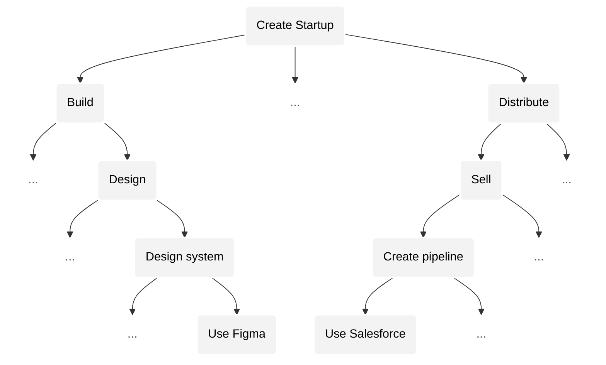

# AI will change the shape of our economy

[homan](https://x.com/homanspirit) & [shiv](https://scholar.google.com/citations?user=WNUGEccAAAAJ&hl=en)

## Predictions

A post AI world will be dynamic and extreme.

1) **Peak outcomes will grow (superexponentially).** The very best results in any field (a startup, a scientific breakthrough, a piece of art, etc.) will become far bigger than anything we’ve seen before.
2) **Competition will grow (exponentially).**
3) **Outcomes will become more extreme (superexponentially).** The gap between success and failure will widen: most projects will earn little, while a few capture extraordinary rewards, like how one song on TikTok goes viral while millions are unheard. For the first time, _all_ activities, not just startups or entertainment, will follow this pattern of extreme outcomes.
4) **New opportunities will multiply (superexponentially).**
5) **Winners will be replaced faster (exponentially).**
6) **More winners (exponentially).**

> The specificity of these growth rates matters. Misjudging the difference between "exponential" and "superexponential" growth can lead to very different, sometimes even opposite, predictions. In case you're unfamiliar with growth rates we recommend reading [our primer](appendix/GrowthRatePrimer.md).

AI will keep expanding our horizons by pushing us towards ever more complex problems. Each time we solve something, we’ll see even bigger challenges ahead. What feels difficult today will seem trivial to our descendants. And importantly, AI will never make us unnecessary. We will always be able to see more than we can do, continuously pushing our horizon further.

To understand why AI will change our world this way, we need to first see how it transforms a single activity.

## Activity

Let’s start with a simple example: driving a car.

Bob wants to drive. But for Bob, the activity of driving is too complex to do all at once. So he breaks it down into **sub-activities**: turning on the car, steering, pressing the gas, shifting gears, checking the mirrors, and so on.

If a sub-activity is simple enough, Bob just does it. If it’s too complex, he breaks[^break] it down further. For example, to shift gears, he has to:
- remember the gear pattern
- press the clutch
- move the gear stick.
- etc.

[^break]: We break an activity into sub-activities when we can't tackle it as a whole. This can happen because we lack skill to perform it as a whole or perhaps due to lack of tools. For example, a great filmmaker who already knows what they want to create may still have to break it down into sub-activities to _implement_ it: e.g., animation, etc. because they lack the tools or resources to abstract that sub-activity away.

This process of breaking down a complex activity into simpler sub-activities continues until Bob reaches sub-activities he can actually perform without breaking down further.

We can visualize Bob’s process as a tree of activities. The root is the activity Bob wants to perform: driving a car. The leaves are the *simplest* sub-activities that Bob can tackle without breaking down further.

In this tree, complexity falls as we go down because activities are more complex than their sub-activities. By complexity we mean the number of possibilities (or moves) for an activity. For example, the complexity of "changing gears" is the number of possible gear changes you can make.

And importantly, the difference between the complexity of the activity you **want** to tackle and the complexity you **can** tackle (without breaking down further) is what causes this tree to be constructed in the first place.

## Parent vs. child activity

It’s tempting to think that the complexity of a parent activity is just the sum of the complexities of its sub-activities. That sounds reasonable because if the sub-activities make up the parent, shouldn’t their combined complexity equal the whole?

But in reality, the parent activity always contains far more possibilities than the sum of the possibilities of its sub-activities. Many possibilities live in the _spaces between_ sub-activities, that aren’t captured if you only look at each one in isolation.

Take YouTube. If you try to break it into categories: comedy, vlogs, education, music, etc., you miss the _majority_ of content that exists fluidly across or outside of neat categories: mashups, commentary, unexpected formats, entirely new genres. The real richness of YouTube lies *above* categories.

A parent activity is more complex than the sum of its parts (i.e., sum of complexities of its sub-activities). Specifically, the relationship between the parent's complexity and the sum of childs' complexities is at least superlinear (and possibly exponential).

Therefore, as we move up the tree, from sub-activities to their parents, the complexity of an activity grows superexponentially[^complexity-growth].

[^complexity-growth]: Why does complexity grow superexponentially? Because the number of **leaves** (simplest sub-activities) already grows **exponentially** with depth in a tree. And the complexity of a parent activity is a **superlinear function** of the combined complexity of its leaves. So when you recurse upward, you get **superexponential growth**.

> In case you're unfamiliar with growth rates like "superlinear", "exponential", "superexponential", read our [growth rate primer](appendix/GrowthRatePrimer.md).

## Creating a company

Let’s take a more relevant example: **creating a company** (to, say, automate agriculture using robots).

## Similarity between activities

The lower we go in the activity tree, the more the root activity has been broken into smaller and more specific sub-activities.

Each break introduces a difference that wouldn’t exist if the activity could be done as a whole. So the further down the tree we go (i.e., the more we break), the more these differences compound. This means that sub-activities become more different from each other the farther they are from their common ancestor.

This is why the further apart two activities are — that is, the further away their common ancestor is — the less similar they become. In other words, ability transfers less easily between activities the further they are from their common ancestor.

Conversely, the closer two activities are to a shared ancestor, the more similar they are, and the easier it is to transfer ability between them.

For example, in our earlier tree, “Build product” and “Distribute” are higher-level activities that rely on general reasoning and prioritization, so ability transfers more easily between them. In contrast, their sub-activities — like “Design in Figma” or “Set up a sales pipeline in Salesforce” — require domain-specific skills that don’t transfer as easily, making them less similar.

## AGI eats and creates activities

Artificial _general_ intelligence (AGI) is a technology that eats activities below a certain complexity threshold — _across all domains_.

AGI doesn’t care whether an activity is in design, engineering, music, law, or art. It only cares about complexity. Any activity that’s simple enough — no matter the field or domain — will be eaten.

In our earlier example, AGI will start at the leaves of the activity tree: sub-activities like "designing a component in Figma" or "writing a specific algorithm", and then move upward.

As AGI eats these lower-level activities, we’ll be forced to change how we break down activities into sub-activities. In other words, we’ll rebuild our activity tree. And as we do, new sub-activities will emerge that we couldn’t even attempt before. For example, instead of doing the low-level work (using domains specific tools) ourselves, we would focus on the new activity of managing AI agents that do that work for us.

**As AGI continues to push us upward, it will converge our activities (and our attention) toward the root: a singular, highly complex activity.**

## Local vs. global convergence

Our earlier example — creating an agricultural robotics company — is itself a sub-activity within a larger activity tree. That tree might be rooted in building a general robotics company, which includes all the possibilities of our specific company and many more.

And that larger robotics tree is just one sub-tree of an even bigger global activity tree that includes all of humanity’s activities.

So while AGI pushes us upward in our local activity tree, the same convergence happens globally. This means that progress in a more complex activity higher in the tree will make our entire activity irrelevant in the same way that AGI made our local lower-level activities irrelevant.

---

From this understanding of how AGI impacts our activities, we can predict what a post AGI world will look like.

## 1) Higher peak

**Peak outcome grows superexponentially.**

We tend to value an activity based on the number of possibilities it enables — in other words, its complexity.

For example, building YouTube is far more valuable than building a niche video platform. YouTube supports a vastly wider range of content, creators, and use cases (i.e., more possibilities). Similarly, a general robotics company is more valuable than one focused only on agriculture, because it can be applied across many domains, enabling greater possibilities.

And since we’ve already seen that activity complexity grows superexponentially as we move up the tree, the _maximum possible value_ — the peak outcome — will also grow superexponentially.

## 2) More competition

**Competition grows at least exponentially.**

As we move higher up the activity tree, activities become more similar, which means that ability transfers more easily between them.

As activities become more similar, the same skills apply more broadly, meaning more people can compete for the same opportunities, leading to a **much larger pool of competition**.

On top of that, better training tools and resources will allow more people to reach the level needed to compete in complex activities, expanding the pool even further.

So both the growing similarity between activities and the growing number of capable individuals drive competition to grow at least exponentially.

## 3) Extreme outcomes

**Outcomes become more extreme superexponentially, across the board.**

Within any activity, at any moment, a smaller percentage of individuals will be responsible for a greater share of economic value created (a [power law distribution of outcomes](https://en.wikipedia.org/wiki/Power_law)), while the median share falls.

Generally, outcomes become more extreme as the following increase:

1. Complexity of an activity.
2. Competition (quantity and quality).
3. Leverage (how fast you can make a move).

We observe this relationship between extreme outcomes and complexity in popular games such as Chess and Go. Go has more extreme outcomes than Chess because it's more [complex](https://en.wikipedia.org/wiki/Game_complexity) — i.e., has more possible states or possibilities).

Furthermore, as competition has improved in these games over the years (more players, better computer assisted training, coaching, etc.), outcomes have become even more extreme (i.e., ELO spread has increased).

Finally, leverage also matters because the faster you can make a move, the more quickly the underlying extreme outcomes manifest. For example, when two competing startup founders can iterate twice as fast, the difference in their outcomes accelerates, the better one will more quickly outcompete the other.

AGI accelerates all three factors:

1. Complexity grows superexponentially.
2. Competition grows at least exponentially.
3. Leverage (AGI capability) has been growing exponentially.

Thus, outcomes will become more extreme superexponentially.

And, for the first time in history, every activity will face extreme outcomes because AGI doesn’t just target specific industries. It eats low-complexity work across the board.

## 4) More opportunities

**Number of economically viable activities grows superexponentially.**

What we’ve done so far is only a drop in the vast ocean of future activity.

All of the activities we see in our world are sub-activities for some highly complex root activity that we may not even be able to see right now.

The number of visible and viable activities grows with the gap between:
- the complexity of the activities we want to tackle, and
- the complexity we can handle without breaking down further into sub-activities.

Recall: this gap is what causes the tree of sub-activities to be constructed in the first place. The greater this gap, the more activities we have.

Since the complexity of activities grows superexponentially with each level, this gap will always increase, and likely at least exponentially.

## 5) Faster churn

**Rate of displacement of winners grows at least exponentially.**

At higher levels of complexity, it becomes much harder to stay on top. Winning once no longer guarantees continued success. Churn accelerates.

#### Why winners get displaced faster:

1. **Your advantage shrinks.** As you move [up the tree](#activity), the complexity of new activities grows so rapidly that the knowledge you gained in simpler activities increasingly becomes an irrelevant advantage compared to newcomers starting with zero knowledge.
2. **Your learnings become drag.** Learnings from simpler activities increasingly won't translate to insights in more complex activities (and will increasingly create wrong intuitions). At higher levels, success often requires reimagining the problem entirely, not just scaling what worked before.
3. **The pool of competition explodes.** As activities converge, people from other fields, who never seemed like competitors, start solving the same problems as you. You will be made irrelevant from places you least expect.

---

At higher complexities, transferring success from an activity to its parent activity is less about scaling what you already know and more about having a fundamental breakthrough.

Scaling McDonald's from one city to the world was once a high-complexity activity. It mostly involved extending what already worked: same product, same system, different location.

But now, consider scaling a robotics company from one domain (like agriculture) into a general-purpose robotics company. You can't easily reason about how to make a domain specific robot generally useful — this requires re-imagining and big breakthroughs.

Those who will crack the more complex activities will increasingly have to start directly at them. Success at a lower complexity activity creates unnecessary drag and distraction because your learnings at that level become less likely to translate into insights in the higher complexity activities above. For example, OpenAI could not have emerged as an evolution of a domain specific AI winner, it had to start above.

---

Furthermore, the higher up in the tree we are at, the more similar our activities become — i.e., the more easily you can transfer ability from one activity to another. This greatly widens the pool of competition.

Winners will increasingly face competition from places they least expect. We are seeing early signs of this: top content creators and startup founders are starting to find themselves rubbing shoulders fighting for the same attention. Similarly, companies building coding agents are finding themselves competing with companies working on project management tools (because building and managing are converging).

Eventually, some random biology discovery in a quantum computing lab could wipe out a massive sub-tree of robotics companies by enabling embodied intelligence grounded in biology that can generalize far better than mechanical robots. It will be increasingly difficult to predict and counter such competition.

Also, there will be greater quality of competition due to better training at scale (enabled by AI). And as peak outcomes grow superexponentially, the rewards become so massive that more people will go after them by directly attacking activities very high in the tree, shaking up many sub-trees of current winners.

It will be tough to remain a winner when you have no idea where you will be outcompeted from. Especially when many more competent teams will work on activities that will make yours irrelevant.

---

**Therefore, most value will be created by companies that haven't been started, by individuals who haven't been born.**

To win in this new world, teams will have to operate very differently, often in ways that seem wrong to today’s winners.

They’ll spend years just figuring out the right activity and approach because iterating upwards from a lower complexity activity no longer works. 
They’ll abandon current products and customers the moment they glimpse a higher complexity activity emerge. 
They'll distinguish roles by complexity not "domain". 
They’ll run layoffs and hiring frenzies simultaneously at every jump in AGI. 
They’ll worry about breakthroughs in completely unrelated activities that may have a common ancestor with theirs higher up in the tree.

They’ll look paranoid, slow, distracted. And they’ll win. 

Most of our current winners will be blindsided.

## 6) More winners

**Absolute number of winners grows at least exponentially.**

Even though the distribution of outcomes will be far more extreme, since the peak outcomes grow superexponentially, even tiny wins (relative to the peak wins) will still be massive. And since the rate of displacement grows at least exponentially, in a given period of time, there will be many more who would have touched extreme successes as well.

## AGI will expand our horizon

A post AGI world will be dynamic and extreme. Winners will rise and fall more quickly than ever. We’ll see rapid breakthroughs across every field. AGI will push us to dream bigger and tackle problems we once thought were impossible. What feels complex today will feel trivial to our descendants.

Artificial intelligence will never make humans obsolete because we will always see more than we can do. Solving cancer will lead us to confront death itself. Reaching Mars will push us to aim for Pluto.

Our imagination, not ability, defines our frontier. Humanity’s ability to imagine will always exceed anything artificial intelligence will be able to do.

But, we aren't organized in a way that enables us to collectively take advantage of artificial intelligence. In fact, on our current systems, AGI will concentrate opportunity and divide us.

We need [RootNet](whitepaper.md).