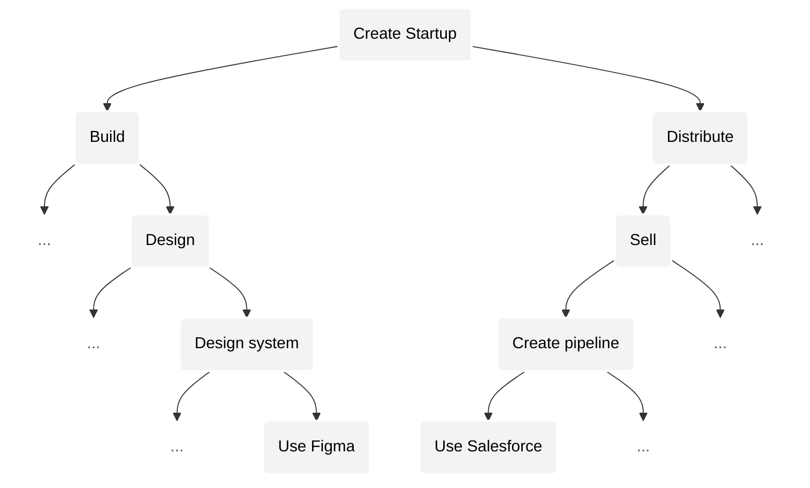
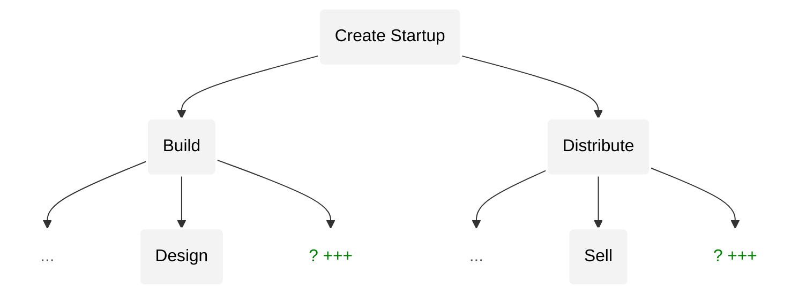
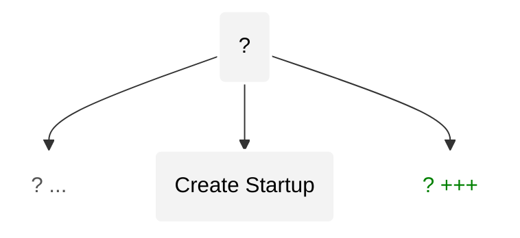

## Convergence phenomenon

Convergence is a phenomenon in which our activities acceleratingly evolve to be more complex _and_ similar — towards a _highly complex_, _singular_ activity.

To understand what this means and how it's caused, we must first understand the nature of an activity.

### Activity tree

Human activity resembles a _finite_, _recursive_ tree [^tree]. Each node of the tree represents an activity. Every activity can be broken down into sub-activities that each can be further divided into more sub-activities, thus forming a tree. This tree is finite because at some point the sub-activities become too simple to be considered an activity.

[^tree]: Viewing human experience as a recursive tree is a very [old idea](https://chatgpt.com/share/68775f64-306c-8004-a5c1-f5ed7983ea07).

Activities have a notion of _complexity_ and _similarity_:

1. Each activity (i.e., node) has a notion of [complexity](https://en.wikipedia.org/wiki/Game_complexity): the number of possible states for that activity. For example: assembly work is less complex due to limited possibilities, whereas product design is far more complex due to exponentially more possibilities. Within the tree, sub-activities will be superexponentially less complex than their parent (explained later).
2. A pair of similarly complex activities have a notion of "similarity": the more similar two activities are, the more seamlessly ability transfers between them. The tree-path distance between two activities (at the same complexity depth) represents the similarity between them.

_Advancements_ (i.e., [changes](#story-instrument-technology)) tend to push us _upwards_ towards more complex activities — by adding more complex activities (and sub-activities) to the tree while removing less complex ones. For example, spreadsheets removed many lower complexity activities related to bookkeeping while spawning many new branches and fields (e.g. analysis, risk modeling, etc.).

Yet, throughout history, advancement has been unequally distributed. Some branches of activity advanced far more rapidly than others. For example, most knowledge work is far more complex than the average activities in agriculture.

But, AGI operates on our tree in a fundamentally different way than any previous advancement. AGI will prune _all_ activities below a certain complexity threshold, completely eliminating less complex activities. Therefore, all activities will become highly complex.

- A. Activities as a tree. It is unbalanced because change is not equally distributed.
- B. Advancements update the tree.
- C. AGI (fundamentally _different_ type of advancement) balances tree by eating all activities below a complexity threshold.

And importantly, due to the tree structure, newly _added_ activities are added higher in the tree (as they are more complex), and thus are closer to each other (i.e., more similar).

Thus, artificial intelligence will _converge_ human activity _towards_ a highly complex, singular, activity such that an individual great at one activity will be great at all.

Let's understand how this phenomenon manifests in our world through the example of creating a startup.

### Example: creating a startup

The following is the activity tree for creating a startup. Complexity falls as you go down the tree.

Firstly, _ease_ of transferring ability from an activity to a similarly complex activity (at same depth) is represented by the _distance_ between them in the tree (i.e. via tree path). This represents the fact that domain specific and execution specific knowledge do not transfer easily, whereas, higher order reasoning and intuition do.

| Depth            | Ability Type                 | Difference                                   | Ability Transferability | Intelligence |
| ---------------- | ---------------------------- | -------------------------------------------- | ----------------------- | ------------ |
| `Towards root`   | Intuition                    | Even more similar "feel" for what works.     | HIGH                    | SI           |
| `D2`             | Logic & reasoning            | Similar analysis & logical experimentation.  | MEDIUM                  | AGI          |
| `D3`             | Domain specific knowledge    | Different frameworks, principles.            | LOW                     | AI           |
| `Towards leaves` | Execution specific knowledge | Very different tools (Figma vs. Salesforce). | VERY LOW                | AI / rules   |

Secondly, we observe that ease of transferring ability _upwards_ (from an activity to its _parent_ activity) becomes more difficult the higher up the tree we go. For example, it is much easier to go from proficiency in using Figma to building design systems than it is to go from designing to building — which requires understanding across design, engineering and the many other functions required to build a product.

---

As AGI prunes the tree according to complexity, we will notice that lower depths disappear, and new activities emerge at depths higher up the tree. These new activities will be more _similar_ to each other (i.e., ability is more likely to transfer) because the tree distance between them is shorter higher up in the tree. This represents the fact that these more complex activities involve less domain and execution specific knowledge (as discussed above).

---

Eventually activities converge towards a _singular_ activity.

---

### Cautions

Before we conclude this example, a few things to keep in mind:

- We should not be attached to the labels we've used ("startup", "design", "sell" etc.) because these labels have no meaning on their own. For example, a lead designer at a far more complex startup will likely be performing higher complexity activities than a CEO of a less complex startup. Similarly, a mediocre designer will not operate at a high level of complexity even though their activity requires them to, because they are ignorant of its complexity.
- In the "Transferability" column above, what we've considered as "HIGH" may be seen as "VERY LOW" by our descendents who will be operating at such heights in the tree where transfering abilities can happen even more seamlessly. These are relative terms.
- While we have modeled our activities as _discrete_ nodes to make it easy to reason, in reality they are fluid: i.e. there are near infinite discrete steps within each step above. Yet, the underlying principle of convergence remains the same.

---

Let's explore the implications of convergence that are relevant to us.

### Convergence amplifies extreme outcomes.

As convergence increases the complexity of our activities, extreme outcomes are amplified.

This is because generally we observe that more complex activities yield more _extreme_ outcomes. E.g., outcomes for product design are far more extreme than outcomes for assembly work. We can also observe this phenomenon in popular board games: Go is far more complex than Chess, and thus has more extreme outcomes[^elo].

[^elo]: Go has a greater ELO spread amongst its top players than Chess, leading to more extreme outcomes.

### All activities become more similar.

Artificial intelligence will enable many more activities than it will remove. The range of activities we have witnessed throughout human history will eventually be a drop in the ocean of activities that will eventually exist. While it's impossible to predict the nature of these activities, we _can_ predict that they will be increasingly _similar_: i.e. ability in one will increasingly translates to ability in all.

### Convergence occurs locally and globally.

Convergence occurs locally _and_ globally. In our example, we saw how the entire tree stemming from "creating a startup" converges towards its root. But, "creating a startup" is a sub-activity for far more complex activities higher up in the _global_ tree. Convergence _also_ occurs in the _global tree_ that "creating a startup" is a part of.

For example, while activities within the average B2B startup converge towards its root, this startup itself will be rendered irrelevant due to convergence higher in the global tree. This is because a new company will emerge at a higher position in the tree that will perform the function of this particular startup and many other _similarly complex_ ones.

Increasingly, companies will be outcompeted from _above_ rather than from the _side_. Companies will be forced to compete and win at _higher_ complexity activities in order to survive.

### Convergence is accelerating.

As activities become more similar, competition increases.

This means that we will push each other to more quickly develop proficiency in more complex activities. Furthermore, artificial intelligence technology is growing exponentially fast, enabling us to perform these more complex activities faster.

Due to these two effects, convergence will accelerate — at least for as long as we can continue to see (and become proficient at) the more complex activities that appear.

Such convergence is not new. We have been feeling convergence for a while, but to a low degree. Ideas such as ["Software eating the world"](https://a16z.com/why-software-is-eating-the-world/), ["Competition is for losers"](https://www.csun.edu/~vcact00f/497CapStone/Peter%20Thiel_%20Competition%20Is%20for%20Losers%20-%20WSJ.pdf), etc. are localized observations of the larger phenomenon of convergence.
