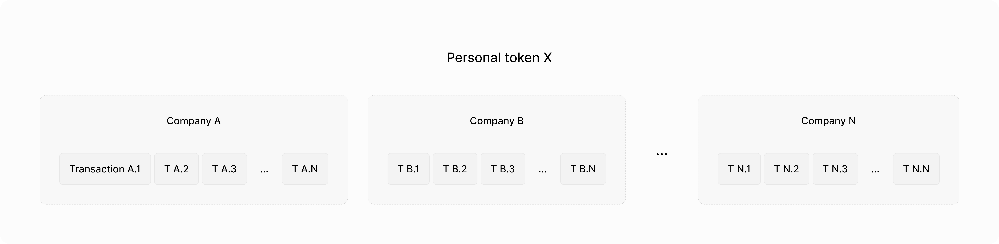
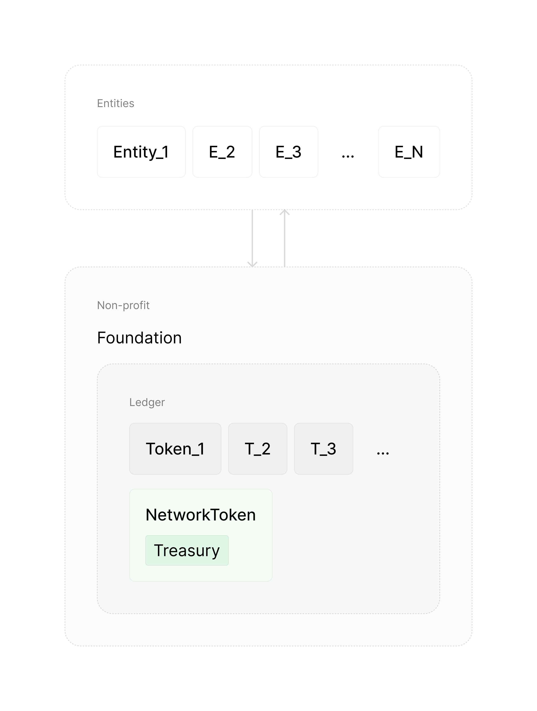

# RootNet

[homan](https://x.com/homanspirit) & [shiv](https://scholar.google.com/citations?user=WNUGEccAAAAJ&hl=en)

---

RootNet is a network that enables collective prosperity in the age of AI, through unity.

In this essay we dive into why we need RootNet, what it is, and how to create it. 

---

## AI will make our world extreme

While AI will enable abundance, prosperity, and more winners than ever before, it will also fundamentally change the shape of our economy by making outcomes extreme: at any moment, a larger share of outcomes will be concentrated in fewer hands ([power law distribution](https://en.wikipedia.org/wiki/Power_law)).
  
Extreme outcomes aren’t new: we’ve seen extreme outcomes in startups, content creation, and more broadly, in any complex activity. What will be new is that outcomes for any activity will be extreme.

> To understand why AI changes our world this way, read: [ai](ai.md).

## Problem

In a post AGI world, due to [extreme outcomes](ai.md#3-extreme-outcomes) in all activities, debt will no longer be a viable means to finance anything.

This is not due to fewer opportunities (AGI will enable far more opportunities than it takes), but rather due to the extreme, winner-takes-all nature of outcomes within any opportunity. In extreme outcomes, the median outcome falls to nothing and thus financing with debt is no longer viable.

Tragically, billions are still taking out loans to finance their lives — from their educations, to their homes, businesses, etc. — without realizing that they will almost certainly never be able to repay these loans as outcomes rapidly becomes more extreme.

Even if one is debt-free, they will almost certainly be outcompeted by one who can experiment boldly and tinker freely with abundant resources.

And critically, in an extreme world, if people don't have a stake in the collective upside, they will resent the winners, dividing us.

Therefore, we need to:
1. Finance human activity in a way that ensures that anyone with potential has access to the resources they need to fully realize their potential, regardless of the circumstances of their birth.
2. Give each individual a stake in the collective upside to elevate our baseline (when any one succeeds everyone should benefit).

Otherwise opportunity will become concentrated in those who aren't be burdened by debt (those with wealth).

## Venture capital

In an extreme world, venture capital (VC) is the best way to finance our lives.

At its core, venture capital aligns people by intertwining their success and failure — through equity in outcomes.

VC is already a popular way to finance startups: investors give startup companies money in exchange for an equity stake in the startup itself. If the startup succeeds, the investors make great returns. If the startup fails, the investors lose their investment. Importantly, startup founders are not indebted to investors. And because of the shared stake, investors are incentivized to give founders the resources they need to succeed.

VC thrives in high-risk, high-reward domains. Because outcomes are extreme, most bets fail — but the few that succeed will more than make up for the rest. Therefore, VC is the only way to finance activities that have extreme outcomes because no other mode of financing can withstand the extreme failure rate.

Since AGI makes all activities extreme, VC will be the only viable way to finance anything. But today’s VC is too limited: only those starting companies can access it. 

To unlock our collective potential, we need to enable individuals to access venture capital to finance a **broader** range of activities, **earlier** in their lives.

We need a new financial instrument that democratizes venture capital.

## Personal token

To democratize access to venture capital, we're introducing the personal token: a financial instrument that represents an individual's potential, with transact-able shares. People can raise venture capital by selling equity in their personal token.

(Jane's personal token with her shareholders and her equities in companies and other personal tokens.)

The value of your personal token is grounded in your equities in companies and other personal tokens. When you earn capital gains (by selling equity in a company or token) a portion is distributed to your personal token shareholders as dividends (proportional to the equity they hold).

But unlike company shareholders, personal token shareholders have no control, ownership, or say in your life. **You retain full agency and complete control over everything you do.** 

> Check out a real personal token: [onroot.net/homan](https://onroot.net/homan).

## Money, Company, Personal token

The personal token is the next step in the evolution of financial instruments — an abstraction that sits above the company, which itself sits above money.

As transactions grew more complex, simple notions of debt and exchange became painful. This pressure gave rise[^messy] to transferable IOUs — i.e., **money**.

[^messy]: In a messy, nonlinear way.

Later, as high-risk high-reward opportunities emerged, debt became painful. This created a pressure that gave rise to transferrable equity in upside — i.e. **venture-backed company**.

For instance, in seafaring, bankers funded many risky journeys, knowing only a few needed to succeed to turn a profit because they had a *stake* in the upside.

Importantly, the notion of a venture-backed company allowed us to assign value to potential by creating a gap between the value of a company and reality (its revenue). A startup may have no revenue, yet its equity holds value because it has potential. And being able to transact on shares of that potential enables venture capital financing.

Today, we're at another inflection point. AGI makes all outcomes extreme, not just those in a few domains, making debt a painful way to finance things. This creates pressure for an instrument that sits above companies: representing an individual’s equities across companies — i.e. **personal token**.

Just as companies let us invest in the potential of a single idea, personal tokens let us invest in the the potential of an individual across all of their ideas. 

## Value concentrates upward

As we advance, value concentrates upward.

Historically, value moved from transactions to companies. Today, top companies are worth far more than their revenue.

In a post-AGI world, this trend will continue. Value will increasingly become concentrated in personal tokens. A personal token will be valued far more than the combined value of its equities in companies. Similarly, the value of a network token will be worth far more than the sum of its equities in personal tokens.

> (recall: a personal token’s value is grounded in its equities in companies and other personal tokens).

With AI, individuals will be able to manifest many more ideas. So instead of investing in individual ideas (companies), people will increasingly want to invest in the source of many valuable ideas (personal tokens).

## Democratizes opportunity

Personal tokens create a market for human potential that will increasingly direct resources based on potential, not privilege.

We acknowledge that initially, personal tokens will better used by the privileged: those with access to capital, education, and networks. But, as the network matures through more participants and investments (in number and magnitude), market forces will more aggressively push resources to undervalued or undiscovered talent with potential.

As we’ve seen [earlier](ai.md#predictions), a post AGI world will bring:
1. More winners.
2. Faster turnover of these winners.
3. Higher quality competition.
4. Larger peak outcomes.

With greater upside and more capable contenders, more capital will flow into the system and spread across a broader range of individuals. As a result, even median contenders will attract more investment than before.

Over time, personal tokens will reduce the impact of privilege by incentivizing resources to seek true potential, wherever it lies.

## RootNetToken

Personal tokens can’t work in isolation. We need infrastructure that enables discovery, fighting fraud, reputation, etc. to support a healthy ecosystem of individuals investing in each other.

To fund these functions, the system collects a small equity fee: a micro stake in every personal token that raises capital.

This fee is collected through a separate token — the RootNetToken — which represents the collective potential of the entire network through its stakes in all personal tokens. The RootNetToken’s wallet — the Treasury — finances everything needed to keep the network running.

But the RootNetToken is far more than infrastructure. It represents our collective potential.

## Universal Basic Equity (UBE)

In an extreme world with a falling median outcome, we need a strong baseline to ensure that everyone has access to opportunity.

We achieve this through **Universal Basic Equity (UBE)**: every citizen receives an equity stake in the collective upside — i.e., a stake in the RootNetToken. This ties our fates together: when one wins, we all win; when one fails, we all feel it.

#### UBE closes the gap between individual and collective success.

Taxing wealth after it’s realized creates delay because we have to wait for equity to be sold before capital gains can be taxed. But when everyone holds equity in the RootNetToken (which holds equity in every one), wealth in everyone's hands increases immediately when any one wins. Any major scientific discovery, technological breakthrough, or artistic expression that instills hope in our future increases the value of the RootNetToken **immediately**. 

And importantly, the value of the RootNetToken is grounded in reality: in personal tokens, which are grounded in companies, which are grounded in revenue, which is grounded in transactions in which real value is created — else the transaction would not have occurred. (We'll revisit this [grounding](#grounded-in-reality) in greater depth later).

#### UBE won't cause inflation.

Unlike [Universal Basic Income](https://en.wikipedia.org/wiki/Universal_basic_income) (UBI), Universal Basic Equity doesn't cause inflation because people are incentivized to hold their equity, not spend it (given the promise of great upside). As long as we have faith in humanity's potential, more people will hold than sell, preventing inflation.

> If needed, UBI can still be layered on top of UBE. For example, by distributing dividends from the RootNetToken, or by occasionally selling small portions of its holdings (triggering dividends for all holders). The network can vote on these mechanics over time.

#### UBE enables a rising safety net.

As AI and scale reduce the cost of goods, UBE grows each person’s wealth without inflation. As your shares accumulate, you gain the freedom to take bold risks. Even if you lose everything, future UBE allocations will support your next attempt. UBE will keep giving people chances to keep trying, learning, and earning their way into greater influence, no matter where they started, or how badly they’ve performed so far.

UBE ensures that our baseline grows, giving each individual a strong safety net to realize their potential.

#### UBE incentivizes having children.

When a child is born, new shares in the RootNetToken are minted for them, slightly diluting everyone else. This creates a natural incentive to have children, as families grow their collective equity. And through that dilution, we collectively invest in the next generation.

---

By pairing personal tokens with UBE, we democratize opportunity and raise the baseline. And critically, we achieve this without relying on debt (which becomes very painful in an extreme, post AGI world).

But there's still a deeper problem we must address.

## Imbalance

When one system races ahead of the others, it creates imbalance. And imbalance leads to suffering.

For example, AI advanced rapidly while our economic system stood still. The result? Outcomes become extreme, debt breaks down, and opportunity concentrates in the hands of the already privileged. This is an imbalance between technological progress and economic organization.

AI is accelerating many such imbalances:
- **Education** is becoming obsolete. People are learning skills that will soon leave them unemployable.
- **Governance** can’t keep up. Laws and institutions are falling behind the pace of change.
- **Politics** has no shared vision. We lack a unifying story that can rally us around collective growth — the kind we need to leverage AI for prosperity, not decay.
- **Healthcare** is falling behind. New, more affordable treatments are emerging faster than we can approve them, delaying access for those in need.
- **Media** is fragmenting. AI enables us to generate content faster than we can verify or agree on what’s real, breaking our shared sense of reality.
- (And many more.)

The faster AI moves, the more painful these mismatches become. Just as rising AI makes debt unbearable, it will make other systems increasingly oppressive. We must adapt.

To advance without imbalance, we must solve a deeper, more fundamental problem.

## Root problem

Our root problem is our inability to **allocate** resources towards what we **truly value**, **quickly**.

#### A. Allocation

Each of us is unique. Our diversity of perspectives is our greatest strength. When every individual can allocate resources based on what they believe is valuable — in proportion to the quality of their judgment — we maximize the intelligence of our collective allocation.

But when a centralized authority allocates resources on behalf of everyone, it flattens that diversity. It cannot capture the full range of individual perspectives. This leads to misallocation — and worse, the suppression of necessary viewpoints.

Importantly, good judgment must be rewarded. Those who allocate well should gain more influence. Those who misallocate should lose it, until they earn it back. Without this feedback loop, we waste resources.

#### B. Value

But allocation alone isn't enough. Allocation depends on what we consider "valuable." If our notion of value is mis-aligned with what we truly value, even "perfect" allocation will miss the mark.

Today, our economic system defines value too narrowly. It often ignores long-term consequences, pushing us to chase short-term profits even at the cost of our future. It also ignores intangible, non-financial value. Most people agree that great parenting is vital to a healthy, prosperous society. But because we can't tangibly represent its value, we fail to direct adequate resources toward it.

#### C. Speed

Even if we define value well and allocate wisely, we still need to move fast. If values shift faster than resources, allocation lags behind reality. And we lose precious time, resources, and potential.

---

This root problem — our inability to allocate resources to what we truly value, quickly — is what causes imbalance. When we can't direct capital, talent, and attention toward what matters, our systems fall out of sync with reality. Progress accelerates in one area, while others are left behind. As long as allocation remains slow, narrow, or misaligned, every breakthrough deepens the divide. Not because we're advancing too fast, but because we're organizing too poorly. And as AI accelerates the pace of breakthroughs, without better organization, we'll suffer needlessly.

---

Every major ideology has blind spots here:
- **Capitalism** excels at decentralizing allocation, but with our current, restrictive notion of value, it drives us toward short-term profit at long-term cost.
- **Socialist and communist** systems aim to capture broader value, but rely on centralized control that suppresses individual judgment.

Markets remain our best tool for allocating resources given a particular notion of value. So rather than discard markets, we must improve our notion of value. 

Therefore, we need a system that can represent true, holistic value so that we can move resources to where they truly belong, at the speed we need.

## The RootNet

[Personal tokens](#personal-token) and the [RootNetToken](#rootnettoken) are part of a more general system: RootNet. 

RootNet is a network designed to represent a more true, holistic notion of value so that we can allocate resources to what we actually care about, efficiently.

On RootNet, there’s no separation between social and financial. All activity is represented by a single primitive: the **token**. A token represents potential, and can be assigned to an individual (personal token), a collective (network token), or an idea (idea token, etc.). 

Every user on RootNet has a personal token, which now generalizes beyond finance to all forms of activity.

The token represents its holder's potential to create value. Users express belief in that potential by transacting on its shares. And importantly, a token's value is always grounded in reality: in its holder's equities in other tokens, companies, or revenue.

By enabling users to transact on tokens seamlessly, RootNet lets people allocate resources to the individuals, collectives, and expressions they value.

As [discussed earlier](#rootnettoken), the network itself holds a token: the RootNetToken. The individual and the collective are structurally intertwined: users hold stakes in the RootNetToken, and the RootNetToken holds stakes in all users. **When anyone creates value for the network, everyone benefits.**

## True value

RootNet enables us to represent what we truly value.

#### RootNet expands existing notion of value. 

The personal token of an individual who has the potential to create economic value by starting, or joining, or investing in companies (or investing in other tokens) will be valued greatly. RootNet enables us to value such potential earlier and more broadly than ever before.

#### RootNet represents intangible value.

RootNet lets us value forms of contribution that have always mattered but were never reflected in economic systems.

Take parenting. Most would agree that parenting is one of the most (if not *the* most) vital contributors to collective prosperity. Children raised with love, care, and resources are more likely to become kind, capable, and hopeful adults — benefiting everyone through both who they are and what they do.

On RootNet, this value can be represented directly. Parents will hold equity in their children's personal tokens and can raise capital by selling shares in their own tokens to support their children. As their children succeed, the value of the parents' tokens will rise. Exceptional parents will even be encouraged to share their wisdom, train others, and **invest** in new parents.

By tangibly representing the value of parenting, RootNet creates a strong incentive for better parenting. Great parents gain access to resources they previously lacked. Absent or harmful parenting becomes economically costly, as it puts at risk future wealth tied to their children’s potential.

> And independent of personal tokens, **Universal Basic Equity (UBE)** will raise the baseline, ensuring all parents have the minimum resources needed to care for their children.

RootNet allows us to allocate resources toward what we deeply value, but previously couldn't represent.

#### RootNet represents collective value.

The RootNetToken captures our collective potential by holding stakes in all personal tokens on RootNet. The stronger our belief that the future will be more prosperous than today, the more we’ll value the RootNetToken.

Our current economic system fails to account for long-term collective consequences, like climate change, because it narrowly defines value. As a result, we’re often rewarded for short-term gains even when they cause long-term harm.

On the other hand, on RootNet, actions that harm our shared future — even if profitable in the short term — will be strongly disincentivized. For example, burning more fossil fuels might yield quick profits, but it undermines our hope in a better future, dragging down the RootNetToken’s value. Since we each hold equity in the RootNetToken, we’re directly harmed. The collective loss will far outweigh the short-term profit, making such behavior economically irrational.

Conversely, actions that strengthen our shared belief in the future will be rewarded. An artist who uplifts our collective hope can increase the value of the RootNetToken itself. As it becomes clear their work creates this kind of value, the artist’s personal token valuation will surge (i.e., we will give them more resources to keep creating such value) — as long as such hope continues to translate into actual value created.

## Grounded in reality

The value represented on RootNet is grounded in reality.

The RootNetToken holds stakes in personal tokens, which in turn hold stakes in companies (and other tokens), which are backed by revenue — i.e., actual transactions that reflect real-world value creation. If no value is created, no transaction occurs, no revenue is generated, and the valuations of companies (and the tokens that hold shares of these companies) will fall. RootNet is anchored in the real value creation.

But what about those who create hope, like artists, especially when no one directly “buys” their work? Why would their personal tokens hold value?

Because hope is real. It shapes behavior, inspires action, and unlocks possibility. Much of what holds humanity back is not lack of ability but lack of belief. The moment we believe something is possible, we begin building it. Throughout history, every great achievement was enabled by a shift in belief that it could be done.

Hope is often a self-fulfilling prophecy. An artist who instills genuine hope that we can solve our problems materially improves our trajectory.

Importantly, RootNet keeps hope grounded. If hope doesn’t translate into actual value creation, the RootNetToken won’t respond, and the market will correct. As long as we continue to translate hope into actual value, actions that instill hope will be tangibly valued because they increase our collective (and therefore individual) wealth. And so, users will allocate resources to such efforts by investing in the tokens of the individuals, collectives, and expressions that generate hope.

## Solution

Let's see how to implement RootNet.

Recall: RootNet is based on a single primitive — the token — that represents potential, that can be assigned to an individual ([personal token](#personal-token)), collective ([network token](#rootnettoken)), or idea (idea token, etc.). Each user on RootNet is assigned a personal token. 

RootNet is built on a decentralized blockchain Ledger that contains all of the tokens in the network, including the [RootNetToken](#rootnettoken) that represents the potential of the entire network. This technical "core" is developed and controlled by a non-profit organization — RootFoundation.

Entities (such as companies) will be able to operate on top of RootNet to enable a wide range of products and services built on tokens, while adhering to the policies of RootNet that determine how entities must engage with the Ledger.

Initially, RootFoundation will determine these policies. Over time, control over these policies, and more broadly all of RootNet's functions and evolution, will be progressively decentralized so that users will own, control and shape RootNet. If during this progressive decentralization RootFoundation fails to live up to what users want, anyone can fork the ledger, issue a new RootNetToken and continue onwards.

Let's expand on each of these...

### Token

RootNet is based on the primitive — the token — that represents an individual, collective, or expression.

A token contains the following information:

1. **ID**: a unique identifier.
2. **Ownership**: total number of shares, and mapping between any token.ID to number of shares that token holds.
3. **Wallet**: holds USDC (for now[^rootcoin]).
4. **Data**: key value mapping that can contain any kind of data: strings, images, videos, etc.
5. **History**: all interactions this token has had with any other token. For example: investing, transacting, liking a post, following, reporting fraud, etc.

There are three kinds of tokens that extend from this primitive: 
1. personal tokens are for individuals.
2. network tokens are for collectives (nations tokens (e.g., "USAToken"), RootNetToken, etc.).
3. idea tokens are for individual ideas or expressions (e.g, companies).

[^rootcoin]: Eventually, RootNet will have its own currency. Starting with USDC will eliminate unnecessary volatility.

### Ledger

The Ledger represents information about all tokens in the network — on a decentralized blockchain. Every edit to the core ledger is recorded and public. Anyone can verify and audit what happens in this system.

### RootNetToken & Treasury

The RootNetToken is an instance of a network token that represents the collective potential of the entire network through its micro stakes in all tokens in the network (which it captures through an equity fee when token shares are transacted). Since the RootNetToken is just another token, it exists within the Ledger.

The RootNetToken's wallet, the Treasury, reflects the dividends the RootNetToken accrues through its stakes in all tokens in the network. The RootNetToken is the economic heart of the entire network: fueling all of the activities required to keep the network healthy.

### Foundation

The Ledger will be developed and controlled by a non-profit organization (RootFoundation).

RootFoundation’s sole goal is to unite humanity and unlock our collective potential.

In addition to building the core technology, RootFoundation will be responsible for educating the world about these new ideas, and advocating for policies in the direction of uniting humanity and unlocking our collective potential.

RootFoundation cannot be “bought”. As the network matures, users will progressively vote on the all of the network's functionality and evolution. Importantly, these voting rights are not related to the user's stake in the RootNetToken. This means that wealthy individuals cannot simply "buy" influence.

RootFoundation members will work together in person at our HQ in San Francisco, California, USA.

### Legal

All transactions in RootNet will be compliant with relevant laws and regulations. This means that investing in tokens within RootNet will initially be restricted to users who live in the United States of America.

## Decentralization

Initially, RootFoundation will hold a lot of control. Over time, as the network matures, RootFoundation will progressively decentralize control. For example, early on, RootFoundation will handle reputation and fraud in a centralized way: managing complaints from users, investigating and banning/pursuing legal actions, etc. Over time, as the network matures, RootFoundation will decentralize reputation by incentivizing users themselves to accurately identify misrepresentation/fraud[^decentralized_reputation].

[^decentralized_reputation]: Perhaps something like a transparent, decentralized [community notes](https://vitalik.eth.limo/general/2023/08/16/communitynotes.html) with appropriate financial incentives.

Such progressive decentralization will enable a rich, competitive ecosystem of ideas, companies, entities, etc. to emerge upon this tokenized foundation. And, users will increasingly have control and influence over all policy and decision making regarding the network (and how entities engage with the network) by voting.

Voting will be continuous: users can shift their vote as soon as they change their minds. Users can transfer their vote for someone else to cast for an individual decision, a type of decision, or all decisions. Such representational voting will enable a much faster rate of decision-making.

## Fork-ability

RootNet is fork-able at its core. If RootFoundation stops serving its users in the way they want, the Ledger itself can be forked, a new RootNetToken issued, and a new foundation can continue the work towards uniting humanity and unlocking our collective potential in a way that's actually aligned with what people want.

All of the RootFoundation’s activity will be publicly available in this repository under an [MIT license](LICENSE), enabling anyone to fork anything without needing permission.

Over time, as the network progressively decentralizes, we believe that even the entities operating on top of RootFoundation will become fork-able because users will vote for policies that force transparency and fork-ability on any entity that engages with the network.

RootFoundation will progressively become more transparent. Eventually, every cent it spends, every idea it produces, every conversation it has, every line of code it writes will be published in realtime for the world to see, judge, and steal. Yet, even today, RootFoundation will be far more transparent than any other organization.

## Unity

If artificial intelligence is to unlock abundance for all of us — not just a privileged few — we must reorganize ourselves.

Our current systems weren’t built for this future. They divide us by concentrating opportunity, rewarding short-term gain at the expense of long-term collective loss, and making the success of one feel like the loss of another. Words alone cannot overcome this. We need better incentives that push for unity.

RootNet enables this. It intertwines our fates: each of us is a stakeholder in the collective, and the collective a stakeholder in each of us. When one wins, we all win. When one falls, we all feel it. Through personal tokens, we fund potential. Through the RootNetToken, we share in collective upside. Through Universal Basic Equity, we raise the baseline without inflation.

And only through such structural unity can we fully take advantage of artificial intelligence — toward prosperity and abundance.

---

We’ve only scratched the surface of what RootNet will make possible. RootNet will even [rewrite our education system](appendix/Education.md) through better incentives.

No part of this idea is “owned” by anyone. We encourage the world to challenge it, fork it, build on it, and take it further than any of us ever could alone.

The more experiments, the more competition, the better for humanity.  So long as we are structurally united, any victory is a shared one.

May the best network win and lift us all with it.

[Vote for humanity](https://github.com/root-foundation/root#vote-for-humanity)